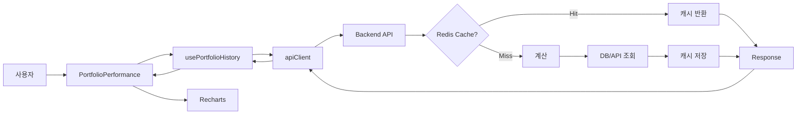

# 🎉 포트폴리오 프론트엔드 통합 완료!

**날짜**: 2025-10-11
**상태**: ✅ **통합 준비 완료**

---

## 📊 완료된 작업 요약

### ✅ 1. 타입 정의 동기화

- 백엔드: `PortfolioHistoryPoint` (Python Pydantic)
- 프론트엔드: `PortfolioHistoryPoint` (TypeScript)
- 결과: **완벽하게 일치** (date, portfolio, benchmark)

### ✅ 2. API 엔드포인트 구현

- 경로: `GET /api/portfolio/history`
- 파라미터: `period` (1D, 1W, 1M, 3M, 6M, 1Y, ALL)
- 응답: `List[PortfolioHistoryPoint]` (JSON 배열)
- 캐싱: Redis (5분 TTL)

### ✅ 3. 프론트엔드 통합

- API 클라이언트: `apiClient.getPortfolioHistory()`
- React Hook: `usePortfolioHistory`
- 컴포넌트: `PortfolioPerformance`
- 차트: `PortfolioPerformanceChart` (Recharts)

### ✅ 4. 환경 설정

- CORS: `localhost:9000` 허용
- 환경 변수: `.env.local` 생성
- API URL: `http://localhost:8000`

### ✅ 5. 문서화

- 📚 [메인 통합 가이드](./guide/portfolio-frontend-integration-guide.md) (24KB)
- 🚀 [빠른 시작 가이드](./guide/portfolio-quick-start.md) (3.8KB)
- 📖 [API 명세서](./api/portfolio-history-api-spec.md) (11KB)
- 🔧 [트러블슈팅 FAQ](./troubleshooting/portfolio-integration-faq.md) (16KB)
- 📋 [통합 상태 보고서](./guide/integration-status.md) (신규)

---

## 🚀 바로 시작하기

### 원클릭 테스트

```bash
# 자동 통합 테스트 실행
./scripts/test-portfolio-integration.sh
```

### 수동 실행

#### 1. 백엔드 시작

```bash
cd backend
source vkis/bin/activate
python app/main.py
```

#### 2. 프론트엔드 시작

```bash
cd stock-trading-ui
npm run dev
```

#### 3. 브라우저 확인

```
http://localhost:9000
```

---

## 📁 생성된 파일

### 문서

```
docs/
├── guide/
│   ├── README.md                              # 문서 가이드 (신규)
│   ├── portfolio-frontend-integration-guide.md # 메인 가이드
│   ├── portfolio-quick-start.md               # 빠른 시작
│   └── integration-status.md                   # 통합 상태 (신규)
│
├── api/
│   └── portfolio-history-api-spec.md          # API 명세서
│
└── troubleshooting/
    └── portfolio-integration-faq.md           # FAQ
```

### 설정 파일

```
stock-trading-ui/
└── .env.local                                  # 환경 변수 (신규)
```

### 테스트 스크립트

```
scripts/
└── test-portfolio-integration.sh              # 통합 테스트 (신규)
```

---

## 🎯 검증 체크리스트

### 코드 검증 ✅

- [x] 타입 정의 일치
- [x] API 응답 형식 검증
- [x] 프론트엔드 클라이언트 검증
- [x] CORS 설정 완료
- [x] 환경 변수 설정

### 실행 검증 (사용자가 확인)

- [ ] 백엔드 서버 실행
- [ ] 프론트엔드 서버 실행
- [ ] API Health Check 성공
- [ ] 브라우저에서 차트 표시
- [ ] Mock 경고 메시지 없음
- [ ] 기간 변경 정상 동작

---

## 🔍 통합 검증 방법

### 방법 1: 자동 테스트 스크립트

```bash
./scripts/test-portfolio-integration.sh
```

**확인 항목**:

- ✅ 백엔드 서버 Health Check
- ✅ Portfolio API 응답 검증
- ✅ 데이터 포맷 검증
- ✅ 필수 필드 확인
- ✅ 환경 설정 확인

### 방법 2: 수동 검증

#### API 테스트

```bash
# Health Check
curl http://localhost:8000/health

# Portfolio History
curl "http://localhost:8000/api/portfolio/history?period=1M" | jq
```

#### 브라우저 테스트

1. http://localhost:9000 접속
2. F12 → Network 탭
3. `/api/portfolio/history` 요청 확인
4. Status: 200 OK
5. Response: JSON 배열 확인

---

## 📖 사용 가이드

### 초보자

1. 📖 [메인 통합 가이드](./guide/portfolio-frontend-integration-guide.md) 읽기 (30분)
2. 🚀 단계별 실행
3. 🔧 문제 발생 시 [FAQ](./troubleshooting/portfolio-integration-faq.md) 참고

### 경험자

1. 🚀 [빠른 시작 가이드](./guide/portfolio-quick-start.md) (5분)
2. 📖 [API 명세서](./api/portfolio-history-api-spec.md) 참고
3. 🔧 문제 시 [FAQ](./troubleshooting/portfolio-integration-faq.md)

---

## 🔄 데이터 흐름



---

## ⚙️ 기술 스택

### 백엔드

- FastAPI 0.110+
- Pydantic v2
- Redis (선택)
- APScheduler

### 프론트엔드

- Next.js 15
- TypeScript
- Recharts
- React Hooks

---

## 🎨 주요 기능

### 1. 실시간 포트폴리오 추적

- 5분마다 자동 스냅샷 저장
- Redis 캐싱으로 빠른 응답

### 2. 벤치마크 비교

- KOSPI 지수와 비교
- 정규화된 수익률 표시

### 3. 다양한 기간 지원

- 1D (당일)
- 1W (1주일)
- 1M (1개월)
- 3M, 6M, 1Y
- ALL (전체)

### 4. 반응형 차트

- Recharts 기반
- 인터랙티브 툴팁
- 다크 테마 지원

---

## 🐛 알려진 제한사항

### 현재 제한사항

1. **단일 계좌**: 하나의 계좌만 조회 가능
2. **추정 데이터**: 과거 데이터는 현재 보유량 기반 추정
3. **현금 흐름 미반영**: 입출금, 배당 등 미반영

### 향후 개선 (Phase 2)

1. 실제 거래 이력 반영
2. 현금 흐름 추적
3. 다중 계좌 지원
4. 추가 벤치마크 (KOSDAQ, S&P500)

---

## 📊 성능

### Redis 캐싱 효과

| 상황         | 응답 시간  |
| ---------- | ------ |
| 캐시 히트      | < 50ms |
| 캐시 미스 (1M) | 1~3s   |
| 캐시 미스 (1Y) | 3~10s  |

### 최적화 팁

1. Redis 활성화
2. 동일 기간 재조회 시 캐시 활용
3. 프론트엔드 메모이제이션

---

## 🆘 문제 해결

### 빠른 해결책

| 문제               | 해결            |
| ---------------- | ------------- |
| Mock 경고 계속 표시    | 백엔드 서버 실행 확인  |
| CORS 에러          | 백엔드 재시작       |
| 404 Not Found    | URL 경로 확인     |
| 500 Server Error | 백엔드 로그 확인     |
| 차트 안 보임          | Console 에러 확인 |

### 상세 가이드

- 📚 [FAQ 문서](./troubleshooting/portfolio-integration-faq.md)
- 📖 [메인 가이드 - 문제 해결](./guide/portfolio-frontend-integration-guide.md#8-문제-해결)

---

## ✨ 다음 단계

### 즉시 할 수 있는 것

1. 🎨 차트 스타일 커스터마이징
2. 📊 추가 지표 표시
3. 🔔 알림 기능 추가

### Phase 2 계획

1. 📈 실제 거래 이력 반영
2. 💰 현금 흐름 추적
3. 🔄 다중 계좌 지원
4. 📱 모바일 최적화

---

## 🙏 기여

### 보고 및 피드백

- 🐛 버그 리포트: GitHub Issues
- 💡 기능 제안: GitHub Discussions
- 📖 문서 개선: Pull Request

---

## 📝 변경 이력

### v1.0.0 (2025-10-11)

- ✨ 포트폴리오 통합 완료
- 📚 완전한 문서 세트 작성
- 🧪 자동 테스트 스크립트 추가
- 🎨 환경 설정 자동화

---

## 🎉 축하합니다!

포트폴리오 프론트엔드 통합이 완료되었습니다!

이제 실제 계좌 데이터로 포트폴리오 성과를 확인할 수 있습니다.

**시작하기**:

```bash
# 1. 테스트 실행
./scripts/test-portfolio-integration.sh

# 2. 서버 시작
# 터미널 1: backend
cd backend && source vkis/bin/activate && python app/main.py

# 터미널 2: frontend
cd stock-trading-ui && npm run dev

# 3. 브라우저 열기
open http://localhost:9000
```

**문서 읽기**:

- 🚀 처음이신가요? → [빠른 시작 가이드](./guide/portfolio-quick-start.md)
- 📖 자세히 알고 싶으신가요? → [메인 통합 가이드](./guide/portfolio-frontend-integration-guide.md)
- 🔧 문제가 있나요? → [FAQ](./troubleshooting/portfolio-integration-faq.md)

---

**Happy Coding! 🚀**
