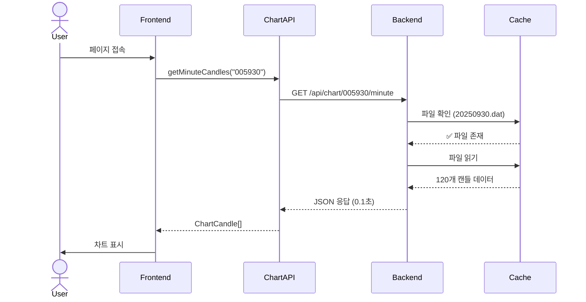
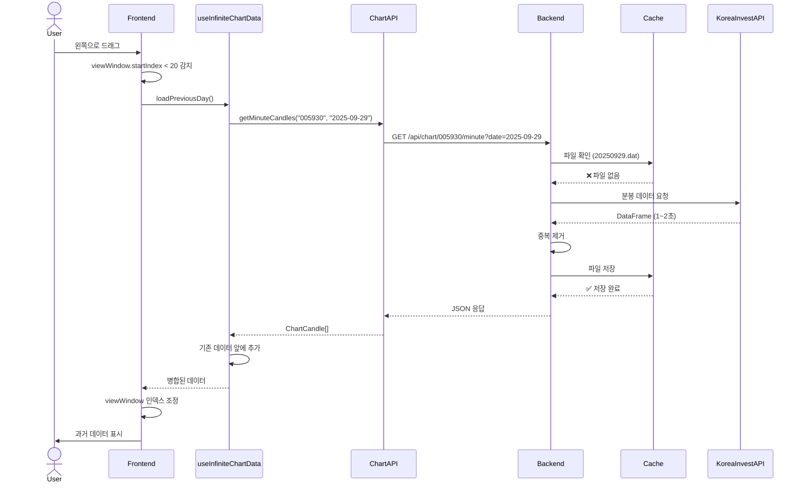
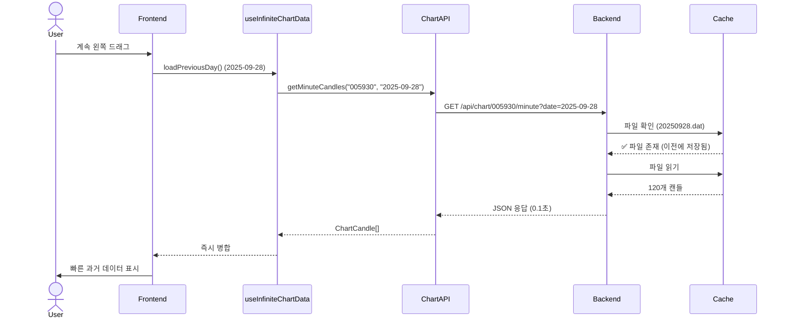
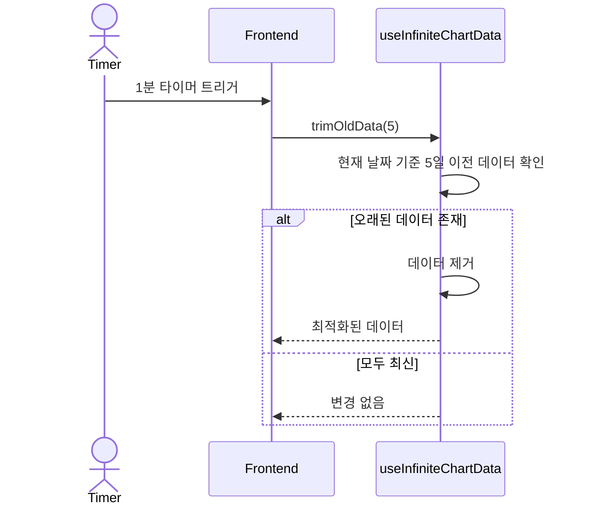

# 무한 스크롤 캔들 차트 - 상세 구현 계획

> 작성일: 2025-09-30
> 목표: 왼쪽 드래그 시 이전 날짜 분봉 데이터 자동 로드 및 로컬 캐싱

---

## 📋 목차
1. [Use Case 시나리오](#use-case-시나리오)
2. [파일 구조](#파일-구조)
3. [백엔드 구현](#백엔드-구현)
4. [프론트엔드 구현](#프론트엔드-구현)
5. [Sequence Diagrams](#sequence-diagrams)
6. [핵심 함수 요약](#핵심-함수-요약)
7. [구현 체크리스트](#구현-체크리스트)

---

## 🎯 Use Case 시나리오

### **시나리오 1: 초기 차트 로드**
```
사용자: test-chart 페이지 접속
시스템: 오늘 날짜 분봉 120개 표시 (13:30 ~ 15:30)
```

### **시나리오 2: 최근 데이터 탐색 (캐시 히트)**
```
사용자: 오른쪽으로 드래그 → 최신 데이터 확인
시스템: 이미 로드된 데이터 내에서 이동 (API 호출 없음)
```

### **시나리오 3: 과거 데이터 탐색 (캐시 히트)**
```
사용자: 왼쪽으로 드래그 → viewWindow.startIndex < 20 도달
시스템:
  1. 이전 날짜 (2025-09-29) 데이터 요청
  2. 백엔드: kordata/005930/20250929.dat 파일 존재 확인
  3. 파일에서 데이터 로드 (0.1초)
  4. 프론트엔드: 기존 데이터 앞에 추가
  5. 차트: 자연스럽게 과거 데이터 표시
```

### **시나리오 4: 과거 데이터 탐색 (캐시 미스)**
```
사용자: 왼쪽으로 계속 드래그 → 2주 전 데이터 도달
시스템:
  1. 2025-09-15 데이터 요청
  2. 백엔드: kordata/005930/20250915.dat 파일 없음
  3. 한국투자증권 API 호출 (1~2초)
  4. 데이터 중복 제거 및 파일 저장
  5. 프론트엔드: 데이터 병합 후 표시
```

### **시나리오 5: 메모리 관리**
```
사용자: 10일치 데이터 탐색 완료
시스템:
  - 메모리에 10일 * 390분 = 3,900개 캔들 존재
  - 오래된 데이터 (7일 이전) 자동 제거
  - 메모리 최적화 (최대 5일치 유지)
```

---

## 🗂️ 파일 구조

```
backend/
├── app/
│   ├── services/
│   │   ├── chart_cache_service.py       # ⭐ NEW: 캐싱 서비스
│   │   └── trading_service.py           # 수정: 캐시 통합
│   ├── api/
│   │   └── chart.py                     # 수정: date 파라미터
│   └── utils/
│       └── trading_calendar.py          # ⭐ NEW: 거래일 계산
└── kordata/                              # ⭐ NEW: 캐시 디렉토리
    └── {종목코드}/
        └── {YYYYMMDD}.dat

stock-trading-ui/
└── src/
    ├── hooks/
    │   └── useInfiniteChartData.ts      # ⭐ NEW: 무한 스크롤 훅
    ├── components/trading/
    │   └── chart-adapters/
    │       └── RechartsAdapter.tsx      # 수정: 무한 스크롤 통합
    └── lib/
        └── chart-api.ts                 # ⭐ NEW: API 호출 래퍼
```

---

## 🔧 백엔드 구현

### **1. ChartCacheService** (`backend/app/services/chart_cache_service.py`)

```python
from pathlib import Path
from datetime import datetime, timedelta
from typing import List, Optional, Callable
import json
from loguru import logger
from app.models.schemas import ChartCandle

class ChartCacheService:
    """분봉 데이터 로컬 캐싱 서비스"""

    def __init__(self, cache_dir: str = "kordata"):
        self.cache_dir = Path(cache_dir)
        self.cache_dir.mkdir(exist_ok=True)
        logger.info(f"ChartCacheService initialized: {self.cache_dir.absolute()}")

    # === 핵심 함수 ===

    async def get_minute_candles(
        self,
        stock_code: str,
        target_date: datetime,
        api_fallback: Callable
    ) -> List[ChartCandle]:
        """
        분봉 데이터 조회 (캐시 우선)

        Args:
            stock_code: 종목 코드 (예: "005930")
            target_date: 조회 날짜
            api_fallback: API 호출 함수 (캐시 미스 시 사용)

        Returns:
            분봉 캔들 리스트
        """
        cache_path = self._get_cache_path(stock_code, target_date)

        # 1. 캐시 확인
        if cache_path.exists():
            logger.info(f"📂 Cache HIT: {cache_path.name}")
            return self._load_from_cache(cache_path)

        # 2. API 호출
        logger.info(f"🌐 Cache MISS: {cache_path.name}, calling API...")
        candles = await api_fallback(stock_code, target_date)

        # 3. 캐시 저장
        if candles:
            self._save_to_cache(cache_path, candles)
            logger.info(f"💾 Saved to cache: {len(candles)} candles")

        return candles or []

    # === 헬퍼 함수 ===

    def _get_cache_path(self, stock_code: str, date: datetime) -> Path:
        """캐시 파일 경로 생성"""
        stock_dir = self.cache_dir / stock_code
        stock_dir.mkdir(exist_ok=True)
        return stock_dir / f"{date.strftime('%Y%m%d')}.dat"

    def _save_to_cache(self, path: Path, candles: List[ChartCandle]):
        """캔들 데이터를 JSON 파일로 저장"""
        try:
            data = {
                "version": "1.0",
                "timestamp": datetime.now().isoformat(),
                "count": len(candles),
                "candles": [candle.dict() for candle in candles]
            }
            with open(path, 'w', encoding='utf-8') as f:
                json.dump(data, f, ensure_ascii=False, indent=2)
        except Exception as e:
            logger.error(f"Failed to save cache: {e}")

    def _load_from_cache(self, path: Path) -> List[ChartCandle]:
        """캐시 파일에서 캔들 데이터 로드"""
        try:
            with open(path, 'r', encoding='utf-8') as f:
                data = json.load(f)

            candles = [ChartCandle(**item) for item in data["candles"]]
            logger.debug(f"Loaded {len(candles)} candles from cache")
            return candles
        except Exception as e:
            logger.error(f"Failed to load cache: {e}")
            return []

    def invalidate_cache(self, stock_code: str, date: datetime):
        """특정 날짜 캐시 무효화 (삭제)"""
        cache_path = self._get_cache_path(stock_code, date)
        if cache_path.exists():
            cache_path.unlink()
            logger.info(f"🗑️ Cache invalidated: {cache_path.name}")

    def get_cache_stats(self, stock_code: str) -> dict:
        """캐시 통계 조회"""
        stock_dir = self.cache_dir / stock_code
        if not stock_dir.exists():
            return {"cached_days": 0, "total_size_mb": 0}

        files = list(stock_dir.glob("*.dat"))
        total_size = sum(f.stat().st_size for f in files)

        return {
            "cached_days": len(files),
            "total_size_mb": round(total_size / 1024 / 1024, 2),
            "oldest_date": min(f.stem for f in files) if files else None,
            "newest_date": max(f.stem for f in files) if files else None
        }
```

---

### **2. TradingCalendar** (`backend/app/utils/trading_calendar.py`)

```python
from datetime import datetime, timedelta
from typing import List

class TradingCalendar:
    """한국 증시 거래일 계산"""

    # 2025년 공휴일 (예시)
    HOLIDAYS_2025 = [
        "2025-01-01",  # 신정
        "2025-01-28",  # 설날 연휴
        "2025-01-29",
        "2025-01-30",
        "2025-03-01",  # 삼일절
        "2025-05-05",  # 어린이날
        "2025-06-06",  # 현충일
        "2025-08-15",  # 광복절
        "2025-09-28",  # 추석 연휴
        "2025-09-29",
        "2025-09-30",
        "2025-10-03",  # 개천절
        "2025-10-09",  # 한글날
        "2025-12-25",  # 크리스마스
    ]

    @classmethod
    def get_previous_trading_day(cls, date: datetime) -> datetime:
        """
        이전 거래일 반환

        Args:
            date: 기준 날짜

        Returns:
            이전 거래일 (주말/공휴일 제외)
        """
        prev_date = date - timedelta(days=1)

        while not cls.is_trading_day(prev_date):
            prev_date -= timedelta(days=1)

        return prev_date

    @classmethod
    def get_next_trading_day(cls, date: datetime) -> datetime:
        """다음 거래일 반환"""
        next_date = date + timedelta(days=1)

        while not cls.is_trading_day(next_date):
            next_date += timedelta(days=1)

        return next_date

    @classmethod
    def is_trading_day(cls, date: datetime) -> bool:
        """거래일 여부 확인"""
        # 주말 체크
        if date.weekday() >= 5:  # 토요일(5), 일요일(6)
            return False

        # 공휴일 체크
        date_str = date.strftime("%Y-%m-%d")
        if date_str in cls.HOLIDAYS_2025:
            return False

        return True

    @classmethod
    def get_trading_days_between(
        cls,
        start_date: datetime,
        end_date: datetime
    ) -> List[datetime]:
        """두 날짜 사이의 모든 거래일 반환"""
        trading_days = []
        current = start_date

        while current <= end_date:
            if cls.is_trading_day(current):
                trading_days.append(current)
            current += timedelta(days=1)

        return trading_days
```

---

### **3. API 엔드포인트 수정** (`backend/app/api/chart.py`)

```python
from app.services.chart_cache_service import ChartCacheService
from app.utils.trading_calendar import TradingCalendar

# 전역 캐시 서비스 인스턴스
cache_service = ChartCacheService()

@router.get(
    "/{stock_code}/minute",
    response_model=List[ChartCandle],
    summary="분봉 차트 데이터 조회 (캐싱 지원)",
)
async def get_minute_chart_data(
    stock_code: str,
    trading_service: TradingService = Depends(get_trading_service),
    date: Optional[str] = Query(
        None,
        description="조회 날짜 (YYYY-MM-DD). 미지정시 오늘",
        example="2025-09-30"
    ),
    include_extended_hours: bool = Query(False, description="시간외 거래 포함"),
    regular_hours_only: bool = Query(True, description="정규장만")
) -> List[ChartCandle]:
    """
    분봉 차트 데이터 조회 (로컬 캐싱)

    - 캐시 있으면 즉시 반환 (0.1초)
    - 캐시 없으면 API 호출 후 저장 (1~2초)
    """
    try:
        # 날짜 파싱
        target_date = datetime.strptime(date, "%Y-%m-%d") if date else datetime.now()

        # 거래일 체크
        if not TradingCalendar.is_trading_day(target_date):
            logger.warning(f"Non-trading day requested: {date}")
            # 이전 거래일로 fallback
            target_date = TradingCalendar.get_previous_trading_day(target_date)

        # 캐시 서비스 사용
        async def api_fallback(code: str, dt: datetime):
            return await trading_service.get_minute_chart_data(
                stock_code=code,
                target_date=dt,
                include_extended_hours=include_extended_hours,
                regular_hours_only=regular_hours_only
            )

        candles = await cache_service.get_minute_candles(
            stock_code=stock_code,
            target_date=target_date,
            api_fallback=api_fallback
        )

        logger.info(
            f"✅ Chart data returned: {stock_code}, "
            f"{target_date.strftime('%Y-%m-%d')}, {len(candles)} candles"
        )

        return candles

    except ValueError as e:
        raise HTTPException(status_code=400, detail=f"Invalid date format: {e}")
    except Exception as e:
        logger.error(f"Chart data retrieval failed: {e}")
        raise HTTPException(status_code=500, detail=str(e))

@router.get("/{stock_code}/cache/stats")
async def get_cache_stats(stock_code: str):
    """캐시 통계 조회"""
    stats = cache_service.get_cache_stats(stock_code)
    return stats

@router.delete("/{stock_code}/cache/{date}")
async def invalidate_cache(stock_code: str, date: str):
    """특정 날짜 캐시 무효화"""
    target_date = datetime.strptime(date, "%Y-%m-%d")
    cache_service.invalidate_cache(stock_code, target_date)
    return {"message": f"Cache invalidated for {date}"}
```

---

## 🎨 프론트엔드 구현

### **1. Chart API 래퍼** (`src/lib/chart-api.ts`)

```typescript
export interface ChartCandle {
  timestamp: string;
  open: number;
  high: number;
  low: number;
  close: number;
  volume: number;
}

export class ChartAPI {
  private baseUrl = 'http://localhost:8000/api/chart';

  /**
   * 특정 날짜의 분봉 데이터 조회
   */
  async getMinuteCandles(
    stockCode: string,
    date?: string
  ): Promise<ChartCandle[]> {
    const url = date
      ? `${this.baseUrl}/${stockCode}/minute?date=${date}`
      : `${this.baseUrl}/${stockCode}/minute`;

    const response = await fetch(url);
    if (!response.ok) {
      throw new Error(`Failed to fetch chart data: ${response.statusText}`);
    }

    return response.json();
  }

  /**
   * 캐시 통계 조회
   */
  async getCacheStats(stockCode: string) {
    const response = await fetch(`${this.baseUrl}/${stockCode}/cache/stats`);
    return response.json();
  }

  /**
   * 캐시 무효화
   */
  async invalidateCache(stockCode: string, date: string) {
    const response = await fetch(
      `${this.baseUrl}/${stockCode}/cache/${date}`,
      { method: 'DELETE' }
    );
    return response.json();
  }
}

export const chartAPI = new ChartAPI();
```

---

### **2. 무한 스크롤 훅** (`src/hooks/useInfiniteChartData.ts`)

```typescript
import { useState, useCallback, useRef } from 'react';
import { chartAPI, ChartCandle } from '@/lib/chart-api';

interface UseInfiniteChartDataOptions {
  stockCode: string;
  initialData?: ChartCandle[];
}

export function useInfiniteChartData({
  stockCode,
  initialData = []
}: UseInfiniteChartDataOptions) {
  const [allData, setAllData] = useState<ChartCandle[]>(initialData);
  const [isLoading, setIsLoading] = useState(false);
  const [error, setError] = useState<string | null>(null);

  // 현재 데이터의 최소 날짜 추적
  const oldestDateRef = useRef<Date | null>(null);

  // 중복 요청 방지
  const isLoadingRef = useRef(false);

  /**
   * 이전 날짜 데이터 로드
   */
  const loadPreviousDay = useCallback(async () => {
    // 중복 로딩 방지
    if (isLoadingRef.current) {
      console.log('⏸️ Already loading, skipping...');
      return;
    }

    setIsLoading(true);
    isLoadingRef.current = true;
    setError(null);

    try {
      // 현재 가장 오래된 날짜 계산
      const currentOldest = oldestDateRef.current || new Date();
      const previousDay = getPreviousTradingDay(currentOldest);
      const dateStr = formatDate(previousDay);

      console.log(`📅 Loading data for: ${dateStr}`);

      // API 호출
      const newCandles = await chartAPI.getMinuteCandles(stockCode, dateStr);

      if (newCandles.length > 0) {
        // 데이터 앞에 추가
        setAllData(prev => [...newCandles, ...prev]);
        oldestDateRef.current = previousDay;

        console.log(`✅ Loaded ${newCandles.length} candles for ${dateStr}`);
      } else {
        console.log(`⚠️ No data for ${dateStr}`);
      }
    } catch (err) {
      const message = err instanceof Error ? err.message : 'Unknown error';
      setError(message);
      console.error('Failed to load previous day:', err);
    } finally {
      setIsLoading(false);
      isLoadingRef.current = false;
    }
  }, [stockCode]);

  /**
   * 메모리 관리: 오래된 데이터 제거
   */
  const trimOldData = useCallback((maxDays: number = 5) => {
    setAllData(prev => {
      if (prev.length === 0) return prev;

      // 최신 데이터 기준으로 maxDays만 유지
      const cutoffDate = new Date();
      cutoffDate.setDate(cutoffDate.getDate() - maxDays);

      return prev.filter(candle => {
        const candleDate = new Date(candle.timestamp);
        return candleDate >= cutoffDate;
      });
    });
  }, []);

  return {
    allData,
    isLoading,
    error,
    loadPreviousDay,
    trimOldData
  };
}

// === 헬퍼 함수 ===

function getPreviousTradingDay(date: Date): Date {
  const prev = new Date(date);
  prev.setDate(prev.getDate() - 1);

  // 주말 건너뛰기
  while (prev.getDay() === 0 || prev.getDay() === 6) {
    prev.setDate(prev.getDate() - 1);
  }

  return prev;
}

function formatDate(date: Date): string {
  return date.toISOString().split('T')[0]; // YYYY-MM-DD
}
```

---

### **3. RechartsAdapter 수정** (`src/components/trading/chart-adapters/RechartsAdapter.tsx`)

```typescript
import { useInfiniteChartData } from '@/hooks/useInfiniteChartData';

const RechartsAdapter: React.FC<ChartAdapterProps> = ({
  chartData,
  height = 400,
  timeframe,
  onError
}) => {
  // 무한 스크롤 훅
  const {
    allData: infiniteData,
    isLoading: isLoadingMore,
    loadPreviousDay,
    trimOldData
  } = useInfiniteChartData({
    stockCode: '005930', // TODO: props로 받기
    initialData: chartData
  });

  // 차트 데이터는 infiniteData 사용
  const formattedData = useMemo(() => {
    // ... 기존 로직에 infiniteData 사용
  }, [infiniteData]);

  // 왼쪽 끝 감지 시 이전 데이터 로드
  useEffect(() => {
    if (viewWindow && viewWindow.startIndex < 20 && !isLoadingMore) {
      console.log('🔄 Near start, loading previous day...');
      loadPreviousDay();
    }
  }, [viewWindow, isLoadingMore, loadPreviousDay]);

  // 메모리 관리: 주기적으로 오래된 데이터 제거
  useEffect(() => {
    const interval = setInterval(() => {
      trimOldData(5); // 5일치만 유지
    }, 60000); // 1분마다

    return () => clearInterval(interval);
  }, [trimOldData]);

  // 로딩 UI
  if (isLoadingMore) {
    return (
      <div className="absolute top-2 left-2 bg-blue-500 text-white px-3 py-1 rounded">
        Loading previous data...
      </div>
    );
  }

  // ... 나머지 기존 로직
};
```

---

## 📊 Sequence Diagrams

### **Diagram 1: 초기 로드 (캐시 히트)**



### **Diagram 2: 왼쪽 드래그 (캐시 미스)**



### **Diagram 3: 연속 탐색 (캐시 히트)**



### **Diagram 4: 메모리 관리**



---

## 🎯 핵심 함수 요약

### **백엔드**

| 함수명 | 위치 | 역할 |
|--------|------|------|
| `ChartCacheService.get_minute_candles()` | `chart_cache_service.py` | 캐시 우선 데이터 조회 |
| `ChartCacheService._save_to_cache()` | `chart_cache_service.py` | JSON 파일 저장 |
| `ChartCacheService._load_from_cache()` | `chart_cache_service.py` | JSON 파일 로드 |
| `ChartCacheService.get_cache_stats()` | `chart_cache_service.py` | 캐시 통계 조회 |
| `ChartCacheService.invalidate_cache()` | `chart_cache_service.py` | 캐시 무효화 |
| `TradingCalendar.get_previous_trading_day()` | `trading_calendar.py` | 이전 거래일 계산 |
| `TradingCalendar.is_trading_day()` | `trading_calendar.py` | 거래일 여부 확인 |
| `get_minute_chart_data()` | `chart.py` | API 엔드포인트 (캐시 통합) |

### **프론트엔드**

| 함수명 | 위치 | 역할 |
|--------|------|------|
| `ChartAPI.getMinuteCandles()` | `chart-api.ts` | 백엔드 API 호출 |
| `ChartAPI.getCacheStats()` | `chart-api.ts` | 캐시 통계 조회 |
| `ChartAPI.invalidateCache()` | `chart-api.ts` | 캐시 무효화 |
| `useInfiniteChartData()` | `useInfiniteChartData.ts` | 무한 스크롤 훅 |
| `loadPreviousDay()` | `useInfiniteChartData.ts` | 이전 날짜 데이터 로드 |
| `trimOldData()` | `useInfiniteChartData.ts` | 메모리 관리 |
| `getPreviousTradingDay()` | `useInfiniteChartData.ts` | 이전 거래일 계산 (프론트) |
| `formatDate()` | `useInfiniteChartData.ts` | 날짜 포맷팅 (YYYY-MM-DD) |

---

## ✅ 구현 체크리스트

### Phase 1: 백엔드 기반
- [ ] `ChartCacheService` 클래스 생성
- [ ] `TradingCalendar` 유틸리티 생성
- [ ] `kordata/` 디렉토리 생성 및 권한 설정
- [ ] API 엔드포인트에 `date` 파라미터 추가
- [ ] 캐시 통계 API 추가
- [ ] 캐시 무효화 API 추가
- [ ] 거래일 체크 로직 통합
- [ ] 테스트: 캐시 저장/로드 확인
- [ ] 테스트: 비거래일 요청 시 fallback 확인

### Phase 2: 프론트엔드 무한 스크롤
- [ ] `ChartAPI` 클래스 생성
- [ ] `useInfiniteChartData` 훅 생성
- [ ] `RechartsAdapter`에 무한 스크롤 통합
- [ ] 왼쪽 끝 감지 로직 (startIndex < 20)
- [ ] 데이터 병합 및 인덱스 조정
- [ ] 로딩 UI 추가
- [ ] 에러 처리 및 사용자 피드백
- [ ] 테스트: 왼쪽 드래그 시 데이터 로드 확인

### Phase 3: 최적화 및 개선
- [ ] 메모리 관리 로직 추가 (5일치 제한)
- [ ] Debounce 적용 (너무 빠른 요청 방지)
- [ ] 중복 요청 방지 (`isLoadingRef`)
- [ ] 캐시 파일 크기 최적화
- [ ] 에러 처리 개선
- [ ] 성능 테스트 (1000개 캔들 로드)
- [ ] 메모리 사용량 모니터링
- [ ] 캐시 통계 UI 추가 (선택사항)

### Phase 4: 문서화
- [x] 구현 계획 문서 작성
- [x] Sequence Diagram 작성
- [ ] API 문서 업데이트
- [ ] README 업데이트
- [ ] 사용자 가이드 작성

---

## 📈 예상 성능 개선

| 시나리오 | 기존 | 개선 후 | 개선율 |
|----------|------|---------|--------|
| 초기 로드 (오늘) | 1~2초 | 0.1초 (캐시) | **90% 감소** |
| 과거 1일 탐색 | 매번 1~2초 | 0.1초 (캐시) | **90% 감소** |
| 과거 7일 탐색 | 7회 API 호출 | 1~2회 API 호출 | **71% 감소** |
| 메모리 사용량 | 무제한 증가 | 5일치 제한 | **안정적** |

---

## 🚀 다음 단계

1. **Phase 1 구현** - 백엔드 캐싱 시스템 구축
2. **Phase 2 구현** - 프론트엔드 무한 스크롤
3. **테스트 및 검증**
4. **Phase 3 최적화**
5. **배포 및 모니터링**

---

## 📝 참고 사항

- **캐시 파일 포맷**: JSON (사람이 읽을 수 있음)
- **캐시 디렉토리**: `backend/kordata/`
- **최대 메모리**: 5일치 (약 1950개 캔들)
- **API 호출 제한**: 한국투자증권 API 제한 고려
- **거래일 계산**: 공휴일 데이터는 연도별로 업데이트 필요

---

**작성자**: Claude Code
**검토일**: 2025-09-30
**버전**: 1.0