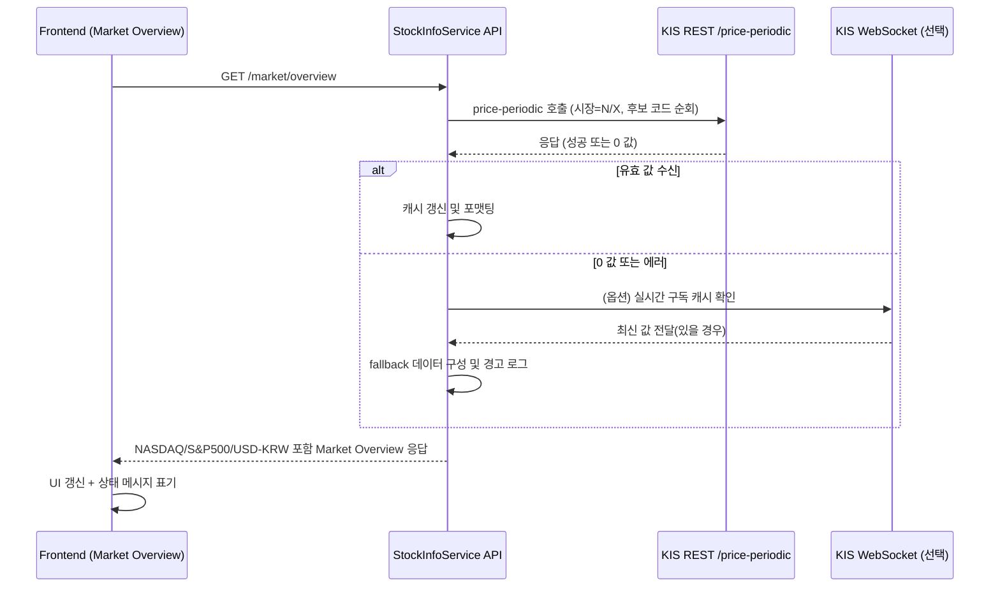

# NASDAQ / S&P 500 / USD-KRW 환율 연동 아키텍처 계획

## 1. 배경 및 목표
- `docs/plan/1008.nasdaq_snp500-KR_exchange.plan.md`에 정리된 조사 결과를 기반으로, 한국투자증권 OpenAPI에서 제공하는 해외 지수·환율 데이터를 백엔드/프론트엔드 전반에 통합한다.
- 기존 KOSPI/KOSDAQ 지수 로직을 확장해 NASDAQ, S&P 500, USD-KRW 환율을 Market Overview 섹션에 노출하고, REST/실시간(WebSocket) 양 경로를 활용 가능한 구조로 설계한다.

## 2. KIS API 지원 요약
| 항목 | 지원 여부 | FID_COND_MRKT_DIV_CODE | 대표 FID_INPUT_ISCD | 비고 |
| --- | --- | --- | --- | --- |
| NASDAQ 종합 지수 | ✅ | `N` (해외지수) | `NDX`, `IXIC` | 복수 코드 시도 필요 |
| S&P 500 지수 | ✅ | `N` | `US500`, `SPX` | 운영 환경에 따라 코드 차이 |
| USD/KRW 환율 | ✅ | `X` (환율) | `FX@KRW` | 기간 시세 중심 데이터 |

- REST 엔드포인트: `GET /uapi/overseas-price/v1/quotations/price-periodic`
- 필수 파라미터: `FID_COND_MRKT_DIV_CODE`, `FID_INPUT_ISCD`, `FID_INPUT_DATE_1`, `FID_INPUT_DATE_2`, `FID_PERIOD_DIV_CODE`
- 인증: OAuth2 Access Token (HashKey 불필요)

## 3. 구현 전략
### 3.1 백엔드 서비스 확장
1. `KoreaInvestAPIService`
   - `get_overseas_index_price()`(가칭) 비동기 메서드를 추가하여 해외 지수/환율 조회를 Wrap.
   - `FID_COND_MRKT_DIV_CODE`를 인자로 받아 N/X 분기 처리, 후보 `FID_INPUT_ISCD` 리스트를 순회하고 `MarketIndexData` 포맷으로 반환.
   - 실패 시 `last_raw_response`, `last_error`에 원문 메타(`rt_cd`, `msg_cd`, `msg1`) 저장.
2. 후보 코드 전략
   ```python
   OVERSEAS_INDEX_CANDIDATES = {
       "nasdaq": [("N", "NDX"), ("N", "IXIC")],
       "sp500": [("N", "US500"), ("N", "SPX")],
       "usdkrw": [("X", "FX@KRW")]
   }
   ```
   - KOSDAQ 복수 코드 순회 로직과 동일하게 재사용.
3. WebSocket 연동(옵션)
   - KIS 실시간 TR(`H0STISE0` 등)을 활용해 해외 지수/환율 채널 구독을 확장.
   - `realtime_service`에 캐시를 저장하고 REST 호출 실패 또는 0 값일 때 fallback.

### 3.2 StockInfoService 및 API 응답 구조
- `get_market_indices()`에서 `nasdaq`, `sp500`, `usdkrw` 키를 추가해 데이터를 수집.
- REST 성공 → 값 캐시 후 반환, 실패·0 값 → WebSocket 캐시/기본값으로 대체하고 경고 로그 출력.
- `get_market_overview()`에서 새 지표를 Market Overview 응답에 포함.

### 3.3 프론트엔드 업데이트
- Market Overview 컴포넌트/훅(`useMarketOverview`)에 NASDAQ, S&P 500, USD-KRW 섹션을 추가.
- 값이 0이거나 최신 타임스탬프가 없으면 "실시간 데이터 수신 대기 중" 등 안내 문구 노출.
- 필요 시 ToolTip/Badge에 REST vs WebSocket 공급원 정보 표기.

## 4. 테스트 전략
- `tests/test_overseas_index_service.py`(신규) 작성: 후보 코드별 REST 호출 후 `current` 등 값이 0이 아닌지 검증, 실패 시 `last_raw_response`를 출력.
- 통합 테스트: `python tests/test_overseas_index_service.py -v` (토큰 유효성 필요).
- 프론트엔드: `npm run test` 및 실제 UI 확인.
- 모니터링: 운영 중 `backend.log` 또는 API 로그에서 응답 코드(`rt_cd`, `msg_cd`) 상시 확인.

## 5. 운영 및 보안 유의사항
- AppKey/AppSecret, Access Token은 `.env`나 `config.yaml`에서 안전하게 관리하고 비공개 저장소에 커밋 금지.
- KIS Developers 포털의 해외 지수/환율 코드 파일을 정기적으로 동기화해 코드 변경에 대응.
- REST 응답이 잦은 0 값이면 WebSocket 또는 대체 코드를 우선 검토하고, 로그에 후보 실패 내역을 남겨 추후 분석.

## 6. 순서도 (Sequence Diagram)


## 7. 후속 작업 제안
- WebSocket 실시간 통합 여부를 결정하고, 필요 시 기존 KOSDAQ 실시간 캐시 구조를 활용해 해외 지수/환율도 동일하게 처리.
- Market Overview에 데이터 최신 시각, 공급 경로 표시를 추가해 운영자가 REST/실시간 상태를 즉시 확인 가능하도록 구현.
- 추가 지표(다우존스, 유로/달러 등) 확장을 고려할 경우, 동일한 후보 코드·캐시 전략을 템플릿화.

## 8. 단계별 구현 일정 (세부 Task)

### 8.1 Backend 1차 구현
- `brokers/korea_investment/ki_env.py` 환경 로더가 제공하는 토큰/기본 헤더를 재사용하도록 `KoreaInvestAPIService` 해외 지수/환율 메서드를 작성한다.
- `StockInfoService.get_market_indices()`에 NASDAQ/S&P500/USD-KRW 후보 코드 테이블을 추가하고, REST 응답 → 캐시 저장 → 반환 흐름을 완성한다.
- `main.py` 및 관련 FastAPI 라우트에서 신규 지표 필드가 직렬화되도록 스키마/응답 모델을 확장한다.

### 8.2 Backend 단위 테스트 및 CLI 검증
- `tests/test_overseas_index_service.py`(신규)에서 후보 코드별 호출을 검증하고, 응답이 0일 경우 raw 메타(`rt_cd`, `msg_cd`, `msg1`)를 출력한다.
- CLI 점검용 스크립트(예: `scripts/check_overseas_indices.py`)를 만들어 백엔드 실행 중 `python scripts/check_overseas_indices.py --target nasdaq` 형태로 각각의 지표를 수동 확인할 수 있도록 한다.
- `./vkis/bin/python -m pytest tests/test_overseas_index_service.py -v`로 기본 단위 테스트를 수행하고, CLI 스크립트 실행 로그를 저장해 운영 전 점검 도구로 활용한다.

### 8.3 Backend 통합 및 로그 정리
- REST 성공/실패 시 로그 레벨과 메시지(`rt_cd`, `msg1`, 후보 코드 시도 기록)를 정리해 `backend.log`에서 추적 가능하도록 한다.
- WebSocket fallback을 도입할 경우 `realtime_service`에 캐시 키(`overseas.nasdaq`, `overseas.sp500`, `overseas.usdkrw`)를 추가하고, REST 실패 시 자동 참조하도록 한다.
- 통합 완료 후 `backend/scripts/start_backend.sh`로 서버를 기동해 `/market/overview` 응답에 신규 필드가 포함되는지 확인한다.

### 8.4 Frontend UI 반영
- `MarketOverview` 관련 훅/컴포넌트에 NASDAQ/S&P500/USD-KRW 타일을 추가하고, 값 미존재 시 "실시간 데이터 수신 대기 중" 텍스트를 노출한다.
- 프론트 단위 테스트(필요 시 스냅샷 업데이트)와 `npm run test` 실행 후 수동으로 `http://localhost:9000`에서 UI를 확인한다.
- 백엔드 CLI 스크립트/단위 테스트가 모두 통과한 상태에서만 프론트 변경을 적용해 데이터 일관성을 유지한다.

### 8.5 배포 전 점검 체크리스트
- `ki_env.py`에서 읽어오는 토큰/승인 키가 실제 환경과 일치하는지 확인하고, 만료 시 `token_manager` 로직으로 자동 갱신되는지 검증한다.
- `docs/execution`에 테스트 로그와 실행 명령(`pytest`, CLI 스크립트, frontend test)을 기록해 후속 회고 및 운영에 참고한다.
