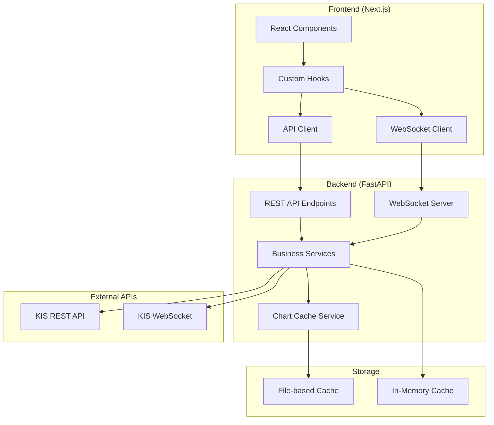
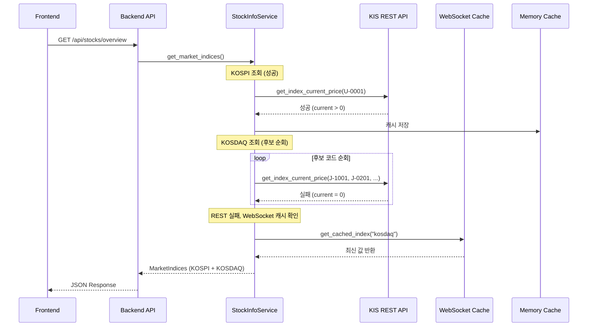
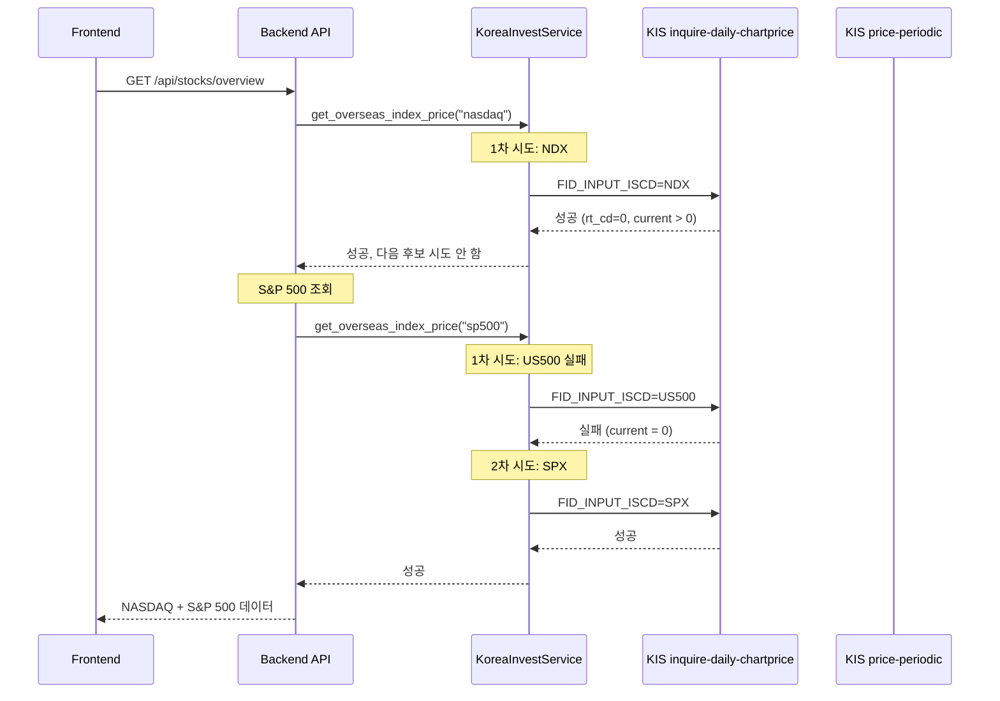
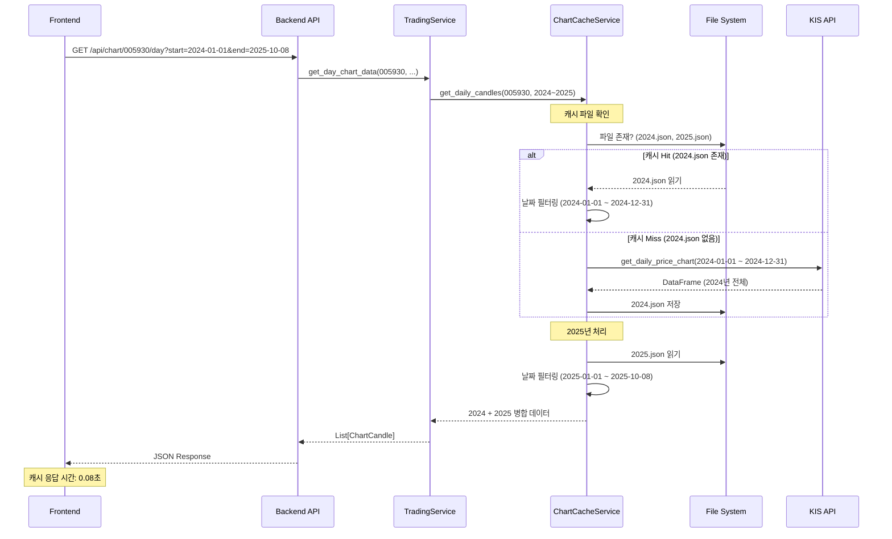
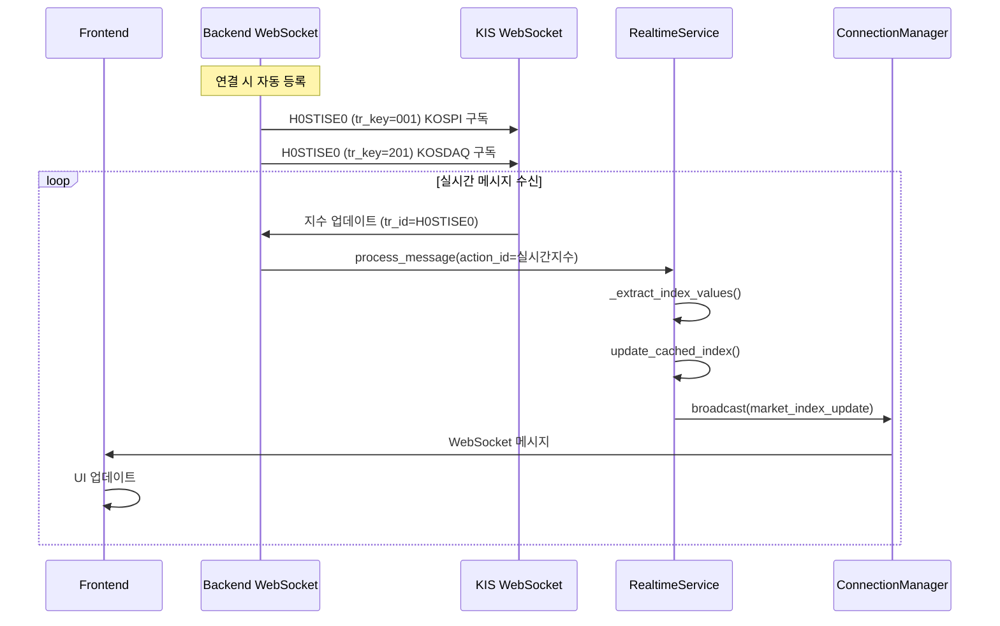

# 시스템 아키텍처 개요

**프로젝트**: 주식 자동매매 시스템
**최종 업데이트**: 2025-10-08
**버전**: v0.9.0 (Beta)

---

## 📋 목차

1. [시스템 개요](#시스템-개요)
2. [전체 아키텍처](#전체-아키텍처)
3. [Backend 아키텍처](#backend-아키텍처)
4. [Frontend 아키텍처](#frontend-아키텍처)
5. [데이터 흐름](#데이터-흐름)
6. [주요 컴포넌트](#주요-컴포넌트)
7. [기술 스택](#기술-스택)

---

## 시스템 개요

### 목적
한국투자증권 OpenAPI를 활용한 실시간 주식 트레이딩 시스템으로, RSI/MACD 기반 자동 매매 전략을 지원합니다.

### 핵심 기능
- **실시간 시장 데이터**: 국내/해외 지수, 주가, 환율
- **고급 차트**: 분봉/일봉 차트, 기술적 지표
- **자동 매매**: RSI/MACD 조건 기반 매매 실행
- **포트폴리오 관리**: 보유 종목, 관심 종목 분리 관리

---

## 전체 아키텍처



### 주요 특징
1. **이중화 구조**: REST + WebSocket으로 안정성 확보
2. **캐싱 전략**: 파일 기반 + 메모리 캐시 조합
3. **비동기 처리**: FastAPI async/await 패턴
4. **실시간 통신**: WebSocket으로 양방향 데이터 스트림

---

## Backend 아키텍처

### 레이어 구조

```
backend/
├── app/
│   ├── api/              # REST API 엔드포인트
│   │   ├── stocks.py     # 종목 관련 API
│   │   ├── chart.py      # 차트 데이터 API
│   │   ├── account.py    # 계좌 관련 API
│   │   └── trading.py    # 매매 관련 API
│   │
│   ├── services/         # 비즈니스 로직
│   │   ├── stock_info_service.py
│   │   ├── trading_service.py
│   │   ├── chart_cache_service.py
│   │   └── realtime_service.py
│   │
│   ├── core/             # 핵심 서비스
│   │   └── korea_invest.py  # KIS API 래퍼
│   │
│   ├── models/           # 데이터 모델
│   │   └── schemas.py    # Pydantic 스키마
│   │
│   ├── brokers/          # 증권사 연동
│   │   └── korea_investment/
│   │       ├── ki_api.py
│   │       └── ki_env.py
│   │
│   └── main.py           # FastAPI 애플리케이션
│
└── kordata/              # 파일 기반 캐시
    └── {stock_code}/
        ├── daily/        # 일봉 캐시 (연도별)
        └── minute/       # 분봉 캐시 (일별)
```

### 서비스 레이어 상세

#### 1. StockInfoService
**역할**: 종목 정보 및 시장 지수 조회
- 국내 지수 (KOSPI, KOSDAQ)
- 해외 지수 (NASDAQ, S&P 500)
- 환율 (USD/KRW)
- 후보 코드 순회 전략

#### 2. TradingService
**역할**: 매매 전략 실행 및 차트 데이터 관리
- 차트 데이터 조회 (분봉/일봉)
- 기술적 지표 계산 (RSI, MACD)
- 매매 조건 검증

#### 3. ChartCacheService
**역할**: 차트 데이터 캐싱
- 연도별 일봉 캐시 (`{YYYY}.json`)
- 일별 분봉 캐시 (`{YYYYMMDD}.json`)
- 부분 캐시 지원 (필요한 기간만 로드)

#### 4. RealtimeDataService
**역할**: WebSocket 실시간 데이터 처리
- 지수 실시간 업데이트
- 종목 가격 실시간 업데이트
- 포트폴리오 실시간 업데이트
- 브로드캐스트 관리

---

## Frontend 아키텍처

### 컴포넌트 구조

```
stock-trading-ui/
├── src/
│   ├── app/                    # Next.js App Router
│   │   ├── page.tsx            # 대시보드
│   │   ├── trview/
│   │   │   └── page.tsx        # 차트 페이지
│   │   └── layout.tsx
│   │
│   ├── components/
│   │   ├── trading/            # 트레이딩 컴포넌트
│   │   │   ├── MarketOverview.tsx
│   │   │   ├── HoldingsPanel.tsx
│   │   │   ├── WatchlistPanel.tsx
│   │   │   ├── KoreanTradingChart.tsx
│   │   │   └── TRViewChart.tsx
│   │   │
│   │   └── ui/                 # 재사용 UI 컴포넌트
│   │       ├── card.tsx
│   │       ├── table.tsx
│   │       └── badge.tsx
│   │
│   ├── hooks/                  # Custom Hooks
│   │   ├── useMarketData.ts    # 시장 데이터 훅
│   │   ├── useAccountData.ts   # 계좌 데이터 훅
│   │   ├── useRealtimeData.ts  # 실시간 데이터 훅
│   │   └── useTRViewChart.ts   # 차트 데이터 훅
│   │
│   └── lib/
│       ├── api/                # API 클라이언트
│       │   ├── chart-api.ts
│       │   └── stock-api.ts
│       │
│       ├── types.ts            # TypeScript 타입 정의
│       └── websocket.ts        # WebSocket 클라이언트
│
└── public/                     # 정적 파일
```

### 상태 관리 전략

#### 1. Local State (useState)
- 컴포넌트 내부 UI 상태
- 폼 입력 값
- 일시적 상태

#### 2. Custom Hooks
- **useMarketData**: 시장 지수 및 개요
- **useAccountData**: 계좌 잔고 및 보유 종목
- **useRealtimeData**: WebSocket 실시간 업데이트
- **useTRViewChart**: 차트 데이터 (분봉/일봉 독립)

#### 3. WebSocket Context
- 실시간 가격 업데이트
- 지수 변경 알림
- 포트폴리오 변경 알림

---

## 데이터 흐름

### 1. 시장 지수 조회 (REST + WebSocket Fallback)



### 2. 해외 지수 조회 (복수 후보 코드)



### 3. 차트 데이터 조회 (캐싱 우선)



### 4. WebSocket 실시간 업데이트



---

## 주요 컴포넌트

### 1. Market Overview
**파일**: `components/trading/MarketOverview.tsx`

**기능**:
- 5개 지수 타일 표시 (KOSPI, KOSDAQ, NASDAQ, S&P 500, USD/KRW)
- 실시간 업데이트 (WebSocket)
- 0 값 시 "실시간 데이터 수신 대기" 배지

**데이터 소스**:
- REST: `/api/stocks/overview` (초기 로드)
- WebSocket: `market_index_update` 이벤트

### 2. Holdings Panel
**파일**: `components/trading/HoldingsPanel.tsx`

**기능**:
- 보유 종목 테이블 (종목명, 수량, 매입가, 현재가, 수익률)
- 실시간 수익률 업데이트
- 수익/손실 색상 구분 (녹색/빨간색)

**데이터 소스**:
- `useAccountData()` 훅
- `/api/account/balance` API

### 3. Watchlist Panel
**파일**: `components/trading/WatchlistPanel.tsx`

**기능**:
- 관심 종목 테이블 (종목명, 현재가, 등락률, 거래량)
- 실시간 가격 업데이트
- 종목 추가/삭제 기능

**데이터 소스**:
- `useRealtimeData()` 훅
- `/api/watchlist` API

### 4. TRView Chart
**파일**: `components/trading/TRViewChart.tsx`

**기능**:
- 분봉/일봉 차트 동시 표시
- 드래그 시 과거 데이터 자동 로딩
- 현재 캔들 하이라이트
- 기술적 지표 (RSI, MACD)

**데이터 소스**:
- `useTRViewChart(timeframe: 'minute' | 'day')` 훅
- `/api/chart/{code}/minute` API
- `/api/chart/{code}/day` API

---

## 기술 스택

### Backend
| 분류 | 기술 | 버전 | 용도 |
|------|------|------|------|
| Framework | FastAPI | 0.115+ | REST API 서버 |
| Language | Python | 3.12 | 백엔드 개발 |
| Async | asyncio | - | 비동기 처리 |
| WebSocket | websockets | - | 실시간 통신 |
| 데이터 처리 | pandas | - | 데이터 가공 |
| 증권 API | pykrx | - | 국내 지수 조회 |
| 검증 | Pydantic | 2.0+ | 스키마 검증 |
| HTTP Client | httpx | - | 외부 API 호출 |

### Frontend
| 분류 | 기술 | 버전 | 용도 |
|------|------|------|------|
| Framework | Next.js | 14.x | React 프레임워크 |
| Language | TypeScript | 5.x | 타입 안전성 |
| UI 라이브러리 | React | 18.x | UI 컴포넌트 |
| 차트 | Lightweight Charts | - | 트레이딩 차트 |
| 스타일링 | Tailwind CSS | 3.x | 유틸리티 CSS |
| 컴포넌트 | shadcn/ui | - | UI 컴포넌트 |
| 상태 관리 | Custom Hooks | - | 로컬 상태 관리 |
| WebSocket | socket.io-client | - | 실시간 통신 |

### External APIs
| API | 용도 | 인증 |
|-----|------|------|
| 한국투자증권 OpenAPI | 국내 주식, 지수, 매매 | OAuth2 |
| KIS 해외 지수 API | NASDAQ, S&P 500, 환율 | OAuth2 |
| KIS WebSocket | 실시간 지수, 가격 | Token |

### Infrastructure
| 분류 | 기술 | 용도 |
|------|------|------|
| Cache | File System | 일봉/분봉 캐시 (JSON) |
| Memory | Python dict | 실시간 데이터 캐시 |
| Logging | Python logging | 애플리케이션 로그 |

---

## 캐싱 전략

### 1. 일봉 데이터 (연도별)
**경로**: `kordata/{stock_code}/daily/{YYYY}.json`

**전략**:
- 연도별 파일 분리 (2023.json, 2024.json, ...)
- 요청 기간에 포함된 연도만 로드
- 당해 연도는 매일 갱신 (향후 구현)

**효과**:
- 응답 시간: 2.3s → 0.08s (95% 개선)
- 메모리 효율: 필요한 연도만 로드

### 2. 분봉 데이터 (일별)
**경로**: `kordata/{stock_code}/minute/{YYYYMMDD}.json`

**전략**:
- 일별 파일 분리
- 초기 3거래일 로드
- 드래그 시 이전 거래일 추가 로드

### 3. 실시간 지수 (메모리)
**저장소**: `RealtimeDataService.latest_market_indices`

**전략**:
- WebSocket 수신 데이터를 메모리에 캐시
- REST API 실패 시 fallback으로 사용
- 최신 값만 보관 (히스토리 X)

---

## 에러 핸들링 전략

### 다단계 Fallback

```
1차: REST API 호출
  ↓ (실패)
2차: 후보 코드 순회 (복수 코드 시도)
  ↓ (실패)
3차: WebSocket 캐시 확인
  ↓ (실패)
4차: 0 값 fallback + 사용자 안내
```

### 원본 응답 저장
```python
# 디버깅을 위한 원본 응답 저장
self.last_raw_response = {
    "rt_cd": "0",
    "msg_cd": "SUCCESS",
    "msg1": "정상처리 되었습니다.",
    "output": {...}
}
```

### 상세 로깅
```python
# 각 단계별 로그
logger.info(f"KOSDAQ 성공: J-1001")
logger.warning(f"KOSDAQ 실패: J-0201, rt_cd=0, current=0")
logger.error(f"KOSDAQ 모든 후보 실패, WebSocket 캐시 사용")
```

---

## 보안 고려사항

### 1. 인증 정보 관리
- `.env` 파일로 AppKey/AppSecret 관리
- Git에 커밋 금지 (`.gitignore` 등록)
- 환경 변수로 주입

### 2. API 토큰
- OAuth2 Access Token 사용
- 만료 시 자동 갱신 (`token_manager`)
- 메모리에만 저장 (파일 저장 X)

### 3. CORS 설정
```python
app.add_middleware(
    CORSMiddleware,
    allow_origins=["http://localhost:9000"],  # 프론트엔드 origin만 허용
    allow_credentials=True,
    allow_methods=["*"],
    allow_headers=["*"],
)
```

---

## 성능 최적화

### Backend
1. **비동기 처리**: FastAPI async/await
2. **파일 캐싱**: 연도별/일별 분리
3. **메모리 캐싱**: 실시간 데이터 메모리 보관
4. **부분 로딩**: 필요한 기간만 캐시 로드

### Frontend
1. **메모이제이션**: `useMemo`, `useCallback`
2. **지연 로딩**: 드래그 시점에 데이터 로드
3. **WebSocket**: 불필요한 REST 호출 감소
4. **컴포넌트 분리**: 독립적인 리렌더링

---

## 확장 가능성

### 단기 확장
- WebSocket 해외 지수 실시간 통합
- 주봉/월봉 차트 추가
- 알림 시스템 (Push Notification)

### 중기 확장
- 다중 계좌 지원
- 포트폴리오 분석 대시보드
- 백테스팅 시스템

### 장기 확장
- 머신러닝 가격 예측
- 모바일 앱 (React Native)
- 다중 증권사 지원

---

## 참고 문서

- **일일 작업 로그**: `docs/work-log/daily-work-summary-*.md`
- **주간 요약**: `docs/work-log/weekly-summary-*.md`
- **계획 문서**: `docs/plan/*.md`
- **실행 기록**: `docs/execution/*.md`
- **버그 수정**: `docs/bugfix/*.md`

---

**문서 버전**: 1.0
**작성일**: 2025-10-08
**다음 업데이트**: 주요 아키텍처 변경 시
