# Dashboard Architecture Document
**프로젝트**: 주식 매매 시스템 Dashboard 업그레이드
**버전**: 1.1
**작성일**: 2025-10-10
**최종 수정**: 2025-10-10 (실제 데이터 사용 명확화)
**Base Document**: [1010.dashboard.upgrade.plan.md v2.4](../plan/1010.dashboard.upgrade.plan.md)

---

## 📋 문서 개요

본 문서는 Dashboard 업그레이드 계획을 기반으로 시스템의 아키텍처를 정의합니다. Mermaid UML을 사용하여 구조 다이어그램과 주요 시퀀스 다이어그램을 제공합니다.

---

## 🏗️ 1. System Architecture Overview

### 1.1 High-Level System Architecture

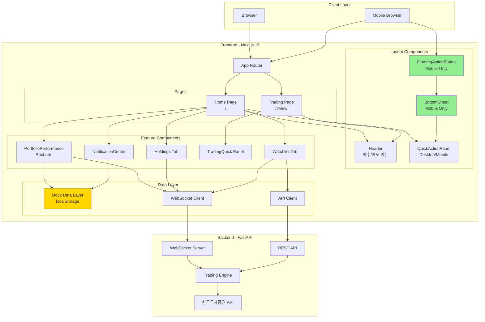
```mermaid
graph TB
    subgraph "Client Layer"
        Browser[Browser]
        Mobile[Mobile Browser]
    end

    subgraph "Frontend - Next.js 15"
        AppRouter[App Router]

        subgraph "Pages"
            HomePage[Home Page<br/>/]
            TradingPage[Trading Page<br/>/trview]
        end

        subgraph "Layout Components"
            Header[Header<br/>매수/매도 메뉴]
            QuickActionPanel[QuickActionPanel<br/>Desktop/Mobile]
            FAB[FloatingActionButton<br/>Mobile Only]
            BottomSheet[BottomSheet<br/>Mobile Only]
        end

        subgraph "Feature Components"
            Portfolio[PortfolioPerformance<br/>Recharts]
            Holdings[Holdings Tab]
            Watchlist[Watchlist Tab]
            TradingQuick[TradingQuick Panel]
            NotificationCenter[NotificationCenter]
        end

        subgraph "Data Layer"
            MockData[Mock Data Layer<br/>localStorage]
            WebSocketClient[WebSocket Client]
            APIClient[API Client]
        end
    end

    subgraph "Backend - FastAPI"
        WebSocketServer[WebSocket Server]
        RESTApi[REST API]
        TradingEngine[Trading Engine]
        KoreaInvest[한국투자증권 API]
    end

    Browser --> AppRouter
    Mobile --> AppRouter

    AppRouter --> HomePage
    AppRouter --> TradingPage

    HomePage --> Header
    HomePage --> Portfolio
    HomePage --> Holdings
    HomePage --> Watchlist
    HomePage --> QuickActionPanel
    HomePage --> NotificationCenter

    Mobile --> FAB
    FAB --> BottomSheet
    BottomSheet --> QuickActionPanel

    TradingPage --> Header
    TradingPage --> TradingQuick

    Portfolio --> WebSocketClient
    Portfolio --> MockData
    Holdings --> WebSocketClient
    Watchlist --> WebSocketClient
    Watchlist --> APIClient
    NotificationCenter --> MockData

    WebSocketClient --> WebSocketServer
    APIClient --> RESTApi

    WebSocketServer --> TradingEngine
    RESTApi --> TradingEngine
    TradingEngine --> KoreaInvest

    style MockData fill:#ffd700
    style FAB fill:#90EE90
    style BottomSheet fill:#90EE90
```

### 1.2 Technology Stack

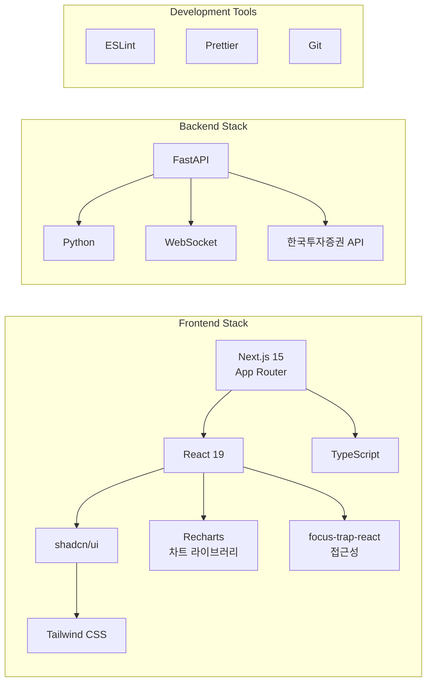
```mermaid
graph LR
    subgraph "Frontend Stack"
        NextJS[Next.js 15<br/>App Router]
        React[React 19]
        TypeScript[TypeScript]
        Tailwind[Tailwind CSS]
        ShadcnUI[shadcn/ui]
        Recharts[Recharts<br/>차트 라이브러리]
        FocusTrap[focus-trap-react<br/>접근성]
    end

    subgraph "Backend Stack"
        FastAPI[FastAPI]
        Python[Python]
        WebSocket[WebSocket]
        KoreaAPI[한국투자증권 API]
    end

    subgraph "Development Tools"
        ESLint[ESLint]
        Prettier[Prettier]
        Git[Git]
    end

    NextJS --> React
    NextJS --> TypeScript
    React --> ShadcnUI
    ShadcnUI --> Tailwind
    React --> Recharts
    React --> FocusTrap

    FastAPI --> Python
    FastAPI --> WebSocket
    FastAPI --> KoreaAPI
```

---

## 🧩 2. Component Structure

### 2.1 Component Hierarchy

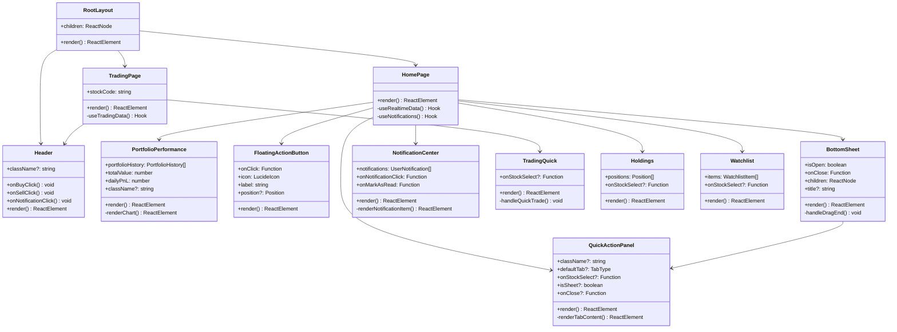
```mermaid
classDiagram
    class RootLayout {
        +children: ReactNode
        +render() ReactElement
    }

    class HomePage {
        +render() ReactElement
        -useRealtimeData() Hook
        -useNotifications() Hook
    }

    class TradingPage {
        +stockCode: string
        +render() ReactElement
        -useTradingData() Hook
    }

    class Header {
        +className?: string
        +onBuyClick() void
        +onSellClick() void
        +onNotificationClick() void
        +render() ReactElement
    }

    class PortfolioPerformance {
        +portfolioHistory: PortfolioHistory[]
        +totalValue: number
        +dailyPnL: number
        +className?: string
        +render() ReactElement
        -renderChart() ReactElement
    }

    class QuickActionPanel {
        +className?: string
        +defaultTab?: TabType
        +onStockSelect?: Function
        +isSheet?: boolean
        +onClose?: Function
        +render() ReactElement
        -renderTabContent() ReactElement
    }

    class FloatingActionButton {
        +onClick: Function
        +icon: LucideIcon
        +label: string
        +position?: Position
        +render() ReactElement
    }

    class BottomSheet {
        +isOpen: boolean
        +onClose: Function
        +children: ReactNode
        +title?: string
        +render() ReactElement
        -handleDragEnd() void
    }

    class NotificationCenter {
        +notifications: UserNotification[]
        +onNotificationClick: Function
        +onMarkAsRead: Function
        +render() ReactElement
        -renderNotificationItem() ReactElement
    }

    class TradingQuick {
        +onStockSelect?: Function
        +render() ReactElement
        -handleQuickTrade() void
    }

    class Holdings {
        +positions: Position[]
        +onStockSelect?: Function
        +render() ReactElement
    }

    class Watchlist {
        +items: WatchlistItem[]
        +onStockSelect?: Function
        +render() ReactElement
    }

    RootLayout --> Header
    RootLayout --> HomePage
    RootLayout --> TradingPage

    HomePage --> PortfolioPerformance
    HomePage --> Holdings
    HomePage --> Watchlist
    HomePage --> QuickActionPanel
    HomePage --> NotificationCenter
    HomePage --> FloatingActionButton
    HomePage --> BottomSheet

    TradingPage --> Header
    TradingPage --> TradingQuick

    BottomSheet --> QuickActionPanel
```

### 2.2 Key Component Interfaces

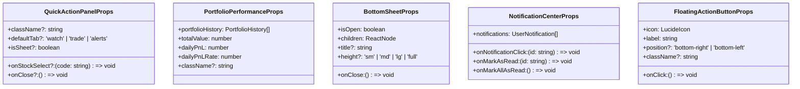
```mermaid
classDiagram
    class QuickActionPanelProps {
        +className?: string
        +defaultTab?: 'watch' | 'trade' | 'alerts'
        +onStockSelect?: (code: string) => void
        +isSheet?: boolean
        +onClose?: () => void
    }

    class PortfolioPerformanceProps {
        +portfolioHistory: PortfolioHistory[]
        +totalValue: number
        +dailyPnL: number
        +dailyPnLRate: number
        +className?: string
    }

    class BottomSheetProps {
        +isOpen: boolean
        +onClose: () => void
        +children: ReactNode
        +title?: string
        +height?: 'sm' | 'md' | 'lg' | 'full'
    }

    class NotificationCenterProps {
        +notifications: UserNotification[]
        +onNotificationClick: (id: string) => void
        +onMarkAsRead: (id: string) => void
        +onMarkAllAsRead: () => void
    }

    class FloatingActionButtonProps {
        +onClick: () => void
        +icon: LucideIcon
        +label: string
        +position?: 'bottom-right' | 'bottom-left'
        +className?: string
    }
```

---

## 📊 3. Data Models

### 3.1 Type System Architecture

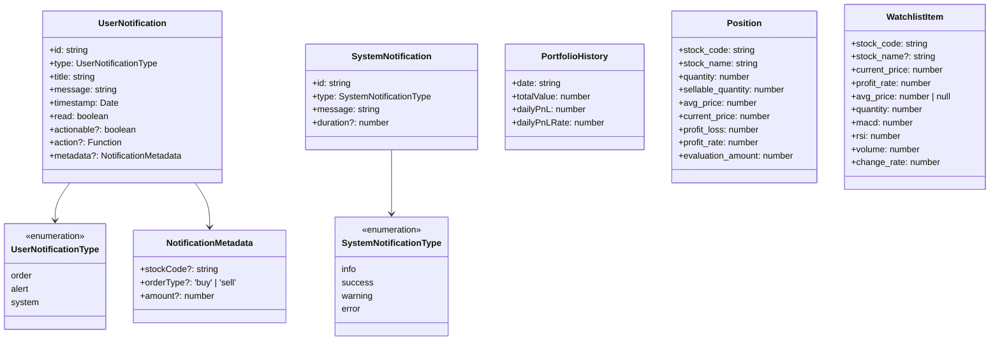
```mermaid
classDiagram
    class UserNotification {
        +id: string
        +type: UserNotificationType
        +title: string
        +message: string
        +timestamp: Date
        +read: boolean
        +actionable?: boolean
        +action?: Function
        +metadata?: NotificationMetadata
    }

    class SystemNotification {
        +id: string
        +type: SystemNotificationType
        +message: string
        +duration?: number
    }

    class NotificationMetadata {
        +stockCode?: string
        +orderType?: 'buy' | 'sell'
        +amount?: number
    }

    class UserNotificationType {
        <<enumeration>>
        order
        alert
        system
    }

    class SystemNotificationType {
        <<enumeration>>
        info
        success
        warning
        error
    }

    class PortfolioHistory {
        +date: string
        +totalValue: number
        +dailyPnL: number
        +dailyPnLRate: number
    }

    class Position {
        +stock_code: string
        +stock_name: string
        +quantity: number
        +sellable_quantity: number
        +avg_price: number
        +current_price: number
        +profit_loss: number
        +profit_rate: number
        +evaluation_amount: number
    }

    class WatchlistItem {
        +stock_code: string
        +stock_name?: string
        +current_price: number
        +profit_rate: number
        +avg_price: number | null
        +quantity: number
        +macd: number
        +rsi: number
        +volume: number
        +change_rate: number
    }

    UserNotification --> UserNotificationType
    UserNotification --> NotificationMetadata
    SystemNotification --> SystemNotificationType
```

### 3.2 State Management

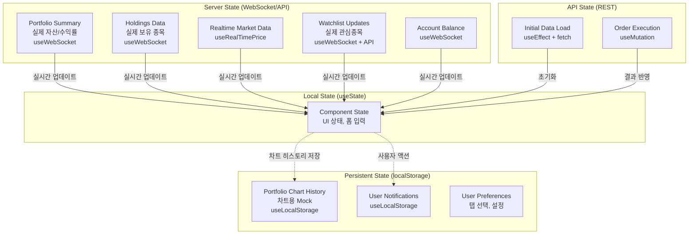
```mermaid
graph TB
    subgraph "Local State (useState)"
        ComponentState[Component State<br/>UI 상태, 폼 입력]
    end

    subgraph "Persistent State (localStorage)"
        PortfolioChartData[Portfolio Chart History<br/>차트용 Mock<br/>useLocalStorage]
        NotificationData[User Notifications<br/>useLocalStorage]
        UserPreferences[User Preferences<br/>탭 선택, 설정]
    end

    subgraph "Server State (WebSocket/API)"
        PortfolioSummary[Portfolio Summary<br/>실제 자산/수익률<br/>useWebSocket]
        HoldingsData[Holdings Data<br/>실제 보유 종목<br/>useWebSocket]
        RealtimeData[Realtime Market Data<br/>useRealTimePrice]
        WatchlistData[Watchlist Updates<br/>실제 관심종목<br/>useWebSocket + API]
        AccountData[Account Balance<br/>useWebSocket]
    end

    subgraph "API State (REST)"
        InitialData[Initial Data Load<br/>useEffect + fetch]
        MutationData[Order Execution<br/>useMutation]
    end

    ComponentState -.->|차트 히스토리 저장| PortfolioChartData
    ComponentState -.->|사용자 액션| NotificationData

    PortfolioSummary -->|실시간 업데이트| ComponentState
    HoldingsData -->|실시간 업데이트| ComponentState
    RealtimeData -->|실시간 업데이트| ComponentState
    WatchlistData -->|실시간 업데이트| ComponentState
    AccountData -->|실시간 업데이트| ComponentState

    InitialData -->|초기화| ComponentState
    MutationData -->|결과 반영| ComponentState
```

---

## 🔄 4. Key Sequence Diagrams

### 4.1 Mobile FAB + Bottom Sheet Workflow

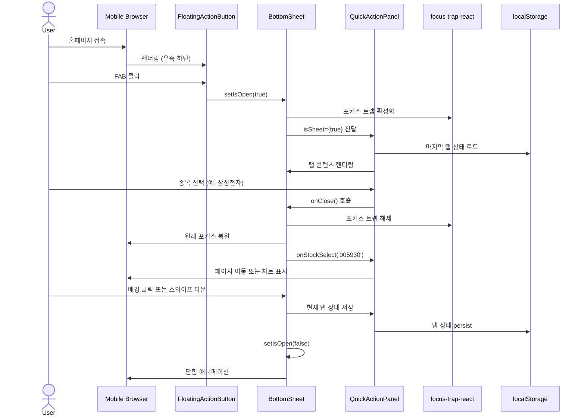
```mermaid
sequenceDiagram
    actor User
    participant Mobile as Mobile Browser
    participant FAB as FloatingActionButton
    participant BottomSheet as BottomSheet
    participant QuickPanel as QuickActionPanel
    participant FocusTrap as focus-trap-react
    participant LocalStorage as localStorage

    User->>Mobile: 홈페이지 접속
    Mobile->>FAB: 렌더링 (우측 하단)

    User->>FAB: FAB 클릭
    FAB->>BottomSheet: setIsOpen(true)
    BottomSheet->>FocusTrap: 포커스 트랩 활성화
    BottomSheet->>QuickPanel: isSheet={true} 전달
    QuickPanel->>LocalStorage: 마지막 탭 상태 로드
    QuickPanel->>BottomSheet: 탭 콘텐츠 렌더링

    User->>QuickPanel: 종목 선택 (예: 삼성전자)
    QuickPanel->>BottomSheet: onClose() 호출
    BottomSheet->>FocusTrap: 포커스 트랩 해제
    BottomSheet->>Mobile: 원래 포커스 복원
    BottomSheet->>QuickPanel: onStockSelect('005930')
    QuickPanel->>Mobile: 페이지 이동 또는 차트 표시

    User->>BottomSheet: 배경 클릭 또는 스와이프 다운
    BottomSheet->>QuickPanel: 현재 탭 상태 저장
    QuickPanel->>LocalStorage: 탭 상태 persist
    BottomSheet->>BottomSheet: setIsOpen(false)
    BottomSheet->>Mobile: 닫힘 애니메이션
```

### 4.2 UserNotification System Workflow

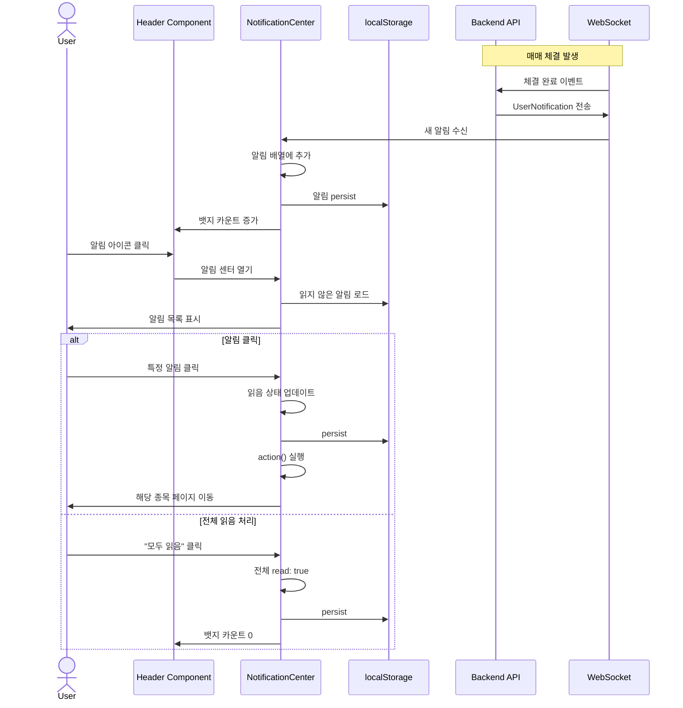
```mermaid
sequenceDiagram
    actor User
    participant Header as Header Component
    participant NotifCenter as NotificationCenter
    participant LocalStorage as localStorage
    participant Backend as Backend API
    participant WebSocket as WebSocket

    Note over Backend,WebSocket: 매매 체결 발생
    WebSocket->>Backend: 체결 완료 이벤트
    Backend->>WebSocket: UserNotification 전송
    WebSocket->>NotifCenter: 새 알림 수신

    NotifCenter->>NotifCenter: 알림 배열에 추가
    NotifCenter->>LocalStorage: 알림 persist
    NotifCenter->>Header: 뱃지 카운트 증가

    User->>Header: 알림 아이콘 클릭
    Header->>NotifCenter: 알림 센터 열기
    NotifCenter->>LocalStorage: 읽지 않은 알림 로드
    NotifCenter->>User: 알림 목록 표시

    alt 알림 클릭
        User->>NotifCenter: 특정 알림 클릭
        NotifCenter->>NotifCenter: 읽음 상태 업데이트
        NotifCenter->>LocalStorage: persist
        NotifCenter->>NotifCenter: action() 실행
        NotifCenter->>User: 해당 종목 페이지 이동
    else 전체 읽음 처리
        User->>NotifCenter: "모두 읽음" 클릭
        NotifCenter->>NotifCenter: 전체 read: true
        NotifCenter->>LocalStorage: persist
        NotifCenter->>Header: 뱃지 카운트 0
    end
```

### 4.3 PortfolioPerformance Chart Loading

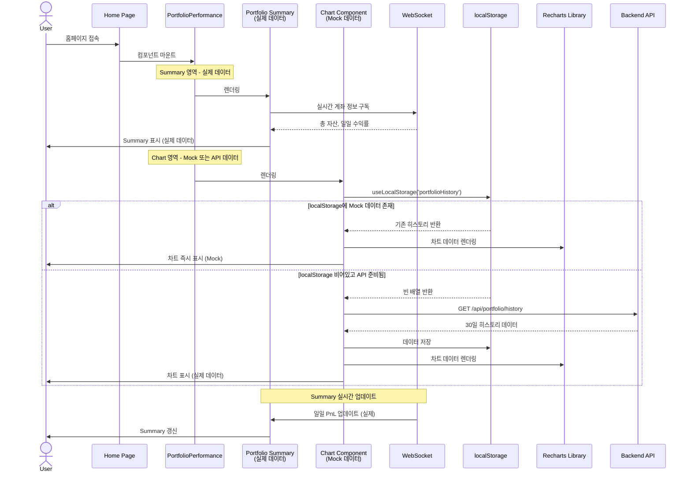
```mermaid
sequenceDiagram
    actor User
    participant HomePage as Home Page
    participant PortfolioComp as PortfolioPerformance
    participant Summary as Portfolio Summary<br/>(실제 데이터)
    participant Chart as Chart Component<br/>(Mock 데이터)
    participant WebSocket as WebSocket
    participant LocalStorage as localStorage
    participant Recharts as Recharts Library
    participant Backend as Backend API

    User->>HomePage: 홈페이지 접속
    HomePage->>PortfolioComp: 컴포넌트 마운트

    Note over PortfolioComp: Summary 영역 - 실제 데이터
    PortfolioComp->>Summary: 렌더링
    Summary->>WebSocket: 실시간 계좌 정보 구독
    WebSocket-->>Summary: 총 자산, 일일 수익률
    Summary->>User: Summary 표시 (실제 데이터)

    Note over PortfolioComp: Chart 영역 - Mock 또는 API 데이터
    PortfolioComp->>Chart: 렌더링
    Chart->>LocalStorage: useLocalStorage('portfolioHistory')
    alt localStorage에 Mock 데이터 존재
        LocalStorage-->>Chart: 기존 히스토리 반환
        Chart->>Recharts: 차트 데이터 렌더링
        Chart->>User: 차트 즉시 표시 (Mock)
    else localStorage 비어있고 API 준비됨
        LocalStorage-->>Chart: 빈 배열 반환
        Chart->>Backend: GET /api/portfolio/history
        Backend-->>Chart: 30일 히스토리 데이터
        Chart->>LocalStorage: 데이터 저장
        Chart->>Recharts: 차트 데이터 렌더링
        Chart->>User: 차트 표시 (실제 데이터)
    end

    Note over Summary,WebSocket: Summary 실시간 업데이트
    WebSocket->>Summary: 일일 PnL 업데이트 (실제)
    Summary->>User: Summary 갱신
```

### 4.4 QuickActionPanel Reuse (Desktop vs Mobile)

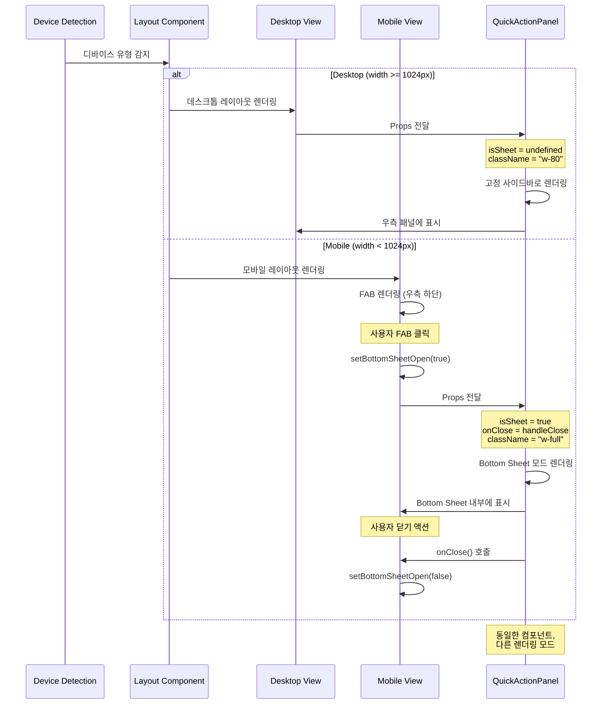
```mermaid
sequenceDiagram
    participant Device as Device Detection
    participant Layout as Layout Component
    participant Desktop as Desktop View
    participant Mobile as Mobile View
    participant QuickPanel as QuickActionPanel

    Device->>Layout: 디바이스 유형 감지

    alt Desktop (width >= 1024px)
        Layout->>Desktop: 데스크톱 레이아웃 렌더링
        Desktop->>QuickPanel: Props 전달
        Note over QuickPanel: isSheet = undefined<br/>className = "w-80"
        QuickPanel->>QuickPanel: 고정 사이드바로 렌더링
        QuickPanel->>Desktop: 우측 패널에 표시
    else Mobile (width < 1024px)
        Layout->>Mobile: 모바일 레이아웃 렌더링
        Mobile->>Mobile: FAB 렌더링 (우측 하단)

        Note over Mobile: 사용자 FAB 클릭
        Mobile->>Mobile: setBottomSheetOpen(true)
        Mobile->>QuickPanel: Props 전달
        Note over QuickPanel: isSheet = true<br/>onClose = handleClose<br/>className = "w-full"
        QuickPanel->>QuickPanel: Bottom Sheet 모드 렌더링
        QuickPanel->>Mobile: Bottom Sheet 내부에 표시

        Note over Mobile: 사용자 닫기 액션
        QuickPanel->>Mobile: onClose() 호출
        Mobile->>Mobile: setBottomSheetOpen(false)
    end

    Note over QuickPanel: 동일한 컴포넌트,<br/>다른 렌더링 모드
```

### 4.5 Holdings/Watchlist Tab Integration

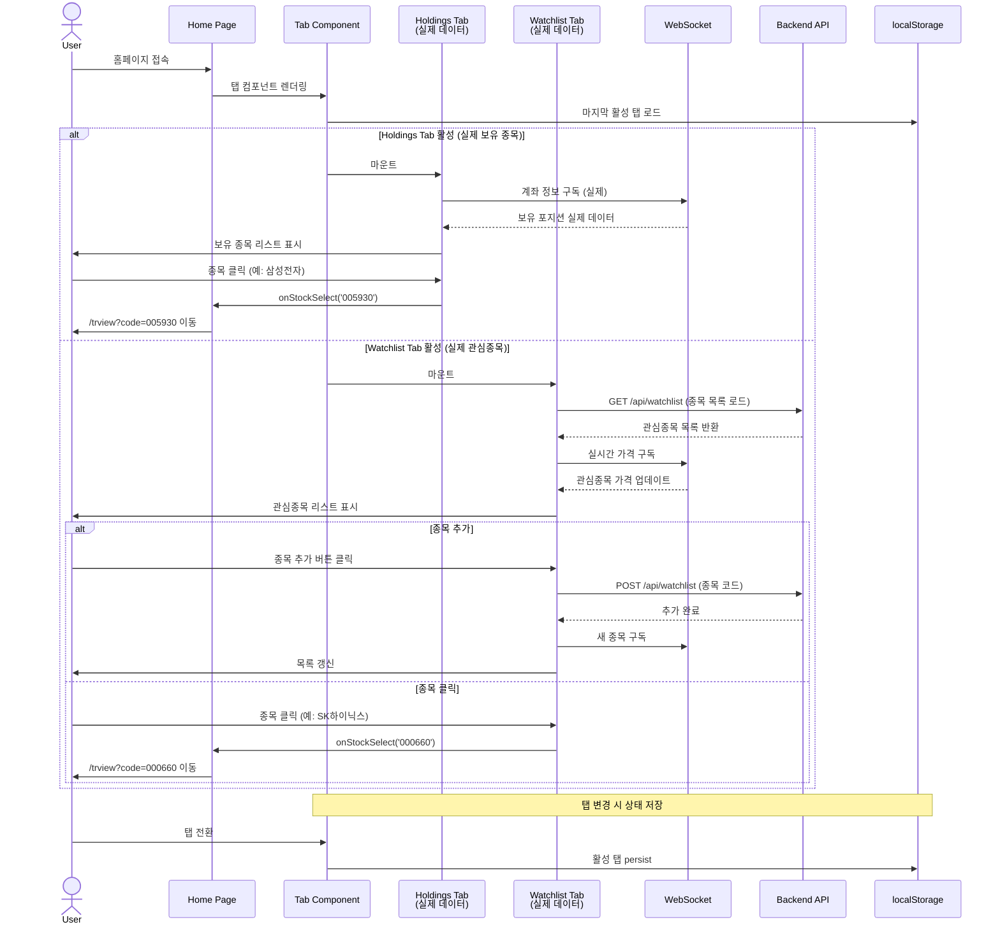
```mermaid
sequenceDiagram
    actor User
    participant HomePage as Home Page
    participant Tabs as Tab Component
    participant Holdings as Holdings Tab<br/>(실제 데이터)
    participant Watchlist as Watchlist Tab<br/>(실제 데이터)
    participant WebSocket as WebSocket
    participant Backend as Backend API
    participant LocalStorage as localStorage

    User->>HomePage: 홈페이지 접속
    HomePage->>Tabs: 탭 컴포넌트 렌더링
    Tabs->>LocalStorage: 마지막 활성 탭 로드

    alt Holdings Tab 활성 (실제 보유 종목)
        Tabs->>Holdings: 마운트
        Holdings->>WebSocket: 계좌 정보 구독 (실제)
        WebSocket-->>Holdings: 보유 포지션 실제 데이터
        Holdings->>User: 보유 종목 리스트 표시

        User->>Holdings: 종목 클릭 (예: 삼성전자)
        Holdings->>HomePage: onStockSelect('005930')
        HomePage->>User: /trview?code=005930 이동
    else Watchlist Tab 활성 (실제 관심종목)
        Tabs->>Watchlist: 마운트
        Watchlist->>Backend: GET /api/watchlist (종목 목록 로드)
        Backend-->>Watchlist: 관심종목 목록 반환
        Watchlist->>WebSocket: 실시간 가격 구독
        WebSocket-->>Watchlist: 관심종목 가격 업데이트
        Watchlist->>User: 관심종목 리스트 표시

        alt 종목 추가
            User->>Watchlist: 종목 추가 버튼 클릭
            Watchlist->>Backend: POST /api/watchlist (종목 코드)
            Backend-->>Watchlist: 추가 완료
            Watchlist->>WebSocket: 새 종목 구독
            Watchlist->>User: 목록 갱신
        else 종목 클릭
            User->>Watchlist: 종목 클릭 (예: SK하이닉스)
            Watchlist->>HomePage: onStockSelect('000660')
            HomePage->>User: /trview?code=000660 이동
        end
    end

    Note over Tabs,LocalStorage: 탭 변경 시 상태 저장
    User->>Tabs: 탭 전환
    Tabs->>LocalStorage: 활성 탭 persist
```

---

## 🚀 5. Phase-by-Phase Architecture Evolution

### 5.1 Phase 0: Foundation Setup

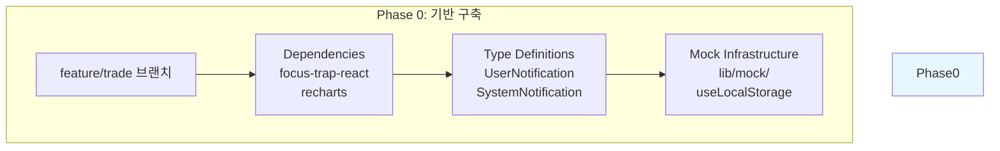
```mermaid
graph TB
    subgraph "Phase 0: 기반 구축"
        Branch[feature/trade 브랜치]
        Deps[Dependencies<br/>focus-trap-react<br/>recharts]
        Types[Type Definitions<br/>UserNotification<br/>SystemNotification]
        MockInfra[Mock Infrastructure<br/>lib/mock/<br/>useLocalStorage]

        Branch --> Deps
        Deps --> Types
        Types --> MockInfra
    end

    style Phase0 fill:#e6f7ff
```

### 5.2 Phase 1-A: Mobile FAB + Bottom Sheet

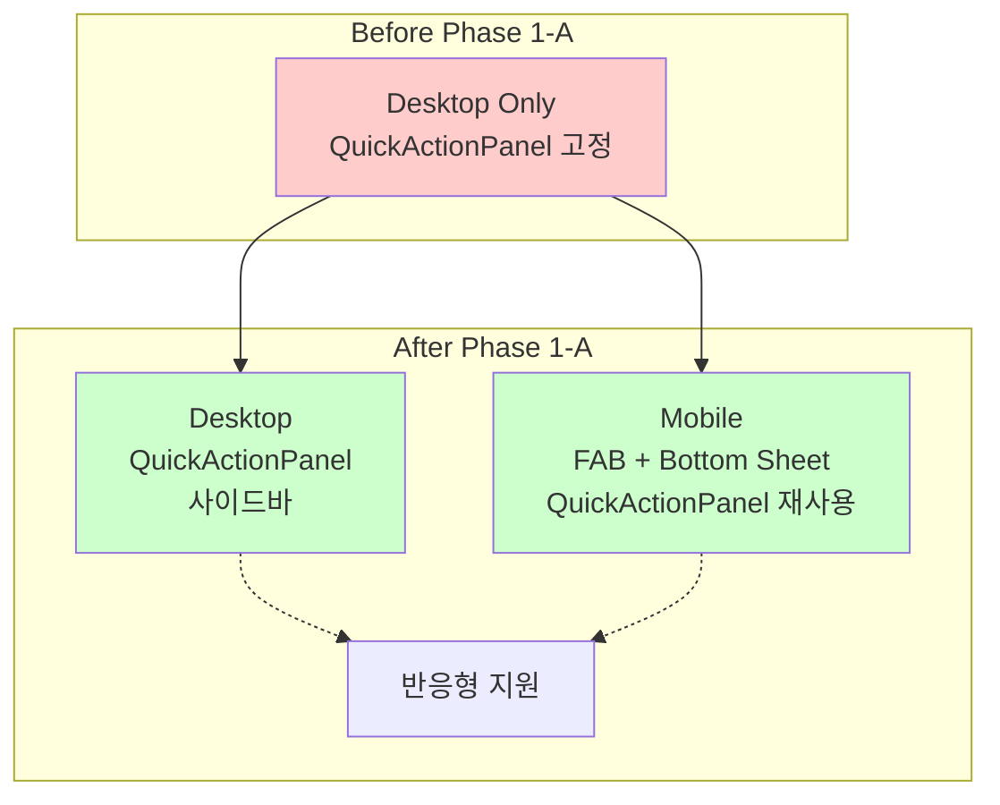
```mermaid
graph TB
    subgraph "Before Phase 1-A"
        DesktopOnly[Desktop Only<br/>QuickActionPanel 고정]
    end

    subgraph "After Phase 1-A"
        Desktop[Desktop<br/>QuickActionPanel<br/>사이드바]
        Mobile[Mobile<br/>FAB + Bottom Sheet<br/>QuickActionPanel 재사용]

        Desktop -.-> Responsive[반응형 지원]
        Mobile -.-> Responsive
    end

    DesktopOnly --> Desktop
    DesktopOnly --> Mobile

    style DesktopOnly fill:#ffcccc
    style Desktop fill:#ccffcc
    style Mobile fill:#ccffcc
```

### 5.3 Phase 1-B: QuickActionPanel Enhancement

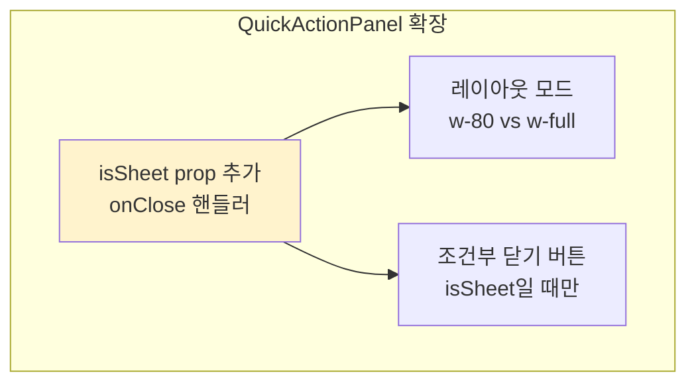
```mermaid
graph TB
    subgraph "QuickActionPanel 확장"
        Props[isSheet prop 추가<br/>onClose 핸들러]
        Layout[레이아웃 모드<br/>w-80 vs w-full]
        CloseBtn[조건부 닫기 버튼<br/>isSheet일 때만]

        Props --> Layout
        Props --> CloseBtn
    end

    style Props fill:#fff3cd
```

### 5.4 Phase 2: PortfolioPerformance Chart

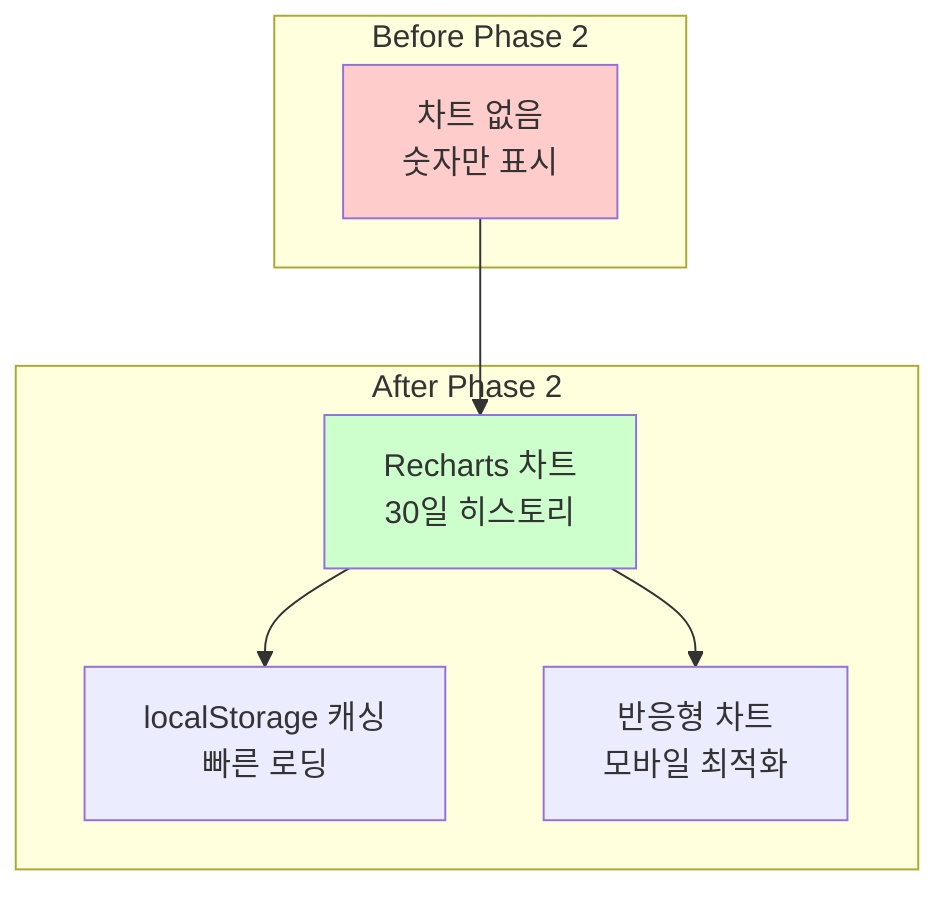
```mermaid
graph TB
    subgraph "Before Phase 2"
        NoChart[차트 없음<br/>숫자만 표시]
    end

    subgraph "After Phase 2"
        Chart[Recharts 차트<br/>30일 히스토리]
        LocalCache[localStorage 캐싱<br/>빠른 로딩]
        Responsive2[반응형 차트<br/>모바일 최적화]

        Chart --> LocalCache
        Chart --> Responsive2
    end

    NoChart --> Chart

    style NoChart fill:#ffcccc
    style Chart fill:#ccffcc
```

### 5.5 Phase 3: Holdings/Watchlist Tabs

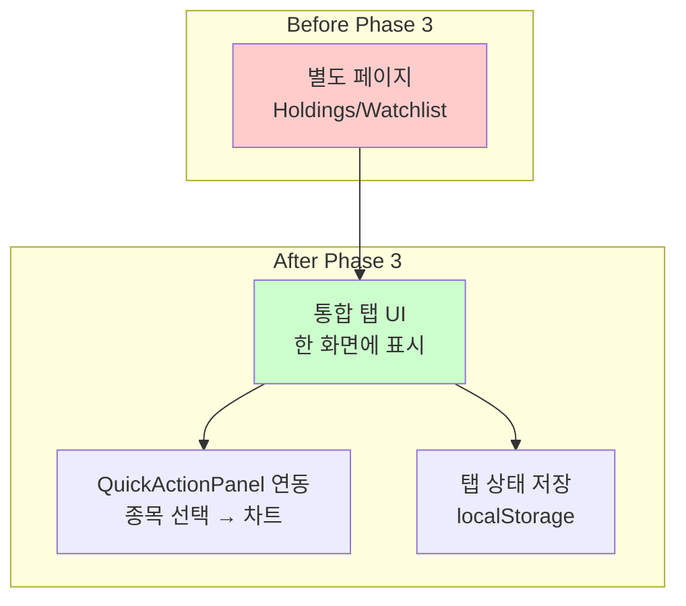
```mermaid
graph TB
    subgraph "Before Phase 3"
        Separate[별도 페이지<br/>Holdings/Watchlist]
    end

    subgraph "After Phase 3"
        Tabs[통합 탭 UI<br/>한 화면에 표시]
        Integration[QuickActionPanel 연동<br/>종목 선택 → 차트]
        Persistence[탭 상태 저장<br/>localStorage]

        Tabs --> Integration
        Tabs --> Persistence
    end

    Separate --> Tabs

    style Separate fill:#ffcccc
    style Tabs fill:#ccffcc
```

### 5.6 Phase 4: Notification System

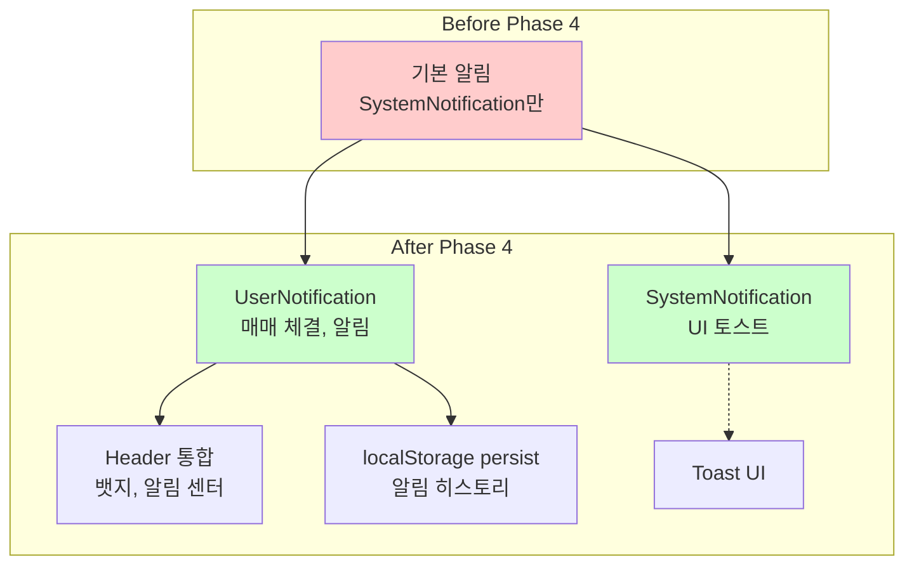
```mermaid
graph TB
    subgraph "Before Phase 4"
        BasicNotif[기본 알림<br/>SystemNotification만]
    end

    subgraph "After Phase 4"
        UserNotif[UserNotification<br/>매매 체결, 알림]
        SystemNotif[SystemNotification<br/>UI 토스트]
        Header2[Header 통합<br/>뱃지, 알림 센터]
        Storage[localStorage persist<br/>알림 히스토리]

        UserNotif --> Header2
        SystemNotif -.-> UI[Toast UI]
        UserNotif --> Storage
    end

    BasicNotif --> UserNotif
    BasicNotif --> SystemNotif

    style BasicNotif fill:#ffcccc
    style UserNotif fill:#ccffcc
    style SystemNotif fill:#ccffcc
```

### 5.7 Phase 5: Header Improvements

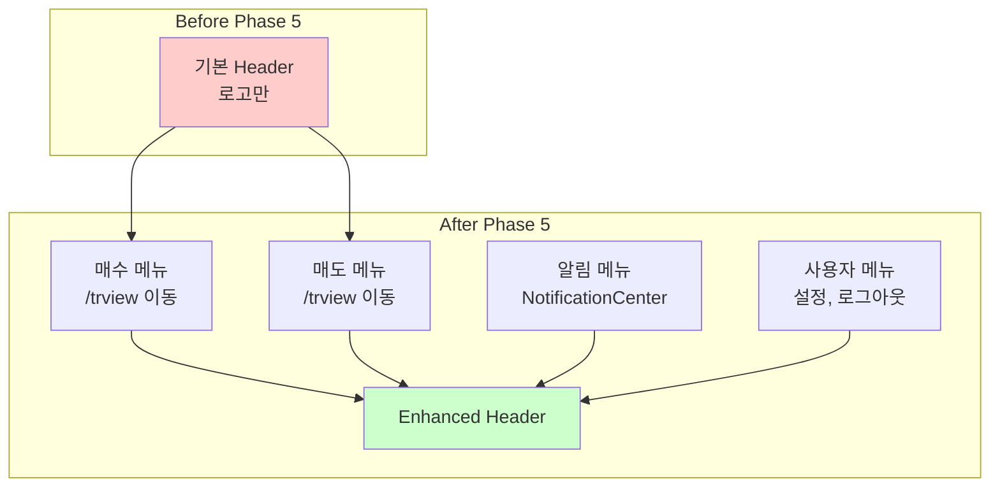
```mermaid
graph TB
    subgraph "Before Phase 5"
        BasicHeader[기본 Header<br/>로고만]
    end

    subgraph "After Phase 5"
        BuyMenu[매수 메뉴<br/>/trview 이동]
        SellMenu[매도 메뉴<br/>/trview 이동]
        NotifMenu[알림 메뉴<br/>NotificationCenter]
        UserMenu[사용자 메뉴<br/>설정, 로그아웃]

        BuyMenu --> Enhanced[Enhanced Header]
        SellMenu --> Enhanced
        NotifMenu --> Enhanced
        UserMenu --> Enhanced
    end

    BasicHeader --> BuyMenu
    BasicHeader --> SellMenu

    style BasicHeader fill:#ffcccc
    style Enhanced fill:#ccffcc
```

### 5.8 Complete Architecture (After All Phases)

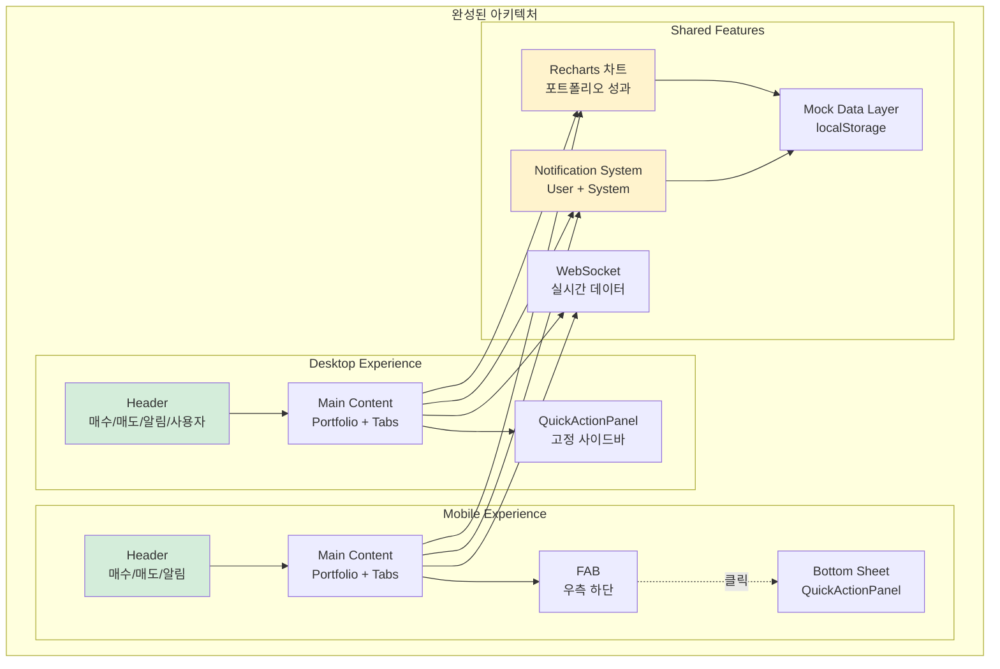
```mermaid
graph TB
    subgraph "완성된 아키텍처"
        subgraph "Desktop Experience"
            DesktopHeader[Header<br/>매수/매도/알림/사용자]
            DesktopMain[Main Content<br/>Portfolio + Tabs]
            DesktopSidebar[QuickActionPanel<br/>고정 사이드바]

            DesktopHeader --> DesktopMain
            DesktopMain --> DesktopSidebar
        end

        subgraph "Mobile Experience"
            MobileHeader[Header<br/>매수/매도/알림]
            MobileMain[Main Content<br/>Portfolio + Tabs]
            MobileFAB[FAB<br/>우측 하단]
            MobileSheet[Bottom Sheet<br/>QuickActionPanel]

            MobileHeader --> MobileMain
            MobileMain --> MobileFAB
            MobileFAB -.->|클릭| MobileSheet
        end

        subgraph "Shared Features"
            Notifications[Notification System<br/>User + System]
            Charts[Recharts 차트<br/>포트폴리오 성과]
            MockData2[Mock Data Layer<br/>localStorage]
            WebSocket2[WebSocket<br/>실시간 데이터]

            DesktopMain --> Notifications
            DesktopMain --> Charts
            MobileMain --> Notifications
            MobileMain --> Charts

            Charts --> MockData2
            Notifications --> MockData2
            DesktopMain --> WebSocket2
            MobileMain --> WebSocket2
        end
    end

    style DesktopHeader fill:#d4edda
    style MobileHeader fill:#d4edda
    style Notifications fill:#fff3cd
    style Charts fill:#fff3cd
```

---

## 🔐 6. Security & Performance Considerations

### 6.1 Security Architecture

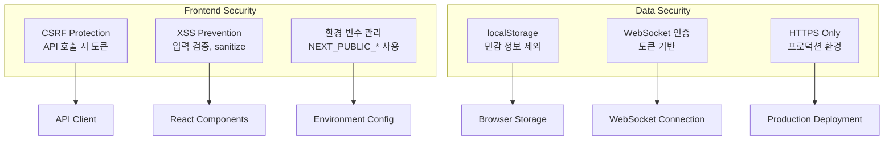
```mermaid
graph TB
    subgraph "Frontend Security"
        CSRF[CSRF Protection<br/>API 호출 시 토큰]
        XSS[XSS Prevention<br/>입력 검증, sanitize]
        Secrets[환경 변수 관리<br/>NEXT_PUBLIC_* 사용]
    end

    subgraph "Data Security"
        LocalStorageEnc[localStorage<br/>민감 정보 제외]
        WebSocketAuth[WebSocket 인증<br/>토큰 기반]
        HTTPS[HTTPS Only<br/>프로덕션 환경]
    end

    CSRF --> API[API Client]
    XSS --> Components[React Components]
    Secrets --> Config[Environment Config]

    LocalStorageEnc --> Storage[Browser Storage]
    WebSocketAuth --> WS[WebSocket Connection]
    HTTPS --> Production[Production Deployment]
```

### 6.2 Performance Optimization

```mermaid
graph TB
    subgraph "Rendering Performance"
        CodeSplit[코드 스플리팅<br/>Dynamic Import]
        Lazy[Lazy Loading<br/>차트, 이미지]
        Memo[React.memo<br/>불필요한 리렌더링 방지]
    end

    subgraph "Data Performance"
        LocalCache[localStorage 캐싱<br/>빠른 초기 로딩]
        Debounce[Debounce<br/>입력 처리, 검색]
        Throttle[Throttle<br/>WebSocket 업데이트]
    end

    subgraph "Network Performance"
        Compression[Gzip/Brotli<br/>압축 전송]
        CDN[CDN<br/>정적 자산]
        Prefetch[Prefetch<br/>다음 페이지 미리 로드]
    end

    CodeSplit --> Bundle[Optimized Bundle]
    Lazy --> Bundle
    Memo --> Bundle

    LocalCache --> FastLoad[Fast Initial Load]
    Debounce --> FastLoad
    Throttle --> FastLoad

    Compression --> Network[Network Layer]
    CDN --> Network
    Prefetch --> Network

    Bundle --> UX[Better UX]
    FastLoad --> UX
    Network --> UX
```

---

## 📦 7. Deployment Architecture

### 7.1 Development Environment

```mermaid
graph LR
    subgraph "Local Development"
        DevServer[Next.js Dev Server<br/>localhost:9000]
        BackendDev[FastAPI Backend<br/>localhost:8000]
        MockDataDev[Mock Data Layer<br/>localStorage]

        DevServer --> BackendDev
        DevServer --> MockDataDev
    end

    style DevServer fill:#e1f5ff
    style BackendDev fill:#e1f5ff
```

### 7.2 Production Environment (Future)

```mermaid
graph TB
    subgraph "Production Deployment"
        subgraph "Frontend"
            Vercel[Vercel/Next.js<br/>App Router SSR]
            CDN2[CDN<br/>Static Assets]
        end

        subgraph "Backend"
            FastAPIProd[FastAPI<br/>Production Server]
            Redis[Redis<br/>WebSocket State]
            DB[Database<br/>PostgreSQL]
        end

        subgraph "External Services"
            KoreaInvestProd[한국투자증권 API]
            Monitoring[Monitoring<br/>Sentry, Analytics]
        end

        Vercel --> FastAPIProd
        CDN2 --> Vercel
        FastAPIProd --> Redis
        FastAPIProd --> DB
        FastAPIProd --> KoreaInvestProd

        Vercel --> Monitoring
        FastAPIProd --> Monitoring
    end

    style Vercel fill:#d4edda
    style FastAPIProd fill:#d4edda
```

---

## 🧪 8. Testing Strategy

### 8.1 Testing Pyramid

```mermaid
graph TB
    subgraph "Testing Levels"
        E2E[E2E Tests<br/>Playwright<br/>핵심 사용자 플로우]
        Integration[Integration Tests<br/>컴포넌트 통합<br/>API 통합]
        Unit[Unit Tests<br/>개별 함수<br/>유틸리티]
    end

    Unit --> Integration
    Integration --> E2E

    style Unit fill:#d4edda
    style Integration fill:#fff3cd
    style E2E fill:#f8d7da
```

### 8.2 Test Coverage Areas

```mermaid
graph LR
    subgraph "Component Tests"
        QuickPanelTest[QuickActionPanel<br/>Desktop/Mobile 모드]
        BottomSheetTest[BottomSheet<br/>열기/닫기, 드래그]
        ChartTest[PortfolioPerformance<br/>차트 렌더링]
    end

    subgraph "Integration Tests"
        TabTest[Tab Integration<br/>Holdings ↔ Watchlist]
        NotifTest[Notification Flow<br/>생성 → 표시 → 읽음]
        WebSocketTest[WebSocket Flow<br/>연결 → 업데이트]
    end

    subgraph "E2E Tests"
        MobileFlow[Mobile FAB Flow<br/>FAB → Sheet → 종목 선택]
        TradingFlow[Trading Flow<br/>Header 매수 → Chart → 체결]
        NotifE2E[Notification E2E<br/>체결 → 알림 → 확인]
    end
```

---

## 📚 9. References & Dependencies

### 9.1 Core Dependencies

| Package | Version | Purpose | Phase |
|---------|---------|---------|-------|
| Next.js | 15.x | Frontend Framework | All |
| React | 19.x | UI Library | All |
| TypeScript | 5.x | Type Safety | All |
| Tailwind CSS | 3.x | Styling | All |
| shadcn/ui | Latest | Component Library | All |
| **recharts** | Latest | Chart Library | Phase 2 |
| **focus-trap-react** | Latest | Accessibility (Modal) | Phase 1-A |
| Lightweight Charts | Latest | Trading Charts | Existing |

### 9.2 Development Dependencies

| Package | Purpose |
|---------|---------|
| ESLint | Code Linting |
| Prettier | Code Formatting |
| TypeScript | Type Checking |

### 9.3 Related Documents

- **Base Plan**: [1010.dashboard.upgrade.plan.md v2.3](../plan/1010.dashboard.upgrade.plan.md)
- **Detailed UX Design**: [1010.dashboard.ux-design-detailed.md](../plan/1010.dashboard.ux-design-detailed.md)
- **Logging Implementation**: [1010.impl.logging.md](../execution/1010.impl.logging.md)

---

## 📝 10. Conclusion & Next Steps

### 10.1 Architecture Highlights

1. **Responsive Design**: 단일 컴포넌트(QuickActionPanel)를 Desktop/Mobile 모두에서 재사용
2. **Data Strategy**:
   - **실제 데이터**: Holdings, Watchlist, Portfolio Summary (WebSocket/API)
   - **Mock 데이터**: UserNotification, Portfolio Chart History (localStorage)
3. **Performance**: localStorage 캐싱으로 빠른 초기 로딩 (차트 히스토리)
4. **Accessibility**: focus-trap-react를 활용한 모달 접근성
5. **Type Safety**: UserNotification/SystemNotification 분리로 명확한 타입 시스템
6. **Scalability**: Phase별 점진적 개발로 위험 최소화

### 10.2 Implementation Checklist

- [ ] **Phase 0**: 브랜치 설정, 의존성 설치, 타입 정의 (30분-1시간)
- [ ] **Phase 1-A**: Mobile FAB + BottomSheet (2-3시간)
- [ ] **Phase 1-B**: QuickActionPanel isSheet 지원 (1-2시간)
- [ ] **Phase 2**: PortfolioPerformance 차트 (2-3시간)
- [ ] **Phase 3**: Holdings/Watchlist 탭 통합 (2-3시간)
- [ ] **Phase 4**: Notification 시스템 (3-4시간)
- [ ] **Phase 5**: Header 개선 (2-3시간)
- [ ] **Testing**: 각 Phase별 테스트 (전체 2-3시간)
- [ ] **Documentation**: 구현 문서 작성 (1시간)

### 10.3 Future Enhancements

1. **Advanced Charts**: 더 많은 차트 유형 (볼린저 밴드, MACD 등)
2. **Dark Mode**: 완전한 다크 모드 지원
3. **Offline Support**: Service Worker를 활용한 오프라인 기능
4. **Push Notifications**: 브라우저 푸시 알림 지원
5. **Mobile App**: React Native로 네이티브 앱 개발

---

## 📋 변경 이력

### v1.1 (2025-10-10)
**변경 내용**: 실제 데이터 vs Mock 데이터 사용 명확화
- System Architecture: Holdings, Portfolio Summary를 실제 WebSocket 데이터로 수정
- State Management: 실제 데이터와 Mock 데이터 명확히 분리
- Sequence Diagram 4.3: Portfolio Summary vs Chart 데이터 소스 구분
- Sequence Diagram 4.5: Holdings/Watchlist 실제 데이터 사용 및 종목 추가 기능 추가
- Architecture Highlights: 데이터 전략 섹션 추가

### v1.0 (2025-10-10)
**초기 작성**: Mermaid UML 기반 아키텍처 문서 생성

---

**문서 버전**: 1.1
**최종 수정**: 2025-10-10
**작성자**: Claude Code Architecture Team
**승인 상태**: 승인 대기 (디자인 향후 다듬기)
