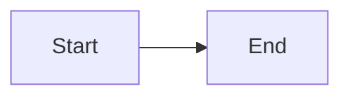
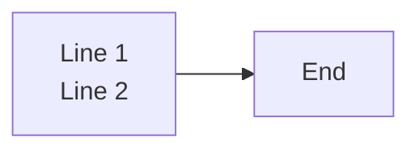
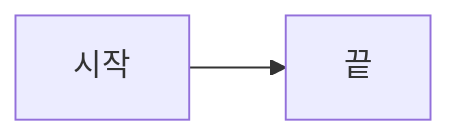
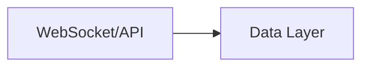
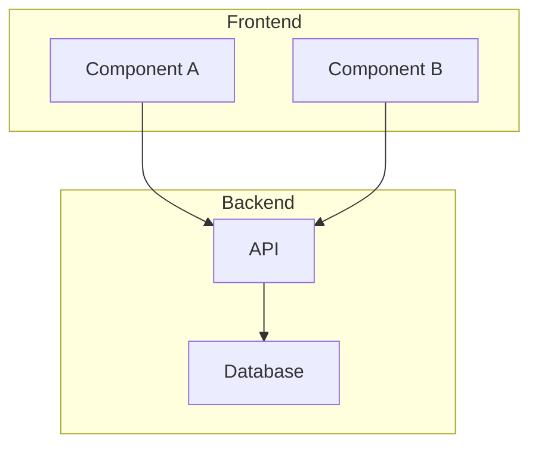
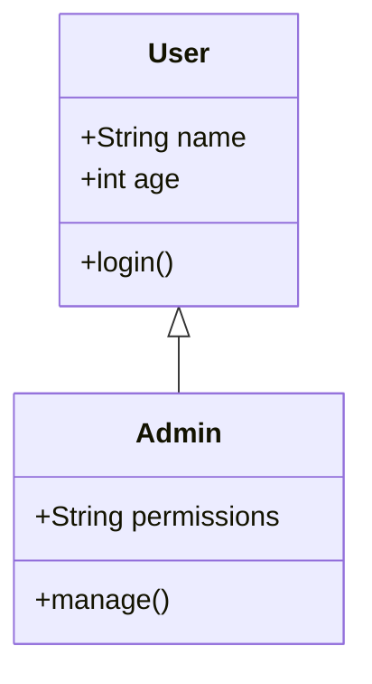
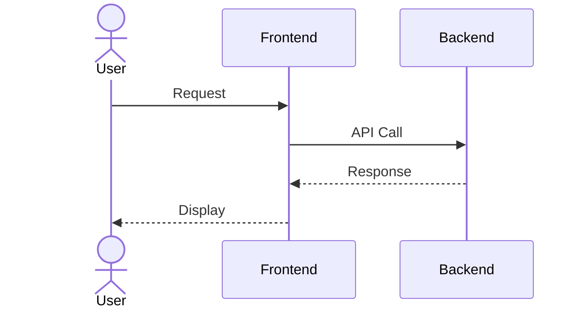

# Mermaid Rendering Test

## Test 1: Simple Graph (Should work)

## Test 2: With BR tags (May fail in older Mermaid)

## Test 3: With Korean (Should work)

## Test 4: With Special Characters

## Test 5: Complex Subgraph

## Test 6: Class Diagram

## Test 7: Sequence Diagram

