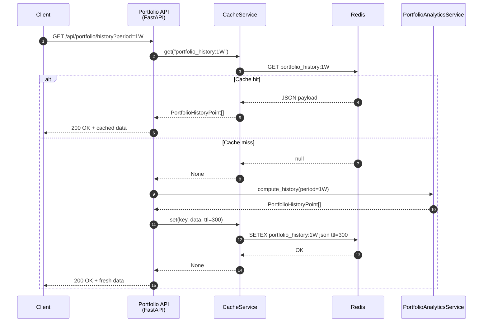

# Redis 기반 포트폴리오 히스토리 캐시

## 개요
FastAPI 백엔드의 `GET /api/portfolio/history` 엔드포인트는 포트폴리오 평가 금액과 KOSPI 벤치마크를 계산합니다. 계산 과정에서 계좌 잔고 조회, 거래 이력 재구성, 종목별 시세 수집 등 I/O가 집중되기 때문에 동일한 조회를 반복하면 API 지연이 커질 수 있습니다. 이를 완화하기 위해 Redis를 사용한 캐시 계층을 도입했습니다.

## 구성 요소
- **CacheService (`backend/app/core/cache.py`)**  
  - `get_settings()`에서 읽어온 `REDIS_URL`로 Redis 커넥션을 초기화합니다.  
  - `get` / `set` / `delete` API를 JSON 직렬화 형태로 제공합니다.  
  - 연결 실패 시 경고 로그를 남기고 `self.redis = None`으로 폴백하여 애플리케이션이 동작을 계속할 수 있게 합니다.
- **Portfolio API (`backend/app/api/portfolio.py`)**  
  - 요청 파라미터 `period`를 포함한 캐시 키(`portfolio_history:{period}`)를 생성합니다.  
  - 캐시 적중 시 Redis에 저장된 JSON을 `PortfolioHistoryPoint` 모델로 역직렬화하여 응답합니다.  
  - 캐시 미스 시 `PortfolioAnalyticsService`를 호출해 데이터를 계산한 뒤 TTL 300초(5분)로 Redis에 저장합니다.

## 요청 흐름
1. 클라이언트가 `/api/portfolio/history?period=1W` 요청을 보냅니다.  
2. API 라우터에서 `CacheService.get("portfolio_history:1W")`로 캐시를 확인합니다.  
3. 캐시가 존재하면 Redis 원본을 그대로 반환하여 계산 로직을 우회합니다.  
4. 캐시가 없으면 `PortfolioAnalyticsService`가 거래 재생, 시세 수집, 벤치마크 정규화를 수행합니다.  
5. 결과 리스트를 JSON으로 직렬화해 Redis에 `set`하고, 동일 데이터를 클라이언트에 응답합니다.

## Sequence Diagram

## 장애 대응
- Redis 연결 실패 또는 명령 오류 시 `CacheService`는 경고 로그만 남기고 None을 반환합니다.  
- API 레벨에서는 캐시 적중 여부만 확인하므로 Redis가 다운되어도 계산 로직이 그대로 실행되어 가용성이 유지됩니다.  
- 캐시 데이터는 JSON 직렬화로 저장되기 때문에 스키마 변경 시에는 Redis 플러시 또는 키 무효화 전략이 필요합니다.

## 향후 고려 사항
- 포트폴리오 기간별 TTL을 다르게 적용해 더 자주 조회되는 구간(예: `1D`)을 단축할 수 있습니다.  
- 계좌별/사용자별 데이터 분리를 위해 캐시 키에 인증 정보를 추가하는 방안을 검토할 수 있습니다.  
- 캐시 미스를 추적할 수 있는 메트릭을 도입하면 Redis 비용과 효과를 모니터링하기 쉽습니다.
