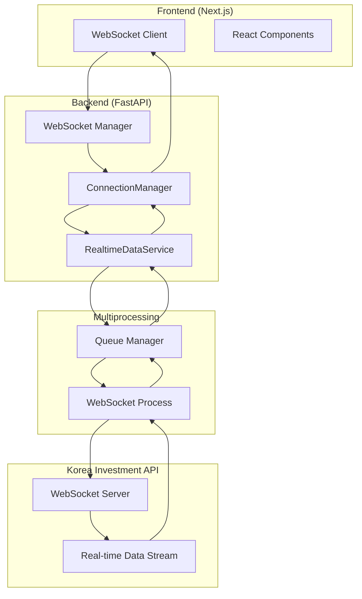

# WebSocket 아키텍처 설계 문서

## 1. 개요

이 문서는 한국투자증권 API WebSocket을 통한 실시간 데이터 수신 시스템의 아키텍처를 설명합니다. Queue 크기 관리와 성능 최적화에 중점을 두어 설계되었습니다.

## 2. 시스템 아키텍처

### 2.1 전체 구조



### 2.2 멀티프로세싱 아키텍처

- **메인 프로세스**: FastAPI 서버, WebSocket 클라이언트 관리
- **WebSocket 프로세스**: 한국투자증권 API 연결 및 데이터 수신
- **Queue 기반 IPC**: 프로세스 간 통신

### 2.3 Queue 구조

```python
# Queue 크기 설정
ws_req_queue = Queue(maxsize=500)      # 요청 Queue (작음)
ws_result_queue = Queue(maxsize=2000)  # 결과 Queue (큼)
```

## 3. Queue 크기 관리 및 성능 최적화

### 3.1 Queue 크기 계산

```python
# 최적 Queue 크기 계산 공식
# 예상 메시지 속도: 초당 100개
# 처리 지연 허용: 최대 10초
# 버퍼 크기: 100 * 10 = 1000개
# 안전 마진: 2배 = 2000개

ws_req_queue = Queue(maxsize=500)      # 요청은 적음
ws_result_queue = Queue(maxsize=2000)  # 결과는 많음
```

### 3.2 Queue 모니터링

Queue 상태를 실시간으로 모니터링하여 성능 문제를 예방합니다.

```python
class QueueMonitor:
    """Queue 상태 모니터링"""
    
    def __init__(self, queue, name, warning_threshold=0.8):
        self.queue = queue
        self.name = name
        self.warning_threshold = warning_threshold
        self.max_size = queue._maxsize if hasattr(queue, '_maxsize') else 0
    
    def check_status(self):
        """Queue 상태 확인"""
        current_size = self.queue.qsize()
        
        if self.max_size > 0:
            usage_ratio = current_size / self.max_size
            
            if usage_ratio > self.warning_threshold:
                logger.warning(
                    f"[{self.name}] Queue 사용률 높음: "
                    f"{current_size}/{self.max_size} ({usage_ratio*100:.1f}%)"
                )
                return "warning"
            elif usage_ratio > 0.95:
                logger.error(
                    f"[{self.name}] Queue 거의 가득 찼습니다!"
                )
                return "critical"
        
        return "ok"
    
    def get_metrics(self):
        """메트릭 반환"""
        current_size = self.queue.qsize()
        return {
            "name": self.name,
            "current_size": current_size,
            "max_size": self.max_size,
            "usage_ratio": current_size / self.max_size if self.max_size > 0 else 0
        }
```

### 3.3 백프레셔(Backpressure) 처리

Queue가 가득 찰 때 데이터 수신 속도를 조절하여 시스템 안정성을 보장합니다.

```python
async def connect(korea_invest_api, url, ws_req_queue, ws_result_queue):
    """백프레셔를 적용한 WebSocket 연결"""
    
    # Queue 모니터 초기화
    result_monitor = QueueMonitor(ws_result_queue, "ws_result_queue")
    dropped_messages_count = 0
    
    while True:
        # Queue 상태 확인
        status = result_monitor.check_status()
        
        if status == "critical":
            # Queue가 가득 차면 데이터 수신 속도 조절
            logger.warning("Queue 가득 참. 100ms 대기...")
            await asyncio.sleep(0.1)
            continue
        
        # 데이터 수신
        data = await websocket.recv()
        parsed_data = parse_websocket_data(data)
        
        # Queue에 추가 (타임아웃 설정)
        try:
            ws_result_queue.put(parsed_data, block=True, timeout=1.0)
        except queue.Full:
            logger.error("Queue 가득 참. 데이터 드롭!")
            dropped_messages_count += 1
```

### 3.4 데이터 처리 속도 최적화

배치 처리를 통해 처리량을 향상시킵니다.

```python
async def _tr_result_loop(self):
    """최적화된 TR 결과 처리 루프"""
    
    batch_size = 10  # 한 번에 처리할 메시지 수
    
    while self.is_running:
        try:
            messages = []
            
            # 배치로 메시지 수집 (최대 batch_size개)
            for _ in range(batch_size):
                if not self.ws_result_queue.empty():
                    messages.append(self.ws_result_queue.get_nowait())
                else:
                    break
            
            if messages:
                # 배치 처리
                await self._process_message_batch(messages)
            
        except Exception as e:
            logger.error(f"TR 결과 처리 오류: {e}")
        
        # 메시지가 없으면 대기 시간 증가
        if not messages:
            await asyncio.sleep(0.05)
        else:
            # 메시지가 있으면 즉시 다음 배치 처리
            await asyncio.sleep(0.001)

async def _process_message_batch(self, messages):
    """메시지 배치 처리"""
    tasks = []
    
    for result_data in messages:
        action_id = result_data.get("action_id")
        
        if action_id == "실시간호가":
            task = self._handle_hoga_data(result_data)
            tasks.append(task)
        elif action_id == "실시간체결":
            task = self._handle_tick_data(result_data)
            tasks.append(task)
        # ... 기타 타입
    
    # 병렬 처리
    await asyncio.gather(*tasks, return_exceptions=True)
```

### 3.5 메모리 효율적인 데이터 구조

불필요한 데이터 복사를 방지하여 메모리 사용량을 최적화합니다.

```python
def receive_realtime_hoga_domestic(data):
    """메모리 효율적인 파싱"""
    values = data.split('^')
    
    # 필요한 데이터만 추출 (전체 복사 X)
    return {
        "종목코드": values[0],
        # 매도호가 - 리스트 컴프리헨션 사용
        "매도호가": [int(values[i]) if values[i] else 0 for i in range(1, 11)],
        "매수호가": [int(values[i+10]) if values[i+10] else 0 for i in range(1, 11)],
        "매도잔량": [int(values[i+20]) if values[i+20] else 0 for i in range(1, 11)],
        "매수잔량": [int(values[i+30]) if values[i+30] else 0 for i in range(1, 11)],
    }
```

## 4. 성능 메트릭 및 모니터링

### 4.1 메트릭 수집 클래스

```python
from dataclasses import dataclass
from datetime import datetime
from collections import deque

@dataclass
class PerformanceMetrics:
    """성능 메트릭"""
    messages_received: int = 0
    messages_processed: int = 0
    messages_dropped: int = 0
    parse_errors: int = 0
    broadcast_errors: int = 0
    
    # 처리 시간 추적 (최근 100개)
    processing_times: deque = None
    
    def __post_init__(self):
        if self.processing_times is None:
            self.processing_times = deque(maxlen=100)
    
    def record_processing_time(self, duration_ms: float):
        """처리 시간 기록"""
        self.processing_times.append(duration_ms)
    
    def get_avg_processing_time(self) -> float:
        """평균 처리 시간"""
        if not self.processing_times:
            return 0.0
        return sum(self.processing_times) / len(self.processing_times)
    
    def get_throughput(self, window_seconds: int = 60) -> float:
        """처리량 (메시지/초)"""
        # 실제 구현에서는 시간 기반 카운팅 필요
        return self.messages_processed / window_seconds
```

### 4.2 모니터링 엔드포인트

```python
# backend/app/api/monitoring.py

from fastapi import APIRouter
from datetime import datetime

router = APIRouter()

@router.get("/metrics/websocket")
async def get_websocket_metrics():
    """WebSocket 성능 메트릭 조회"""
    
    # RealtimeDataService에서 메트릭 가져오기
    metrics = realtime_service.get_metrics()
    
    return {
        "timestamp": datetime.now().isoformat(),
        "queues": {
            "ws_req_queue": {
                "size": ws_req_queue.qsize(),
                "max_size": 500
            },
            "ws_result_queue": {
                "size": ws_result_queue.qsize(),
                "max_size": 2000
            }
        },
        "performance": {
            "messages_received": metrics.messages_received,
            "messages_processed": metrics.messages_processed,
            "messages_dropped": metrics.messages_dropped,
            "avg_processing_time_ms": metrics.get_avg_processing_time(),
            "throughput_per_sec": metrics.get_throughput()
        },
        "connections": {
            "active_clients": len(connection_manager.active_connections)
        }
    }
```

## 5. 데이터 흐름 최적화

### 5.1 선택적 브로드캐스트

모든 클라이언트에게 데이터를 전송하는 대신, 특정 종목을 구독한 클라이언트에게만 전송합니다.

```python
class ConnectionManager:
    """개선된 ConnectionManager"""
    
    def __init__(self):
        self.active_connections: List[WebSocket] = []
        # 종목별 구독자 관리
        self.stock_subscribers: Dict[str, Set[WebSocket]] = {}
    
    def subscribe_stock(self, websocket: WebSocket, stock_code: str):
        """종목 구독"""
        if stock_code not in self.stock_subscribers:
            self.stock_subscribers[stock_code] = set()
        self.stock_subscribers[stock_code].add(websocket)
    
    async def broadcast_to_subscribers(self, stock_code: str, message: dict):
        """특정 종목 구독자에게만 전송"""
        subscribers = self.stock_subscribers.get(stock_code, set())
        
        if not subscribers:
            return
        
        message_str = json.dumps(message)
        
        # 병렬 전송
        tasks = [
            self.send_personal_message(ws, message_str)
            for ws in subscribers
            if ws in self.active_connections
        ]
        
        await asyncio.gather(*tasks, return_exceptions=True)
```

### 5.2 데이터 압축

큰 데이터의 경우 압축을 통해 네트워크 대역폭을 절약합니다.

```python
import zlib
import base64

def compress_message(data: dict) -> str:
    """메시지 압축 (큰 데이터용)"""
    json_str = json.dumps(data)
    
    # 압축 임계값 (1KB 이상만 압축)
    if len(json_str) < 1024:
        return json_str
    
    compressed = zlib.compress(json_str.encode('utf-8'))
    encoded = base64.b64encode(compressed).decode('utf-8')
    
    return json.dumps({
        "compressed": True,
        "data": encoded
    })
```

## 6. 에러 처리 및 복구

### 6.1 Circuit Breaker 패턴

연결 실패가 반복될 때 자동으로 연결을 차단하고 복구를 시도합니다.

```python
from enum import Enum
from datetime import datetime, timedelta

class CircuitState(Enum):
    CLOSED = "closed"        # 정상
    OPEN = "open"            # 차단
    HALF_OPEN = "half_open"  # 복구 시도

class CircuitBreaker:
    """Circuit Breaker 패턴 구현"""
    
    def __init__(self, failure_threshold=5, timeout_seconds=60):
        self.failure_threshold = failure_threshold
        self.timeout = timedelta(seconds=timeout_seconds)
        
        self.failure_count = 0
        self.last_failure_time = None
        self.state = CircuitState.CLOSED
    
    def record_success(self):
        """성공 기록"""
        self.failure_count = 0
        self.state = CircuitState.CLOSED
    
    def record_failure(self):
        """실패 기록"""
        self.failure_count += 1
        self.last_failure_time = datetime.now()
        
        if self.failure_count >= self.failure_threshold:
            self.state = CircuitState.OPEN
            logger.error(f"Circuit Breaker OPEN: {self.failure_count}회 실패")
    
    def can_attempt(self) -> bool:
        """시도 가능 여부"""
        if self.state == CircuitState.CLOSED:
            return True
        
        if self.state == CircuitState.OPEN:
            # 타임아웃 경과 확인
            if datetime.now() - self.last_failure_time > self.timeout:
                self.state = CircuitState.HALF_OPEN
                logger.info("Circuit Breaker HALF_OPEN: 복구 시도")
                return True
            return False
        
        # HALF_OPEN 상태
        return True

# 사용 예시
circuit_breaker = CircuitBreaker(failure_threshold=5, timeout_seconds=60)

async def connect_with_circuit_breaker(korea_invest_api, url, ws_req_queue, ws_result_queue):
    """Circuit Breaker를 적용한 연결"""
    
    while True:
        if not circuit_breaker.can_attempt():
            logger.warning("Circuit Breaker OPEN. 60초 대기...")
            await asyncio.sleep(60)
            continue
        
        try:
            await connect(korea_invest_api, url, ws_req_queue, ws_result_queue)
            circuit_breaker.record_success()
            
        except Exception as e:
            logger.error(f"WebSocket 연결 오류: {e}")
            circuit_breaker.record_failure()
            await asyncio.sleep(5)
```

## 7. 실전 구현 가이드

### 7.1 체크리스트

- [ ] Queue 크기 설정 (ws_req_queue: 500, ws_result_queue: 2000)
- [ ] QueueMonitor 클래스 구현
- [ ] 배치 처리 로직 추가
- [ ] 선택적 브로드캐스트 구현
- [ ] 메트릭 수집 및 모니터링 엔드포인트
- [ ] Circuit Breaker 적용
- [ ] 로깅 레벨 최적화 (DEBUG → INFO)

### 7.2 성능 테스트 시나리오

```python
# tests/performance/test_queue_performance.py

import time
from multiprocessing import Queue, Process

def test_queue_throughput():
    """Queue 처리량 테스트"""
    
    queue = Queue(maxsize=2000)
    
    # 프로듀서
    def producer():
        for i in range(10000):
            queue.put({"id": i, "data": "test" * 100})
    
    # 컨슈머
    def consumer():
        count = 0
        start_time = time.time()
        
        while count < 10000:
            if not queue.empty():
                queue.get()
                count += 1
        
        elapsed = time.time() - start_time
        throughput = count / elapsed
        print(f"처리량: {throughput:.2f} 메시지/초")
    
    # 테스트 실행
    p1 = Process(target=producer)
    p2 = Process(target=consumer)
    
    p1.start()
    p2.start()
    
    p1.join()
    p2.join()
```

## 8. 성능 목표

### 8.1 처리량 목표

- **현재**: 초당 100개 메시지
- **목표**: 초당 200개 이상 메시지
- **방법**: 배치 처리, 병렬 처리, 메모리 최적화

### 8.2 지연시간 목표

- **현재**: 평균 50ms
- **목표**: 평균 20ms 이하
- **방법**: Queue 크기 최적화, 백프레셔 처리

### 8.3 메모리 사용량 목표

- **Queue 사용률**: 80% 이하 유지
- **메모리 누수**: 방지
- **방법**: Queue 모니터링, 적절한 크기 설정

## 9. 모니터링 및 알림

### 9.1 주요 메트릭

1. **Queue 사용률**: 80% 이상 시 경고
2. **처리량**: 목표 대비 80% 이하 시 경고
3. **에러율**: 5% 이상 시 경고
4. **연결 상태**: 연결 끊김 시 즉시 알림

### 9.2 로그 레벨

- **ERROR**: 시스템 장애, Queue 오버플로우
- **WARNING**: 성능 저하, 연결 불안정
- **INFO**: 정상 동작, 메트릭 정보
- **DEBUG**: 개발 시에만 사용

## 10. 보안 고려사항

### 10.1 데이터 암호화

- WebSocket 연결: TLS 1.3 사용
- API 키: 환경변수로 관리
- 로그: 민감 정보 제외

### 10.2 접근 제어

- 클라이언트 인증: JWT 토큰
- Rate Limiting: 클라이언트당 제한
- IP 화이트리스트: 개발 환경

## 11. 장애 대응 계획

### 11.1 자동 복구

- Circuit Breaker: 자동 재연결
- Queue 오버플로우: 백프레셔 처리
- 메모리 누수: 프로세스 재시작

### 11.2 수동 개입

- 심각한 장애: 수동 프로세스 재시작
- 성능 저하: Queue 크기 조정
- 데이터 손실: 로그 분석 및 복구

---

이 문서는 WebSocket 시스템의 성능 최적화와 안정성 확보를 위한 종합적인 가이드입니다. 각 섹션의 구현은 점진적으로 진행하며, 성능 테스트를 통해 목표 달성을 확인합니다.
