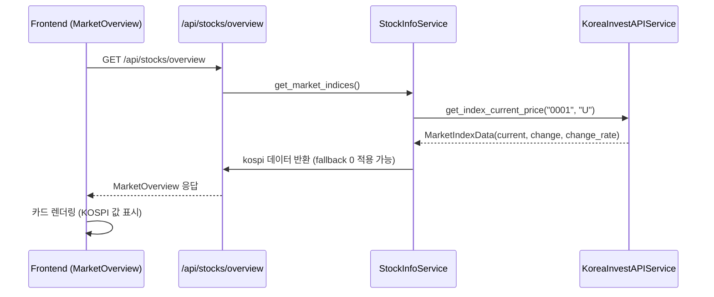

# KOSPI 지수 데이터 복구 내역 (2025-10-08)

## 변경 요약

Rest API 를 통해 KOSPI 지수가 정상 표시되지 않던 문제를 점검하고, 값을 안정적으로 표시하도록 고친 과정을 정리했습니다.

## 주요 변경 사항

1. **REST 호출 파싱 보강**
   - `backend/app/core/korea_invest.py`
     - `MarketIndexData` 모델 도입 (`index_code`, `market_code`, `current`, `change`, `change_rate`).
     - `_parse_index_response`에서 `bstp_nmix_prpr` 등 값을 float 로 변환; 빈 응답은 warning + `last_error` 설정.
2. **StockInfoService 수정**
   - `backend/app/services/stock_info_service.py`
     - KOSPI (`market_code="U"`, `index_code="0001"`) 호출 성공 시 실제 값 반영, 실패 시 경고 후 0 값 fallback.
3. **단위 테스트 보강**
   - `backend/tests/test_kosdaq_index_service.py`
     - KOSDAQ 지수 대비 테스트 파일을 추가하여 KIS 응답 원문을 확인하고 후보 코드를 탐색할 수 있도록 했습니다.

## Mermaid 흐름도



## 테스트

1. REST 지수 확인
   ```bash
   cd backend
   scripts/start_backend.sh
   ```
   - `/api/stocks/overview` → `kospi.current` 값 확인

2. 프론트 렌더링 확인
   ```bash
   cd stock-trading-ui
   npm run dev
   ```
   - http://localhost:9000 → Market Overview 에서 KOSPI 지수 정상 표시 여부 확인

---

**작성일:** 2025-10-08

