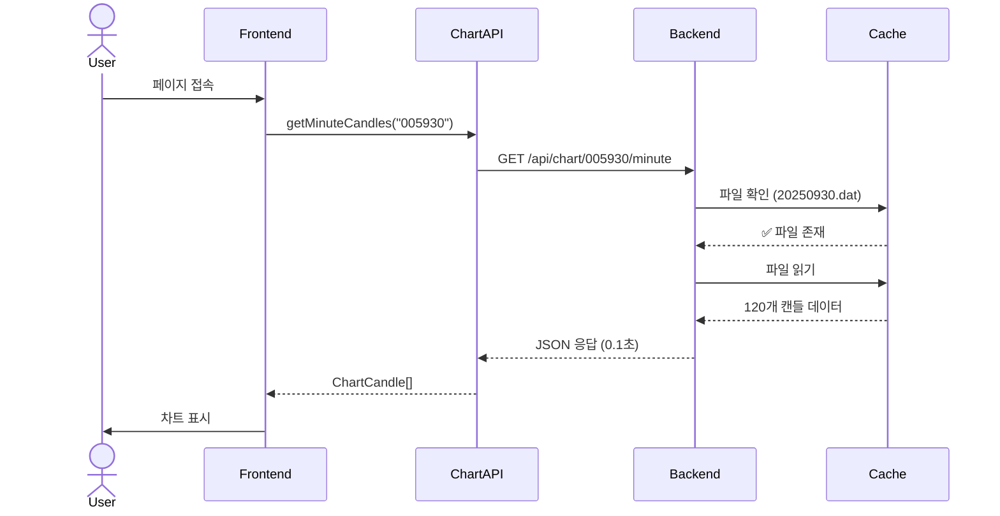
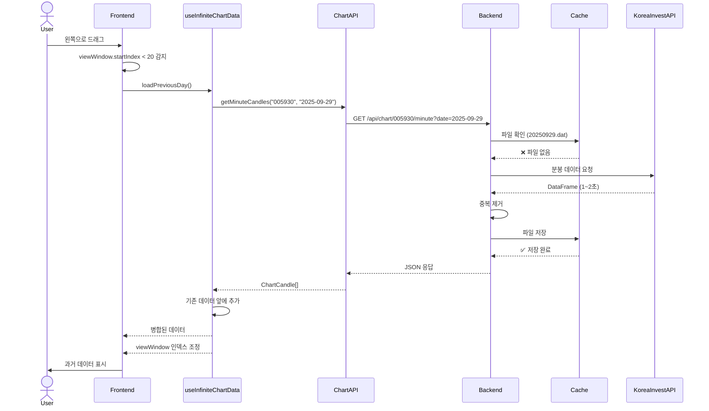
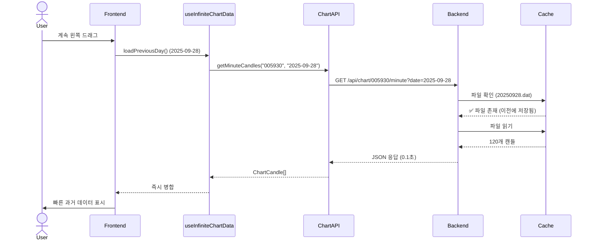
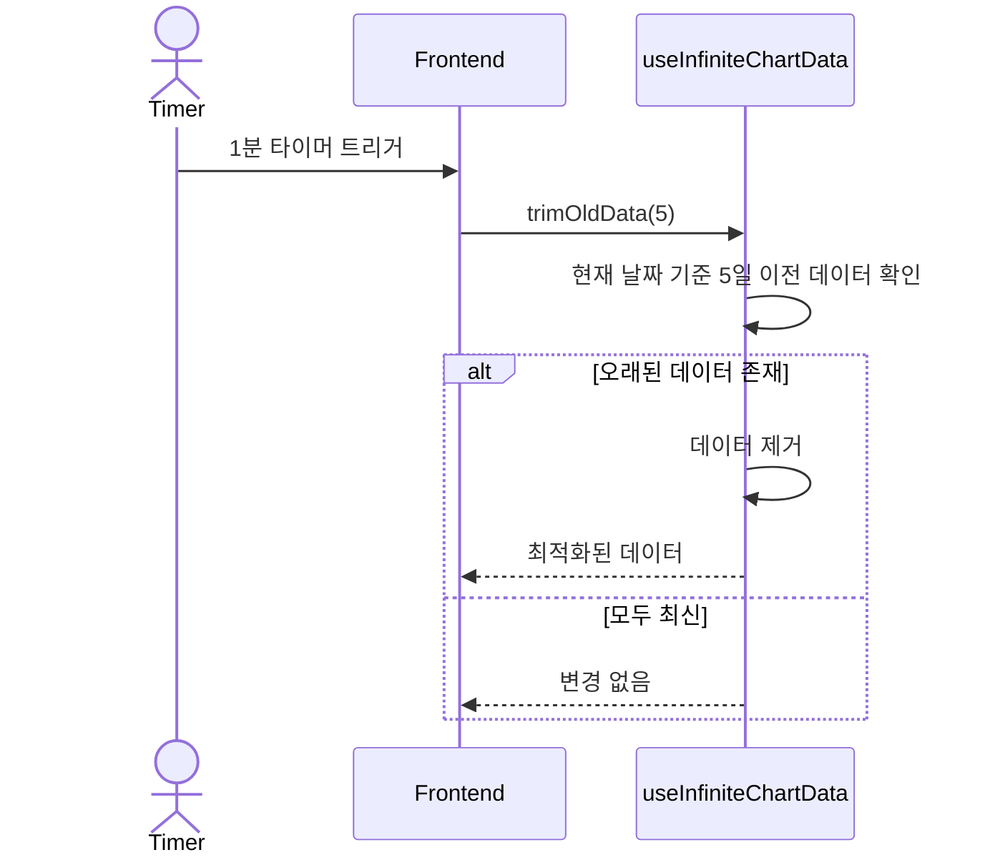

## 📊 Mermaid Sequence Diagrams

Diagram 1: 초기 로드 (캐시 히트)

Diagram 2: 왼쪽 드래그 (캐시 미스)

Diagram 3: 연속 탐색 (캐시 히트)

Diagram 4: 메모리 관리

## 🎯 핵심 함수 요약

### 백엔드

| 함수명                                        | 위치                     | 역할                |
|--------------------------------------------|------------------------|-------------------|
| ChartCacheService.get_minute_candles()     | chart_cache_service.py | 캐시 우선 데이터 조회      |
| ChartCacheService._save_to_cache()         | chart_cache_service.py | JSON 파일 저장        |
| ChartCacheService._load_from_cache()       | chart_cache_service.py | JSON 파일 로드        |
| TradingCalendar.get_previous_trading_day() | trading_calendar.py    | 이전 거래일 계산         |
| TradingCalendar.is_trading_day()           | trading_calendar.py    | 거래일 여부 확인         |
| get_minute_chart_data()                    | chart.py               | API 엔드포인트 (캐시 통합) |

### 프론트엔드

| 함수명                         | 위치                      | 역할              |
|-----------------------------|-------------------------|-----------------|
| ChartAPI.getMinuteCandles() | chart-api.ts            | 백엔드 API 호출      |
| useInfiniteChartData()      | useInfiniteChartData.ts | 무한 스크롤 훅        |
| loadPreviousDay()           | useInfiniteChartData.ts | 이전 날짜 데이터 로드    |
| trimOldData()               | useInfiniteChartData.ts | 메모리 관리          |
| getPreviousTradingDay()     | useInfiniteChartData.ts | 이전 거래일 계산 (프론트) |

## ✅ 구현 체크리스트

### Phase 1: 백엔드 기반

- ChartCacheService 클래스 생성
- TradingCalendar 유틸리티 생성
- kordata/ 디렉토리 생성
- API 엔드포인트에 date 파라미터 추가
- 캐시 통계 API 추가
- 테스트: 캐시 저장/로드 확인

### Phase 2: 프론트엔드 무한 스크롤

- ChartAPI 클래스 생성
- useInfiniteChartData 훅 생성
- RechartsAdapter에 무한 스크롤 통합
- 로딩 UI 추가
- 테스트: 왼쪽 드래그 시 데이터 로드 확인

### Phase 3: 최적화 및 개선

- 메모리 관리 로직 추가
- Debounce 적용
- 에러 처리 개선
- 캐시 무효화 기능 추가
- 성능 테스트
