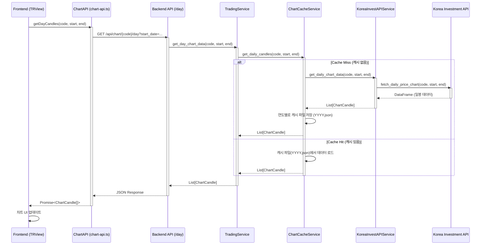
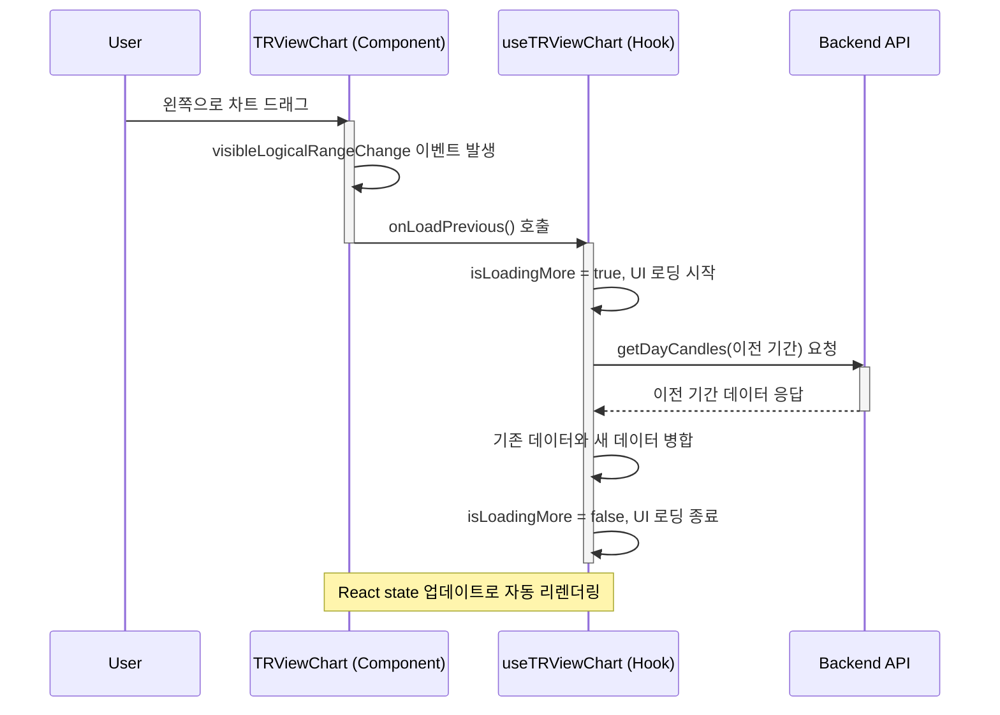

### 🏛️ 일봉 데이터 API 구현 계획 (SPEC)

**문서 ID**: `1005.gem.dailycandle.plan.md`
**작성일**: 2025-10-05

**목표**: `/trview` 엔드포인트에서 일봉(Daily Candle) 데이터를 조회하고 표시할 수 있도록 백엔드 API와 프론트엔드 로직을 구현합니다.

---

### 1. 백엔드 구현 계획

(백엔드 계획은 변경사항 없음)

#### **1.1. `KoreaInvestAPIService` 수정 (`korea_invest.py`)**

*   **현황**: `get_daily_price_chart()` 메소드가 이미 존재하며, `period_code='D'`로 일봉 데이터를 `DataFrame` 형태로 조회 가능합니다.
*   **목표**: `get_daily_price_chart` 메소드의 반환값을 `ChartCandle` 스키마에 맞게 변환하는 새로운 헬퍼 메소드를 추가합니다.
*   **수정 파일**: `backend/app/core/korea_invest.py`
*   **추가할 메소드**: `async def get_daily_chart_data(self, stock_code: str, start_date: str, end_date: str) -> Optional[List[ChartCandle]]:`
    1.  `get_daily_price_chart(stock_code, start_date, end_date, period_code='D')`를 호출하여 `DataFrame`을 받습니다.
    2.  반환된 `DataFrame`의 각 row를 순회하며 `ChartCandle` 모델로 변환합니다. (기존 분봉 변환 로직 참고)
        *   `일자` -> `timestamp` (YYYY-MM-DD 형식의 ISO 문자열)
        *   `시가`, `고가`, `저가`, `종가`, `거래량` -> `open`, `high`, `low`, `close`, `volume`
    3.  변환된 `List[ChartCandle]`을 반환합니다.

---

#### **1.2. `ChartCacheService` 수정 (`chart_cache_service.py`)**

*   **목표**: 일봉 데이터를 연도별로 캐싱하는 새로운 메소드를 추가합니다.
*   **수정 파일**: `backend/app/services/chart_cache_service.py`
*   **추가할 메소드**: `async def get_daily_candles(self, stock_code: str, start_date: datetime, end_date: datetime, korea_invest_service) -> Optional[List[ChartCandle]]:`
    1.  **캐시 파일 경로**: `kordata/{stock_code}/daily/{YYYY}.json` 형식으로 연도별 캐시 파일을 정의합니다.
    2.  **캐시 로직**:
        *   요청된 기간(`start_date` ~ `end_date`)에 해당하는 연도(들)의 캐시 파일이 있는지 확인합니다.
        *   캐시 파일이 있으면, 해당 파일에서 요청된 기간의 데이터를 필터링하여 반환합니다.
        *   캐시 파일이 없거나, 요청 기간에 해당하는 데이터가 부족하면 `korea_invest_service.get_daily_chart_data()`를 호출하여 필요한 기간의 데이터를 API로부터 가져옵니다.
        *   가져온 데이터를 연도별 캐시 파일에 저장(또는 업데이트)하고, 최종적으로 요청된 기간의 데이터를 필터링하여 반환합니다.

---

#### **1.3. `TradingService` 수정 (`trading_service.py`)**

*   **목표**: 일봉 데이터 조회를 위한 서비스 레이어 메소드를 추가합니다.
*   **수정 파일**: `backend/app/services/trading_service.py`
*   **추가할 메소드**: `async def get_day_chart_data(self, stock_code: str, start_date: datetime, end_date: datetime) -> Optional[List[ChartCandle]]:`
    1.  `self.chart_cache_service.get_daily_candles()`를 호출하여 데이터를 조회합니다.
    2.  필요한 경우 추가적인 비즈니스 로직을 적용한 후, 결과를 반환합니다.

---

#### **1.4. API 엔드포인트 추가 (`chart.py`)**

*   **목표**: 프론트엔드에서 사용할 새로운 일봉 API 엔드포인트를 생성합니다.
*   **수정 파일**: `backend/app/api/chart.py`
*   **추가할 엔드포인트**:
    *   **경로**: `/api/chart/{stock_code}/day`
    *   **메소드**: `GET`
    *   **요약**: `일봉 차트 데이터 조회`
    *   **쿼리 파라미터**:
        *   `start_date: str = Query(..., description="시작 날짜 (YYYY-MM-DD)")`
        *   `end_date: str = Query(..., description="종료 날짜 (YYYY-MM-DD)")`
    *   **응답 모델**: `List[ChartCandle]`
    *   **동작**:
        1.  `start_date`, `end_date` 문자열을 `datetime` 객체로 파싱합니다.
        2.  `trading_service.get_day_chart_data()`를 호출하여 데이터를 가져옵니다.
        3.  결과를 JSON으로 반환합니다.

---

### 2. 프론트엔드 연동 계획 (수정안)

**핵심 변경**: 기존의 분봉/일봉 토글 방식 대신, **한 페이지에 분봉 차트와 일봉 차트를 모두 렌더링**합니다.

*   **`chart-api.ts`**:
    *   (변경 없음) `getDayCandles(stockCode, startDate, endDate)` 함수를 추가하여 백엔드의 `/api/chart/{stock_code}/day` API를 호출합니다.

*   **`trview/page.tsx`**:
    *   **`useTRViewChart` 훅 두 번 호출**: 분봉과 일봉 데이터를 각각 독립적으로 관리하기 위해 훅을 두 번 호출합니다.
        ```typescript
        // 1. 분봉 데이터용 훅
        const { chartData: minuteChartData, ... } = useTRViewChart({
          stockCode,
          timeframe: 'minute',
        });

        // 2. 일봉 데이터용 훅
        const { chartData: dayChartData, ... } = useTRViewChart({
          stockCode,
          timeframe: 'day',
        });
        ```
    *   **두 개의 차트 렌더링**: 페이지 내에 `<TRViewChart>` 컴포넌트를 두 개 렌더링하고, 각각 `minuteChartData`와 `dayChartData`를 `prop`으로 전달합니다.
        ```tsx
        {/* 상단: 분봉 차트 */}
        <Card>
          <CardHeader><CardTitle>분봉 차트</CardTitle></CardHeader>
          <CardContent>
            <TRViewChart chartData={minuteChartData} ... />
          </CardContent>
        </Card>

        {/* 하단: 일봉 차트 */}
        <Card>
          <CardHeader><CardTitle>일봉 차트</CardTitle></CardHeader>
          <CardContent>
            <TRViewChart chartData={dayChartData} ... />
          </CardContent>
        </Card>
        ```
    *   **상태 관리 단순화**: 분봉/일봉을 전환하는 `timeframe` 상태가 더 이상 필요하지 않습니다.

*   **`useTRViewChart.ts`**:
    *   `timeframe` prop (`'minute' | 'day'`)을 받도록 훅의 인자를 수정합니다.
    *   `fetchInitialData` 함수 내에서 `timeframe` 값에 따라 분기 처리합니다.
        *   `timeframe === 'day'`: `chartAPI.getDayCandles`를 호출합니다. 초기 조회 시 `endDate`는 오늘, `startDate`는 **1년 전**으로 설정하여 충분한 데이터를 가져옵니다.
        *   `timeframe === 'minute'`: 기존 로직대로 `chartAPI.getMinuteCandles`를 호출합니다.
    *   `loadPreviousDay` 로직을 `loadPrevious`와 같은 이름으로 일반화하거나, `timeframe`에 따라 분기하여 일봉의 경우 **이전 연도**의 데이터를, 분봉의 경우 **이전 거래일**의 데이터를 가져오도록 수정합니다.

*   **`TRViewChartControls.tsx`**:
    *   분봉/일봉 전환 UI가 필요 없으므로 관련 로직을 추가하지 않습니다. 종목 변경 등 다른 컨트롤은 두 차트에 공통으로 적용됩니다.

---

### 3. 아키텍처: 시퀀스 다이어그램 (초기 로드)

**참고**: 아래 다이어그램은 단일 차트(분봉 또는 일봉)의 데이터 흐름을 보여줍니다. 수정된 프론트엔드 계획에 따라, `trview` 페이지는 분봉과 일봉에 대해 각각 아래와 같은 데이터 요청 흐름을 시작하게 됩니다.



---

### 4. 아키텍처: 과거 데이터 로드 (Drag & Fetch)

사용자가 차트를 왼쪽으로 드래그하여 과거 데이터를 추가로 요청하는 시나리오의 시퀀스 다이어그램입니다.

