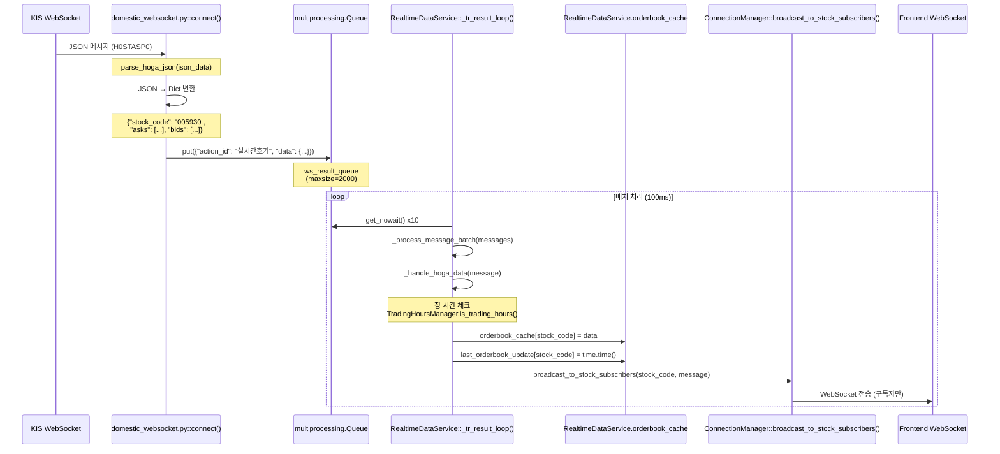
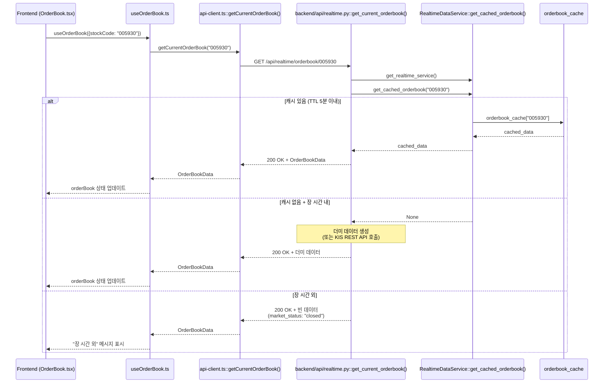
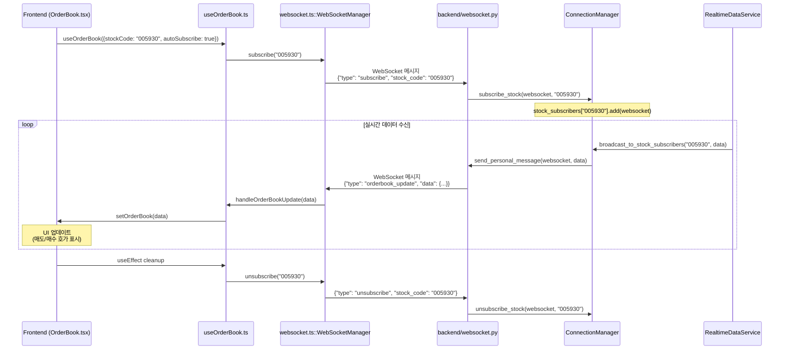

# KIS 실시간 호가 데이터 통합 계획

## 1. Backend: 호가 데이터 파싱 로직 수정

### 1.1 `domestic_websocket.py` - JSON 파싱 함수 추가

**위치**: `backend/app/domestic_websocket.py`

**현재 상태**: 
- `receive_realtime_hoga_domestic()` 함수가 파이프(`^`) 구분자 문자열을 파싱 (line 206)
- KIS API는 실제로 JSON 형식으로 호가 데이터 전송

**수정 내용**:
```python
def parse_hoga_json(json_data: dict) -> dict:
    """
    KIS API JSON 형식 호가 데이터 파싱
    
    Args:
        json_data: {
            "header": {"tr_id": "H0STASP0", "tr_key": "005930"},
            "body": {
                "askp1": "71800", "askp_rsqn1": "100", ...
                "bidp1": "71700", "bidp_rsqn1": "150", ...
                "last": "71700", "time": "180015", ...
            }
        }
    
    Returns:
        {
            "stock_code": "005930",
            "asks": [
                {"price": 71800, "quantity": 100, "order_count": 0},
                ...  # 10개
            ],
            "bids": [
                {"price": 71700, "quantity": 150, "order_count": 0},
                ...  # 10개
            ],
            "current_price": 71700,
            "timestamp": "2025-10-14T18:00:15",
            "market_data": {
                "open": 71000, "high": 72500, "low": 70500,
                "volume": 1234567, "value": 78900000000,
                "sign": "2", "change": 500, "drate": 0.70
            }
        }
    """
    body = json_data.get("body", {})
    header = json_data.get("header", {})
    stock_code = header.get("tr_key", "")
    
    # 매도호가 파싱 (askp1~10, askp_rsqn1~10)
    asks = []
    for i in range(1, 11):
        price = int(body.get(f"askp{i}", 0))
        quantity = int(body.get(f"askp_rsqn{i}", 0))
        asks.append({
            "price": price,
            "quantity": quantity,
            "order_count": 0  # KIS API에서 제공하지 않음
        })
    
    # 매수호가 파싱 (bidp1~10, bidp_rsqn1~10)
    bids = []
    for i in range(1, 11):
        price = int(body.get(f"bidp{i}", 0))
        quantity = int(body.get(f"bidp_rsqn{i}", 0))
        bids.append({
            "price": price,
            "quantity": quantity,
            "order_count": 0
        })
    
    # 현재가 및 시간 정보
    current_price = int(body.get("last", 0))
    time_str = body.get("time", "000000")  # HHMMSS
    date_str = body.get("date", datetime.now().strftime("%Y%m%d"))  # YYYYMMDD
    
    # ISO 8601 형식으로 변환
    timestamp = f"{date_str[:4]}-{date_str[4:6]}-{date_str[6:8]}T{time_str[:2]}:{time_str[2:4]}:{time_str[4:6]}"
    
    return {
        "stock_code": stock_code,
        "asks": asks,
        "bids": bids,
        "current_price": current_price,
        "timestamp": timestamp,
        "market_data": {
            "open": int(body.get("open", 0)),
            "high": int(body.get("high", 0)),
            "low": int(body.get("low", 0)),
            "volume": int(body.get("vol", 0)),
            "value": int(body.get("value", 0)),
            "sign": body.get("sign", "3"),
            "change": int(body.get("change", 0)),
            "drate": float(body.get("drate", 0.0))
        }
    }
```

**`connect()` 함수 수정** (line 205-235):
```python
# 기존 코드
elif trid0 == "H0STASP0":   # 주식호가 데이터 처리
    data_dict = receive_realtime_hoga_domestic(recvstr[3])
    # ...

# 수정 코드
elif trid0 == "H0STASP0":   # 주식호가 데이터 처리
    # JSON 파싱으로 변경
    try:
        json_data = json.loads(recvstr[3])
        data_dict = parse_hoga_json(json_data)
    except json.JSONDecodeError:
        logger.error(f"호가 데이터 JSON 파싱 실패: {recvstr[3][:100]}")
        continue
    
    # 백프레셔 처리 (기존 로직 유지)
    status = result_monitor.check_status()
    if status == "critical":
        # ...
    
    # Queue에 추가
    try:
        ws_result_queue.put(
            dict(
                action_id="실시간호가",
                stock_code=data_dict["stock_code"],
                data=data_dict
            ),
            block=True,
            timeout=1.0
        )
        metrics_collector.metrics.record_message_received()
    except queue.Full:
        logger.error("Queue 가득 참. 호가 데이터 드롭!")
        dropped_messages_count += 1
        metrics_collector.metrics.record_message_dropped()
```

---

## 2. Backend: 호가 데이터 캐시 구현

### 2.1 `realtime_service.py` - 메모리 캐시 추가

**위치**: `backend/app/services/realtime_service.py`

**`__init__()` 수정** (line 24-63):
```python
def __init__(self, korea_invest_service: KoreaInvestAPIService, connection_manager: ConnectionManager, ws_result_queue: Queue):
    # ... 기존 코드 ...
    
    # 호가 데이터 캐시 추가
    self.orderbook_cache: Dict[str, Dict[str, Any]] = {}  # {stock_code: OrderBookData}
    self.orderbook_cache_ttl = 300  # 5분 TTL (초)
    self.last_orderbook_update: Dict[str, float] = {}  # {stock_code: timestamp}
    
    logger.info("실시간 데이터 서비스가 초기화되었습니다 (호가 캐시 포함).")
```

**`_handle_hoga_data()` 수정** (line 320-380):
```python
async def _handle_hoga_data(self, message: Dict[str, Any]):
    """
    실시간 호가 데이터 처리 및 캐시 저장
    
    Args:
        message: {
            "action_id": "실시간호가",
            "stock_code": "005930",
            "data": {
                "stock_code": "005930",
                "asks": [...],
                "bids": [...],
                "current_price": 71700,
                "timestamp": "2025-10-14T18:00:15",
                "market_data": {...}
            }
        }
    """
    try:
        stock_code = message.get("stock_code")
        hoga_data = message.get("data", {})
        
        if not stock_code or not hoga_data:
            logger.warning(f"호가 데이터 누락: {message}")
            return
        
        # 장 시간 체크
        from app.utils.trading_hours import TradingHoursManager
        if not TradingHoursManager.is_trading_hours():
            logger.debug(f"장 시간 외 호가 데이터 무시: {stock_code}")
            return
        
        # 캐시에 저장
        current_time = time.time()
        self.orderbook_cache[stock_code] = {
            "stock_code": stock_code,
            "current_price": hoga_data.get("current_price"),
            "asks": hoga_data.get("asks", []),
            "bids": hoga_data.get("bids", []),
            "timestamp": hoga_data.get("timestamp"),
            "market_status": "open",
            "market_data": hoga_data.get("market_data", {})
        }
        self.last_orderbook_update[stock_code] = current_time
        
        # Frontend로 브로드캐스트 (구독자에게만)
        await self.connection_manager.broadcast_to_stock_subscribers(
            stock_code,
            {
                "type": "orderbook_update",
                "stock_code": stock_code,
                "data": {
                    "asks": hoga_data.get("asks", []),
                    "bids": hoga_data.get("bids", []),
                    "current_price": hoga_data.get("current_price"),
                    "timestamp": hoga_data.get("timestamp")
                },
                "timestamp": datetime.now().isoformat()
            }
        )
        
        self.metrics_collector.metrics.record_message_processed()
        logger.debug(f"호가 데이터 처리 완료: {stock_code}")
        
    except Exception as e:
        logger.error(f"호가 데이터 처리 중 오류: {e}")
        self.metrics_collector.metrics.record_broadcast_error()
```

**캐시 조회 메서드 추가**:
```python
def get_cached_orderbook(self, stock_code: str) -> Optional[Dict[str, Any]]:
    """
    캐시된 호가 데이터 조회
    
    Args:
        stock_code: 종목 코드
    
    Returns:
        캐시된 호가 데이터 또는 None (만료/없음)
    """
    current_time = time.time()
    
    # 캐시 존재 여부 확인
    if stock_code not in self.orderbook_cache:
        return None
    
    # TTL 체크
    last_update = self.last_orderbook_update.get(stock_code, 0)
    if current_time - last_update > self.orderbook_cache_ttl:
        # 만료된 캐시 삭제
        del self.orderbook_cache[stock_code]
        del self.last_orderbook_update[stock_code]
        logger.debug(f"호가 캐시 만료: {stock_code}")
        return None
    
    return self.orderbook_cache[stock_code]

def invalidate_orderbook_cache(self, stock_code: str) -> None:
    """
    특정 종목의 호가 캐시 즉시 무효화 (개선)
    
    Args:
        stock_code: 종목 코드
    
    Note:
        클라이언트가 구독 해제(unsubscribe) 시 호출하여
        stale 데이터 반환을 방지합니다.
    
    Example:
        # 구독 해제 시
        realtime_service.invalidate_orderbook_cache("005930")
    """
    if stock_code in self.orderbook_cache:
        del self.orderbook_cache[stock_code]
        logger.info(f"호가 캐시 무효화: {stock_code}")
    
    if stock_code in self.last_orderbook_update:
        del self.last_orderbook_update[stock_code]
```

---

## 3. Backend: FastAPI app.state를 통한 인스턴스 관리 (개선)

> **개선 사항**: 전역 싱글톤 패턴 대신 FastAPI의 `app.state`를 사용하여 더 idiomatic하고 테스트 용이한 구조로 변경

### 3.1 `main.py` - app.state에 인스턴스 저장

**`lifespan()` 함수 수정** (line 80-148):
```python
@asynccontextmanager
async def lifespan(app: FastAPI):
    # ... 기존 초기화 코드 ...
    
    # RealtimeDataService 초기화
    realtime_service = RealtimeDataService(
        korea_invest_service=korea_invest_api,
        connection_manager=connection_manager,
        ws_result_queue=ws_result_queue
    )
    
    # FastAPI app.state에 저장 (싱글톤 대신)
    app.state.realtime_service = realtime_service
    logger.info("RealtimeDataService가 app.state에 등록되었습니다.")
    
    # ... 나머지 코드 ...
    
    yield
    
    # ... 종료 코드 ...
```

### 3.2 의존성 주입 함수 추가

**파일**: `backend/app/dependencies.py` (새로 생성 또는 기존 파일에 추가)

```python
from fastapi import Request
from app.services.realtime_service import RealtimeDataService

def get_realtime_service(request: Request) -> RealtimeDataService:
    """
    FastAPI 의존성 주입을 통한 RealtimeDataService 조회
    
    Usage:
        @router.get("/some-endpoint")
        async def some_endpoint(
            realtime_service: RealtimeDataService = Depends(get_realtime_service)
        ):
            data = realtime_service.get_cached_orderbook("005930")
            ...
    """
    return request.app.state.realtime_service
```

**장점**:
- FastAPI의 권장 패턴 (idiomatic)
- 테스트 시 독립적인 `app.state` 설정 가능
- 명시적 의존성 주입으로 타입 안정성 향상
- 멀티 인스턴스 지원 가능

---

## 4. Backend: REST API 연동

### 4.1 `api/realtime.py` - 캐시 우선 조회 (개선)

**`get_current_orderbook()` 수정** (line 65-117):
```python
from fastapi import Depends
from app.dependencies import get_realtime_service

@router.get("/orderbook/{stock_code}")
async def get_current_orderbook(
    stock_code: str,
    realtime_service: RealtimeDataService = Depends(get_realtime_service)
):
    """
    특정 종목의 현재 호가 데이터 조회 (REST API)
    
    1. 캐시된 데이터 우선 반환
    2. 캐시 없으면 장 시간 체크
    3. 장 시간 내: 더미 데이터 (KIS REST API 호출 가능)
    4. 장 시간 외: 빈 데이터 + market_status: "closed"
    """
    from app.utils.trading_hours import TradingHoursManager
    from datetime import datetime
    
    try:
        # 1. 캐시 조회 (의존성 주입으로 받은 인스턴스 사용)
        cached_data = realtime_service.get_cached_orderbook(stock_code)
        
        if cached_data:
            logger.info(f"캐시된 호가 데이터 반환: {stock_code}")
            return cached_data
        
        # 2. 장 시간 체크
        now = datetime.now()
        is_open = TradingHoursManager.is_trading_hours(now)
        
        if is_open:
            # 3. 장 시간 내: KIS REST API 호출 (선택사항)
            # 현재는 더미 데이터 반환
            logger.info(f"캐시 없음. 더미 호가 데이터 반환: {stock_code}")
            
            # TODO: korea_invest_service.get_hoga_data(stock_code) 구현 시 활성화
            # hoga_data = await korea_invest_service.get_hoga_data(stock_code)
            
            current_price = 91600  # 더미
            ask_base = current_price + 100
            bid_base = current_price - 100
            
            return {
                "stock_code": stock_code,
                "current_price": current_price,
                "asks": [
                    {"price": ask_base + (i * 100), "quantity": 1000 - (i * 50), "order_count": 5 - i}
                    for i in range(10)
                ],
                "bids": [
                    {"price": bid_base - (i * 100), "quantity": 1000 - (i * 50), "order_count": 5 - i}
                    for i in range(10)
                ],
                "timestamp": now.isoformat(),
                "market_status": "open"
            }
        else:
            # 4. 장 시간 외: 빈 데이터
            logger.info(f"장 시간 외. 빈 호가 데이터 반환: {stock_code}")
            return {
                "stock_code": stock_code,
                "current_price": 0,
                "asks": [{"price": 0, "quantity": 0, "order_count": 0} for _ in range(10)],
                "bids": [{"price": 0, "quantity": 0, "order_count": 0} for _ in range(10)],
                "timestamp": now.isoformat(),
                "market_status": "closed"
            }
    
    except Exception as e:
        logger.error(f"호가 데이터 조회 실패: {stock_code}, {e}")
        raise HTTPException(status_code=500, detail=str(e))
```

**`unsubscribe_orderbook()` 수정 - 캐시 무효화 추가**:
```python
@router.post("/unsubscribe/orderbook")
async def unsubscribe_orderbook(
    stock_code: str,
    realtime_service: RealtimeDataService = Depends(get_realtime_service)
):
    """
    특정 종목의 호가 데이터 구독 해제 (개선: 캐시 무효화 추가)
    """
    try:
        from app.main import ws_req_queue
        
        ws_req_queue.put({
            "action_id": "실시간호가해제",
            "tr_id": "H0STASP0", # KIS API TR_ID
            "tr_key": stock_code
        })
        
        # 캐시 즉시 무효화 (stale 데이터 방지)
        realtime_service.invalidate_orderbook_cache(stock_code)
        logger.info(f"종목 {stock_code} 호가 구독 해제 및 캐시 무효화 완료")
        
        return {
            "success": True,
            "message": f"종목 {stock_code} 호가 구독 해제",
            "stock_code": stock_code
        }
    except Exception as e:
        raise HTTPException(status_code=500, detail=str(e))
```

---

## 5. Frontend WebSocket 연결 장단점 분석

### 5.1 현재 아키텍처 (Frontend → Backend WebSocket → KIS WebSocket)

**장점**:
1. **보안**: KIS API 키가 Backend에만 존재, Frontend 노출 없음
2. **중앙 집중 관리**: 모든 WebSocket 연결을 Backend에서 관리
3. **캐싱**: Backend에서 데이터 캐싱으로 중복 요청 방지
4. **Rate Limiting**: KIS API 호출 제한을 Backend에서 통합 관리
5. **데이터 변환**: KIS API 응답을 Frontend 친화적 형식으로 변환
6. **에러 처리**: Backend에서 재연결, 에러 복구 로직 통합
7. **다중 클라이언트**: 여러 Frontend가 동일 데이터 공유 가능

**단점**:
1. **지연 시간**: Backend를 거치므로 약간의 지연 발생 (보통 10-50ms)
2. **Backend 부하**: 모든 WebSocket 메시지가 Backend를 경유
3. **복잡도**: Backend WebSocket 서버 구현 및 유지보수 필요

### 5.2 대안 아키텍처 (Frontend → KIS WebSocket 직접 연결)

**장점**:
1. **낮은 지연**: Backend를 거치지 않아 실시간성 향상
2. **Backend 부하 감소**: WebSocket 트래픽이 Backend를 거치지 않음

**단점**:
1. **보안 위험**: KIS API 키를 Frontend에 노출해야 함 (치명적)
2. **중복 연결**: 각 Frontend가 개별 KIS WebSocket 연결 생성
3. **Rate Limiting 어려움**: 각 클라이언트가 독립적으로 API 호출
4. **데이터 일관성**: 여러 클라이언트 간 데이터 동기화 어려움
5. **에러 처리**: 각 Frontend에서 재연결 로직 구현 필요

### 5.3 권장 사항

**현재 아키텍처 유지 (Frontend → Backend WebSocket → KIS WebSocket)**

**이유**:
- 보안이 최우선 (API 키 노출 방지)
- 10-50ms 지연은 실시간 거래에서 허용 가능
- Backend 캐싱으로 중복 API 호출 방지
- 다중 사용자 환경에서 효율적

---

## 6. 상세 Sequence Diagram

### 6.1 호가 데이터 수신 및 캐싱



### 6.2 Frontend 호가 데이터 조회



### 6.3 Frontend WebSocket 실시간 업데이트



---

## 7. 테스트 계획

### 7.1 Backend 단위 테스트

**파일**: `backend/tests/test_hoga_parsing.py`

```python
def test_parse_hoga_json():
    """JSON 호가 데이터 파싱 테스트"""
    json_data = {
        "header": {"tr_id": "H0STASP0", "tr_key": "005930"},
        "body": {
            "askp1": "71800", "askp_rsqn1": "100",
            "bidp1": "71700", "bidp_rsqn1": "150",
            "last": "71700", "time": "180015", "date": "20251014"
        }
    }
    
    result = parse_hoga_json(json_data)
    
    assert result["stock_code"] == "005930"
    assert result["asks"][0]["price"] == 71800
    assert result["asks"][0]["quantity"] == 100
    assert result["bids"][0]["price"] == 71700
    assert result["current_price"] == 71700
```

### 7.2 Backend 통합 테스트

**파일**: `backend/tests/test_orderbook_cache.py`

```python
@pytest.mark.asyncio
async def test_orderbook_cache_ttl():
    """호가 캐시 TTL 테스트"""
    service = RealtimeDataService(...)
    
    # 캐시 저장
    await service._handle_hoga_data({
        "stock_code": "005930",
        "data": {"asks": [...], "bids": [...]}
    })
    
    # 즉시 조회: 성공
    cached = service.get_cached_orderbook("005930")
    assert cached is not None
    
    # TTL 만료 후 조회: None
    await asyncio.sleep(301)
    cached = service.get_cached_orderbook("005930")
    assert cached is None
```

### 7.3 Frontend 단위 테스트

**파일**: `stock-trading-ui/src/hooks/__tests__/useOrderBook.test.ts`

```typescript
test('useOrderBook fetches initial data and subscribes', async () => {
  const { result, waitForNextUpdate } = renderHook(() =>
    useOrderBook({ stockCode: '005930', autoSubscribe: true })
  );
  
  expect(result.current.isLoading).toBe(true);
  
  await waitForNextUpdate();
  
  expect(result.current.orderBook).not.toBeNull();
  expect(result.current.orderBook?.stock_code).toBe('005930');
});
```

---

## 8. 구현 순서 (개선)

1. `domestic_websocket.py`: `parse_hoga_json()` 함수 추가 및 `connect()` 수정
2. `realtime_service.py`: 캐시 변수 추가 및 `_handle_hoga_data()` 수정
3. `realtime_service.py`: `invalidate_orderbook_cache()` 메서드 추가 (캐시 무효화)
4. `dependencies.py`: `get_realtime_service()` 의존성 주입 함수 추가
5. `main.py`: `app.state.realtime_service` 설정 (싱글톤 대신)
6. `api/realtime.py`: `Depends(get_realtime_service)` 사용 및 `unsubscribe` 시 캐시 무효화
7. 테스트 코드 작성 및 실행
8. Frontend 연동 확인

**주요 개선 사항**:
- 전역 싱글톤 → FastAPI `app.state` 사용 (테스트 용이성 향상)
- 구독 해제 시 캐시 무효화 로직 추가 (stale 데이터 방지)

---

## 9. 주요 클래스 및 함수 요약

| 파일 | 클래스/함수 | 역할 |
|------|------------|------|
| `domestic_websocket.py` | `parse_hoga_json()` | KIS JSON → Dict 변환 |
| `domestic_websocket.py` | `connect()` | WebSocket 메시지 수신 및 Queue 전달 |
| `realtime_service.py` | `RealtimeDataService` | 실시간 데이터 처리 및 캐싱 |
| `realtime_service.py` | `_handle_hoga_data()` | 호가 데이터 캐시 저장 및 브로드캐스트 |
| `realtime_service.py` | `get_cached_orderbook()` | 캐시 조회 (TTL 체크) |
| `realtime_service.py` | `invalidate_orderbook_cache()` | 캐시 즉시 무효화 (구독 해제 시) |
| `dependencies.py` | `get_realtime_service()` | 의존성 주입 함수 (app.state 조회) |
| `api/realtime.py` | `get_current_orderbook()` | REST API 엔드포인트 (캐시 우선) |
| `api/realtime.py` | `unsubscribe_orderbook()` | 구독 해제 + 캐시 무효화 |
| `websocket/connection.py` | `ConnectionManager.broadcast_to_stock_subscribers()` | 구독자에게만 메시지 전송 |
| `main.py` | `lifespan()` | 애플리케이션 초기화 및 app.state 설정 |

---

## 10. 개선 사항 요약

### 10.1 싱글톤 패턴 → app.state 사용

**변경 전 (전역 싱글톤)**:
```python
# realtime_service.py
_realtime_service_instance = None

def get_realtime_service():
    return _realtime_service_instance
```

**변경 후 (FastAPI app.state)**:
```python
# dependencies.py
def get_realtime_service(request: Request):
    return request.app.state.realtime_service
```

**장점**:
- FastAPI idiomatic 패턴
- 테스트 시 독립적인 인스턴스 생성 가능
- 명시적 의존성 주입

### 10.2 캐시 무효화 로직 추가

**문제 시나리오**:
1. 클라이언트 A가 005930 구독 시작
2. 실시간 호가 데이터 캐시에 저장
3. 클라이언트 A가 구독 해제
4. 5분 후까지 캐시에 오래된 데이터 남음
5. 클라이언트 B가 REST API로 조회 → stale 데이터 반환

**해결책**:
```python
# unsubscribe 시 즉시 캐시 삭제
realtime_service.invalidate_orderbook_cache(stock_code)
```

