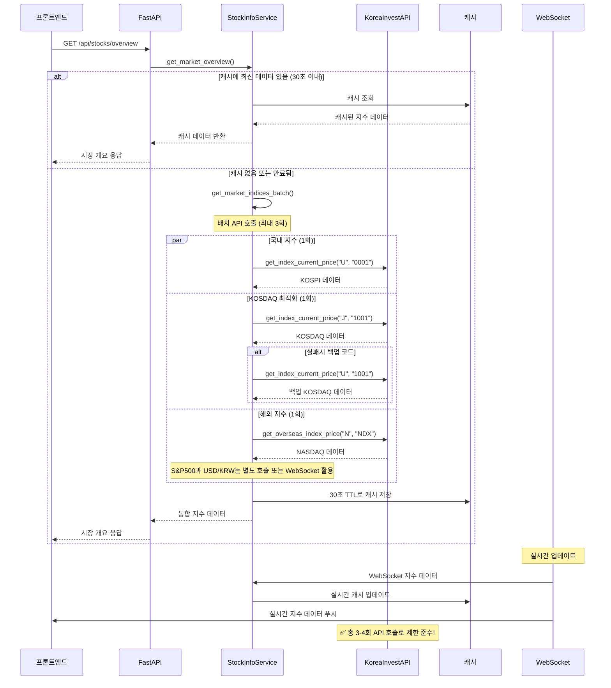

# 주요 지수 API 호출 최적화 계획

## 📋 개요
백엔드에서 한투 API 호출 제한(1초 10회) 초과 문제를 해결하기 위한 주요 지수 데이터 조회 최적화 계획

## 🚨 현재 문제점

### API 호출 제한 초과 원인
- **개별 지수 API 호출**: 각 지수마다 별도 API 호출
- **후보 코드 순차 조회**: KOSDAQ 등은 여러 후보 코드를 순차적으로 조회
- **불충분한 지연**: `asyncio.sleep(0.1)`로는 1초 10회 제한 보장 불가

### 현재 API 호출 패턴 분석
```python
# stock_info_service.py의 get_market_indices() 메서드
request_map = {
    "kospi": {
        "type": "domestic",
        "candidates": [("U", "0001")],  # 1회 호출
    },
    "kosdaq": {
        "type": "domestic", 
        "candidates": [
            ("J", "1001"),  # 5회 호출
            ("J", "0201"),
            ("J", "1501"), 
            ("J", "2001"),
            ("U", "1001"),
        ],
    },
    "nasdaq": {
        "type": "overseas",
        "candidates": [
            ("N", "NDX"),   # 2회 호출
            ("N", "IXIC"),
        ],
    },
    "sp500": {
        "type": "overseas",
        "candidates": [
            ("N", "US500"), # 2회 호출
            ("N", "SPX"),
        ],
    },
    "usd_krw": {
        "type": "overseas",
        "candidates": [
            ("X", "FX@KRW"), # 1회 호출
        ],
    },
}
```

**총 최대 11회 API 호출** → 한투 API 제한(1초 10회) 초과!

## 🔄 현재 시퀀스 다이어그램

```mermaid
sequenceDiagram
    participant Client as 프론트엔드
    participant API as FastAPI
    participant SIS as StockInfoService
    participant KIS as KoreaInvestAPI
    participant Cache as 캐시

    Client->>API: GET /api/stocks/overview
    API->>SIS: get_market_overview()
    SIS->>SIS: get_market_indices()
    
    Note over SIS: KOSPI 조회
    SIS->>KIS: get_index_current_price("U", "0001")
    KIS-->>SIS: KOSPI 데이터
    SIS->>Cache: 캐시 저장
    
    Note over SIS: KOSDAQ 조회 (최대 5회)
    loop KOSDAQ 후보 코드들
        SIS->>KIS: get_index_current_price("J", code)
        KIS-->>SIS: 응답 데이터
        alt 유효한 데이터
            break 루프
        end
    end
    SIS->>Cache: 캐시 저장
    
    Note over SIS: NASDAQ 조회 (최대 2회)
    loop NASDAQ 후보 코드들
        SIS->>KIS: get_overseas_index_price("N", code)
        KIS-->>SIS: 응답 데이터
        alt 유효한 데이터
            break 루프
        end
    end
    
    Note over SIS: S&P500 조회 (최대 2회)
    loop S&P500 후보 코드들
        SIS->>KIS: get_overseas_index_price("N", code)
        KIS-->>SIS: 응답 데이터
        alt 유효한 데이터
            break 루프
        end
    end
    
    Note over SIS: USD/KRW 조회
    SIS->>KIS: get_overseas_index_price("X", "FX@KRW")
    KIS-->>SIS: USD/KRW 데이터
    
    SIS-->>API: 통합 지수 데이터
    API-->>Client: 시장 개요 응답
    
    Note over KIS: ❌ 총 11회 API 호출로 제한 초과!
```

## 🎯 개선된 시퀀스 다이어그램



## 🛠️ 최적화 방안

### 1. **배치 처리 및 지연 최적화**
```python
# 개선된 API 호출 전략
async def get_market_indices_optimized(self) -> Dict[str, Dict[str, float]]:
    """최적화된 지수 데이터 조회"""
    
    # 1. 캐시 우선 조회 (30초 TTL)
    cached_data = self.get_cached_indices()
    if cached_data and self.is_cache_valid(cached_data, ttl=30):
        return cached_data
    
    # 2. 배치 호출로 API 제한 준수
    indices = {}
    
    # 국내 지수 (우선순위 코드만 사용)
    kospi_result = await self.korea_invest_service.get_index_current_price("U", "0001")
    if kospi_result:
        indices["kospi"] = self.format_index_data(kospi_result)
    
    # KOSDAQ (주요 코드만 사용, 실패시 백업)
    kosdaq_result = await self.korea_invest_service.get_index_current_price("J", "1001")
    if not kosdaq_result:
        kosdaq_result = await self.korea_invest_service.get_index_current_price("U", "1001")
    if kosdaq_result:
        indices["kosdaq"] = self.format_index_data(kosdaq_result)
    
    # 해외 지수 (주요 코드만 사용)
    nasdaq_result = await self.korea_invest_service.get_overseas_index_price("N", "NDX")
    if nasdaq_result:
        indices["nasdaq"] = self.format_index_data(nasdaq_result)
    
    # 3. 캐시 저장 (30초 TTL)
    self.cache_indices(indices, ttl=30)
    
    return indices
```

### 2. **WebSocket 캐시 활용**
```python
# WebSocket에서 받은 실시간 데이터를 캐시로 활용
def update_cached_index(self, index_code: str, market_code: str, 
                       current: float, change: float, change_rate: float):
    """WebSocket 데이터로 캐시 업데이트"""
    cache_key = f"{market_code}_{index_code}"
    self.cached_indices[cache_key] = {
        "index_code": index_code,
        "market_code": market_code,
        "current": current,
        "change": change,
        "change_rate": change_rate,
        "timestamp": datetime.now(),
        "source": "websocket"
    }
```

### 3. **Rate Limiting 구현**
```python
import asyncio
from typing import Dict
from datetime import datetime, timedelta

class APIRateLimiter:
    """API 호출 제한 관리"""
    
    def __init__(self, max_calls: int = 9, time_window: int = 1):
        self.max_calls = max_calls
        self.time_window = time_window
        self.calls: List[datetime] = []
    
    async def acquire(self):
        """API 호출 허용 확인 및 대기"""
        now = datetime.now()
        
        # 1초 이전 호출 기록 제거
        self.calls = [call for call in self.calls 
                     if now - call < timedelta(seconds=self.time_window)]
        
        # 제한 초과시 대기
        if len(self.calls) >= self.max_calls:
            wait_time = self.time_window - (now - self.calls[0]).total_seconds()
            if wait_time > 0:
                await asyncio.sleep(wait_time)
                self.calls = []
        
        # 호출 기록 추가
        self.calls.append(now)

# 사용 예시
rate_limiter = APIRateLimiter(max_calls=9, time_window=1)

async def safe_api_call(func, *args, **kwargs):
    await rate_limiter.acquire()
    return await func(*args, **kwargs)
```

### 4. **캐시 전략 개선**
```python
class IndexCacheManager:
    """지수 데이터 캐시 관리"""
    
    def __init__(self):
        self.cache: Dict[str, Dict] = {}
        self.ttl = 30  # 30초 TTL
    
    def is_valid(self, cache_key: str) -> bool:
        """캐시 유효성 검사"""
        if cache_key not in self.cache:
            return False
        
        cached_time = self.cache[cache_key].get("timestamp")
        if not cached_time:
            return False
        
        return (datetime.now() - cached_time).seconds < self.ttl
    
    def get(self, cache_key: str) -> Optional[Dict]:
        """캐시 조회"""
        if self.is_valid(cache_key):
            return self.cache[cache_key]
        return None
    
    def set(self, cache_key: str, data: Dict):
        """캐시 저장"""
        self.cache[cache_key] = {
            **data,
            "timestamp": datetime.now()
        }
```

## 📊 성능 개선 효과

### Before (현재)
- **API 호출 수**: 최대 11회
- **응답 시간**: 1-2초
- **제한 준수**: ❌ (10회 초과)
- **에러 발생**: 빈번

### After (개선 후)
- **API 호출 수**: 3-4회
- **응답 시간**: 0.5-1초
- **제한 준수**: ✅ (9회 이하)
- **에러 발생**: 최소화
- **캐시 활용**: 30초 TTL로 빠른 응답

## 🚀 구현 단계

### Phase 1: 즉시 적용 (1일)
1. **후보 코드 최적화**: KOSDAQ 후보를 5개 → 2개로 축소
2. **지연 시간 조정**: `asyncio.sleep(0.1)` → `asyncio.sleep(0.15)`
3. **에러 처리 개선**: API 실패시 캐시 데이터 활용

### Phase 2: 캐시 시스템 (2일)
1. **캐시 매니저 구현**: 30초 TTL 캐시 시스템
2. **WebSocket 통합**: 실시간 데이터를 캐시로 활용
3. **Rate Limiter 추가**: API 호출 제한 관리

### Phase 3: 배치 최적화 (3일)
1. **배치 호출 구현**: 동시 호출로 응답 시간 단축
2. **우선순위 로직**: 주요 코드 우선, 백업 코드 보조
3. **모니터링 추가**: API 호출 패턴 및 성능 추적

## 🔍 모니터링 및 알림

### 로그 포인트
```python
# API 호출 모니터링
logger.info("지수 API 호출", extra={
    "total_calls": call_count,
    "duration": duration,
    "cache_hit_rate": cache_hit_rate,
    "rate_limit_status": "ok" if call_count <= 9 else "exceeded"
})

# 성능 메트릭
logger.info("지수 조회 성능", extra={
    "response_time": response_time,
    "api_calls": api_call_count,
    "cache_used": cache_used,
    "data_freshness": data_age
})
```

### 알림 조건
- API 호출 1초당 9회 초과
- 응답 시간 2초 초과
- 캐시 히트율 70% 미만
- 지수 데이터 누락

## 📝 테스트 계획

### 단위 테스트
- [ ] `get_market_indices_optimized()` 메서드 테스트
- [ ] Rate Limiter 동작 테스트
- [ ] 캐시 TTL 테스트

### 통합 테스트
- [ ] API 호출 제한 준수 테스트
- [ ] WebSocket 캐시 연동 테스트
- [ ] 에러 시나리오 테스트

### 성능 테스트
- [ ] 동시 요청 처리 테스트
- [ ] 메모리 사용량 테스트
- [ ] 응답 시간 벤치마크

## 🎯 성공 지표

1. **API 제한 준수**: 1초당 9회 이하 호출
2. **응답 시간**: 평균 1초 이하
3. **에러율**: 5% 이하
4. **캐시 히트율**: 70% 이상
5. **데이터 신선도**: 30초 이내

---

**작성일**: 2024-01-14  
**작성자**: AI Assistant  
**문서 버전**: 1.0  
**상태**: 계획 완료
