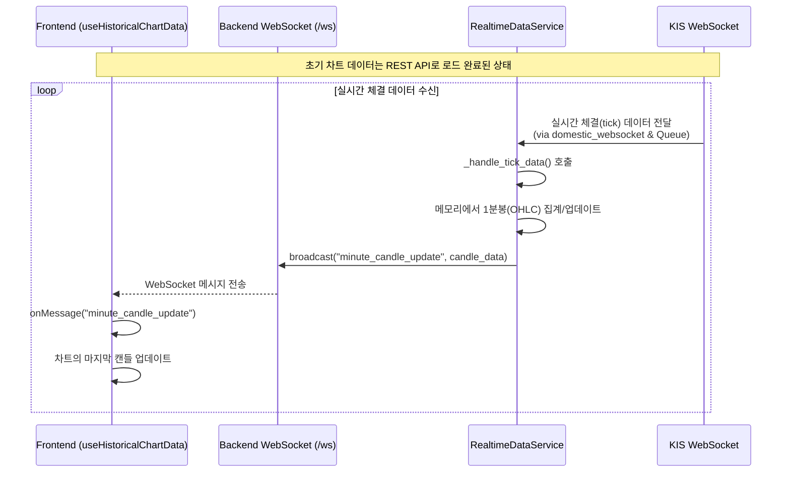

# 분봉 차트 실시간 업데이트 상세 구현 계획 (v2.1)

**문서 ID**: `1016.rt.v.2.1.md`  
**기반 문서**: `1016.chart.realtime.updatecandle.v.2.0.md`  
**작성일**: 2025-10-16

---

## 1. 목표

기존 시스템 아키텍처를 최대한 재활용하여, 실시간 체결(tick) 데이터를 기반으로 현재 분봉 캔들을 업데이트하는 기능을 구현합니다. 이를 통해 사용자는 차트에서 현재 가격 변동을 실시간으로 확인할 수 있습니다.

## 2. 핵심 설계: 기존 WebSocket 파이프라인 확장

새로운 집계 로직이나 폴링(Polling) API를 만드는 대신, 이미 안정적으로 운영 중인 실시간 데이터 파이프라인을 확장하여 구현합니다.

**데이터 흐름**:
1.  **`domestic_websocket.py`**: KIS(한국투자증권)로부터 실시간 체결 데이터(`H0STCNI0`)를 수신하여 `ws_result_queue`에 넣습니다. (변경 없음)
2.  **`RealtimeDataService` (백엔드)**: `ws_result_queue`에서 체결 데이터를 읽어 **메모리 내에서 1분봉으로 집계**합니다.
3.  **`ConnectionManager` (백엔드)**: 집계된 최신 분봉 데이터를 `minute_candle_update`라는 새로운 WebSocket 메시지 타입으로 프론트엔드에 브로드캐스트합니다.
4.  **`useHistoricalChartData` (프론트엔드)**: WebSocket 메시지를 수신하여 현재 차트의 마지막 캔들을 업데이트합니다.

### 전체 흐름도 (Mermaid Sequence Diagram)



## 3. 단계별 구현 계획

### Phase 1: (Backend) `RealtimeDataService` 분봉 집계 기능 추가

**파일**: `backend/app/services/realtime_service.py`

#### **1-1. `__init__`에 분봉 집계용 저장소 추가**

`RealtimeDataService` 클래스 생성자에 종목별 최신 분봉을 저장할 딕셔너리를 추가합니다.

```python
class RealtimeDataService:
    def __init__(self, ...):
        # ... 기존 코드 ...
        # ✅ 추가: {stock_code: {minute_ts: "YYYY-MM-DDTHH:MM:00", ohlc: {...}}}
        self.minute_ohlc_store: Dict[str, Dict[str, Any]] = {}
```

#### **1-2. `_handle_tick_data` 메서드 확장**

기존 `_handle_tick_data` 메서드에 분봉을 집계하고 브로드캐스트하는 로직을 추가합니다.

```python
# backend/app/services/realtime_service.py

async def _handle_tick_data(self, message: Dict[str, Any]):
    """체결 데이터 처리 - 분봉 차트 실시간 업데이트 지원"""
    try:
        data = message.get('data', {})
        stock_code = data.get('종목코드')
        
        if not stock_code:
            return

        # 1. 가격 및 시간 정보 추출
        price = float(str(data.get('현재가')).replace(",", ""))
        now = datetime.now()
        minute_ts = now.strftime('%Y-%m-%dT%H:%M:00')

        # 2. 분봉 집계
        last_candle = self.minute_ohlc_store.get(stock_code)

        if not last_candle or last_candle["minute_ts"] != minute_ts:
            # 새로운 분봉 시작
            new_ohlc = {"open": price, "high": price, "low": price, "close": price, "volume": 0} # 거래량은 추후 계산
            self.minute_ohlc_store[stock_code] = {"minute_ts": minute_ts, "ohlc": new_ohlc}
        else:
            # 기존 분봉 업데이트
            last_candle["ohlc"]["high"] = max(last_candle["ohlc"]["high"], price)
            last_candle["ohlc"]["low"] = min(last_candle["ohlc"]["low"], price)
            last_candle["ohlc"]["close"] = price
            # last_candle["ohlc"]["volume"] += tick_volume # 체결량 데이터가 있다면 추가

        # 3. 업데이트된 분봉 데이터 브로드캐스트
        updated_candle_data = self.minute_ohlc_store[stock_code]
        await self.connection_manager.broadcast({
            "type": "minute_candle_update",
            "stock_code": stock_code,
            "data": {
                "timestamp": updated_candle_data["minute_ts"],
                "open": updated_candle_data["ohlc"]["open"],
                "high": updated_candle_data["ohlc"]["high"],
                "low": updated_candle_data["ohlc"]["low"],
                "close": updated_candle_data["ohlc"]["close"],
                "volume": updated_candle_data["ohlc"]["volume"],
            }
        })
        logger.debug(f"📊 분봉 캔들 업데이트 브로드캐스트: {stock_code} @ {price}")

        # ... 기존 워치리스트용 tick_update 로직 유지 ...

    except Exception as e:
        logger.error(f"체결 데이터 처리 오류: {e}")
        self.metrics_collector.metrics.record_broadcast_error()
```

### Phase 2: (Frontend) WebSocket 메시지 처리 로직 추가

#### **2-1. `websocket.ts`에 타입 정의 추가**

**파일**: `stock-trading-ui/src/lib/websocket.ts`

새로운 메시지 타입(`minute_candle_update`)과 데이터 구조를 정의합니다.

```typescript
// MessageType에 추가
export type MessageType = /* ... 기존 타입 ... | */ "minute_candle_update";

// 인터페이스 추가
export interface MinuteCandleUpdate {
  stock_code: string;
  data: {
    timestamp: string; // YYYY-MM-DDTHH:MM:00
    open: number;
    high: number;
    low: number;
    close: number;
    volume: number;
  };
}
```

#### **2-2. `useHistoricalChartData.ts`에 실시간 업데이트 로직 추가**

**파일**: `stock-trading-ui/src/hooks/useHistoricalChartData.ts`

WebSocket 메시지를 구독하고, 수신된 데이터로 차트의 마지막 캔들을 업데이트하는 `useEffect` 훅을 추가합니다.

```typescript
import { subscribeToMessage } from '@/lib/websocket'; // subscribeToMessage 임포트

// useHistoricalChartData 훅 내부

useEffect(() => {
  // 분봉 차트가 아니거나, 훅이 비활성화 상태면 구독하지 않음
  if (timeframe !== 'minute' || !enabled) return;

  const unsubscribe = subscribeToMessage('minute_candle_update', (message: any) => {
    const update = message as MinuteCandleUpdate;
    if (update.stock_code !== stockCode) return;

    setChartData(prevData => {
      if (prevData.length === 0) return prevData;

      const lastCandle = prevData[prevData.length - 1];
      const lastCandleTime = lastCandle.timestamp.substring(0, 16); // YYYY-MM-DDTHH:MM
      const updateCandleTime = update.data.timestamp.substring(0, 16);

      if (lastCandleTime === updateCandleTime) {
        // 같은 분봉: 마지막 캔들 업데이트
        const updatedLastCandle = { ...lastCandle, ...update.data };
        return [...prevData.slice(0, -1), updatedLastCandle];
      } else if (new Date(update.data.timestamp) > new Date(lastCandle.timestamp)) {
        // 새로운 분봉: 새 캔들 추가 (이 경우, REST API 폴링이 더 안정적일 수 있음)
        // 여기서는 마지막 캔들 업데이트에 집중
        console.log(`새로운 분봉 감지: ${update.data.timestamp}. 폴링을 통해 갱신됩니다.`);
      }
      return prevData;
    });
  });

  // 컴포넌트 언마운트 시 구독 해제
  return () => unsubscribe();
}, [stockCode, timeframe, enabled]);
```

## 4. 검증 계획

1.  **백엔드**: `_handle_tick_data`에 로그를 추가하여 분봉이 올바르게 집계되고, `minute_candle_update` 메시지가 브로드캐스트되는지 확인합니다.
2.  **프론트엔드**: 브라우저 개발자 도구의 WebSocket 프레임에서 `minute_candle_update` 메시지가 수신되는지 확인합니다.
3.  **UI**: 차트의 마지막 캔들이 실시간으로 깜빡이며 업데이트되는지 시각적으로 확인합니다.
4.  **정합성**: 새로운 분이 시작될 때, 기존에 구현된 폴링 로직(`useHistoricalChartData`의 `setInterval`)이 새 캔들을 정상적으로 가져오는지 확인합니다.

이 계획은 기존 시스템의 안정성을 해치지 않으면서 최소한의 변경으로 실시간 분봉 업데이트 기능을 구현하는 데 초점을 맞추고 있습니다.

