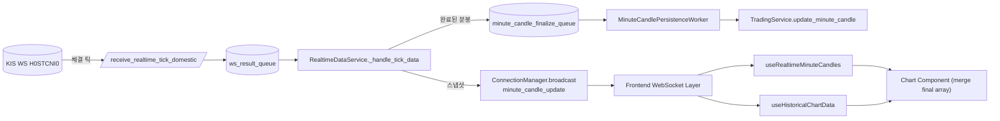

# 실시간 분봉 업데이트 3일 구현 계획

**문서 ID**: `1018.impl.daily.plan.md`  
**작성일**: 2025-10-19  
**참조 문서**: `docs/plan/1018.rt.minute.candle.update.plan.md`

---

## 1. 🎯 목표
한국투자증권 WebSocket(`H0STCNI0`) 체결 데이터를 활용해 1분 봉(OHLCV)을 실시간으로 집계하고, 완성된 분봉은 기존 캐시/REST 파이프라인(`TradingService.update_minute_candle`)에 남기면서 프론트엔드 분봉 차트의 마지막 캔들을 즉각 업데이트한다.  
구조 변경은 최소화하고, 이벤트 큐 기반으로 기존 서비스들과의 결합도를 낮춘다.

### 핵심 원칙
- **분봉 집계는 `RealtimeDataService` 내 `MinuteCandleState`**로 관리한다.
- **완성된 분봉은 `asyncio.Queue`를 통해 별도 코루틴에서** `TradingService.update_minute_candle`을 호출한다.
- **프론트엔드는 REST 훅과 WebSocket 훅을 분리** (`useHistoricalChartData` 유지, 신규 `useRealtimeMinuteCandles` 추가).
- **REST 폴링은 백업 전략으로 유지**한다.

---

## 2. 🗺️ 전체 흐름 요약 (Mermaid)


---

## 3. 🗓️ 3일 일정 (반나절 단위)

### 📅 Day 1 — 백엔드 로직 구현

#### AM (약 2시간): 체결 파싱 및 상태 구조 준비
1. **체결 데이터 파서 확장**
   - 파일: `backend/app/domestic_websocket.py`
   - 함수: `receive_realtime_tick_domestic`
   - 수정 내용:  
     - `체결시간` 오타 정정 및 `체결거래량`, `누적거래량` 파싱 추가.  
     - 반환 키를 영문 스네이크케이스(`stock_code`, `executed_time`, `trade_volume`, `acc_volume` 등)로 정규화하고 원시 문자열(`raw_payload`)을 포함.
     - 참고: `docs/plan/1018.rt.minute.candle.update.plan.md` 3.1.0의 샘플 메시지/헤더 표.
     ```python
     def receive_realtime_tick_domestic(raw: str) -> dict:
         values = raw.split("^")
         return {
             "stock_code": values[0],
             "executed_time": values[1],  # HHMMSS
             "price": int(values[2]) if values[2] else 0,
             "trade_volume": int(values[3]) if len(values) > 3 and values[3] else 0,
             "change_sign": values[4] if len(values) > 4 else "",
             "change": int(values[5]) if len(values) > 5 and values[5] else 0,
             "change_rate": float(values[6]) if len(values) > 6 and values[6] else 0.0,
             "ask_price": int(values[7]) if len(values) > 7 and values[7] else 0,
             "bid_price": int(values[8]) if len(values) > 8 and values[8] else 0,
             "ask_qty": int(values[9]) if len(values) > 9 and values[9] else 0,
             "bid_qty": int(values[10]) if len(values) > 10 and values[10] else 0,
             "market_code": values[11] if len(values) > 11 else "",
             "acc_volume": int(values[15]) if len(values) > 15 and values[15] else 0,
             "acc_value": int(values[16]) if len(values) > 16 and values[16] else 0,
             "open_price": int(values[17]) if len(values) > 17 and values[17] else 0,
             "high_price": int(values[18]) if len(values) > 18 and values[18] else 0,
             "low_price": int(values[19]) if len(values) > 19 and values[19] else 0,
             "sequence": int(values[20]) if len(values) > 20 and values[20] else 0,
             "raw_payload": raw,
         }
     ```
   - 테스트: `_sample_log_enabled = True`로 기동 후 `logs/minute_candle_samples.log`에 샘플 레코드가 남는지 확인.

2. **시간 파싱 헬퍼 생성**
   - 파일: `backend/app/utils/time.py` (신규) 또는 기존 유틸 위치.
   - 함수: `parse_kis_time(time_str: str, *, base: datetime | None = None) -> datetime`
   - 역할: HHMMSS → `datetime` (KST) 변환, 테스트 가능하도록 분리.

3. **분봉 상태 데이터클래스 정의**
   - 파일: `backend/app/models/realtime_minute.py` (신규).
   - 내용: `MinuteCandleState` (plan 문서 의사코드 참고) + `to_chart_candle()` 메서드.

#### PM (약 3시간): RealtimeDataService 확장 및 이벤트 큐
1. **상태 저장소와 락 추가**
   - 파일: `backend/app/services/realtime_service.py`
   - `__init__`에 다음 필드 추가:
     ```python
     self.minute_candle_state: Dict[str, MinuteCandleState] = {}
     self.minute_state_lock = asyncio.Lock()
     self.minute_state_ttl = timedelta(minutes=10)
     self.minute_finalize_queue: asyncio.Queue[Tuple[str, ChartCandle]] = asyncio.Queue(maxsize=200)
     ```

2. **틱 처리 로직 업데이트**
   - 함수: `_handle_tick_data`
   - 작업:
     - 파서에서 넘어온 영문 키 사용.
     - `message["data"]["trade_volume"]`가 0이면 이전 상태의 `acc_volume`과 비교해 증분을 계산하고, 음수·이상치는 0으로 보정하면서 경고 로그 남김.
     - `raw_payload`를 보존해 샘플 로그에 그대로 출력할 수 있도록 `message`에 전달.
     - `parse_kis_time`으로 분 키 생성.
     - 기존 분과 다르면 `_flush_closed_candle` 호출 후 새 상태 생성.
     - 현재 상태에 `apply_tick` 호출.
     - `_broadcast_minute_snapshot` 호출.

3. **완료 분봉 플러시 로직**
   - 함수: `_flush_closed_candle`
   - 작업:
     - `state.to_chart_candle()` 호출.
     - `await self.minute_finalize_queue.put((stock_code, candle))`.
     - `minute_candle_finalize` WebSocket 브로드캐스트 (optional).

4. **정리 작업**
   - 함수: `_drain_stale_states` — 5분 이상 업데이트 없는 상태 제거.
   - 호출 위치: `_market_data_loop` 또는 새로운 주기 코루틴에서 30초마다 실행.

5. **Persistence Worker 구성**
   - 위치: `RealtimeDataService.start`에서 `asyncio.create_task(self._minute_persistence_worker())` 추가.
   - 함수: `_minute_persistence_worker`
     ```python
     async def _minute_persistence_worker(self):
         while self.is_running:
             stock_code, candle = await self.minute_finalize_queue.get()
             try:
                 await self._persist_minute_candle(stock_code, candle)
             finally:
                 self.minute_finalize_queue.task_done()
     ```
   - `_persist_minute_candle` 내부에서 FastAPI dependency를 사용하는 대신, `TradingService`를 lazy import하여 `update_minute_candle` 호출. FastAPI 앱 기동 시 `RealtimeDataService`에 `persistence_service_factory` (콜러블) 주입하는 방식 권장.

6. **FastAPI 시작/종료 훅**
   - 파일: `backend/app/main.py`
   - 작업:
     - `RealtimeDataService` 초기화 시 persistence worker 태스크 등록.
     - 앱 종료 이벤트에서 `await realtime_service.stop_persistence_worker()` 호출.

7. **샘플 로깅 및 메트릭**
   - `RealtimeDataService.__init__`에서 `logs/minute_candle_samples.log` 전용 loguru 핸들 등록 (`_sample_log_limit` 기본 50, 필요 시 변경).
   - `_handle_tick_data` 초반에 샘플 대상 조건 분기(`_sample_log_enabled`, `_sample_log_counter`) 추가, 임계치 도달 시 자동 비활성화.
   - 운영시에는 `_sample_log_enabled=False`로 시작하고, 필요 시만 CLI/환경변수 등으로 활성화.
   - `minute_candle_update` 브로드캐스트 수와 큐 대기 길이를 메트릭에 기록.

---

### 📅 Day 2 — 프론트엔드 연동

#### AM (약 2시간): WebSocket 타입/헬퍼 정비
1. **타입 정의**
   - 파일: `stock-trading-ui/src/lib/types.ts`
   - 추가:
     ```ts
     export interface MinuteCandleUpdateMessage {
       type: 'minute_candle_update';
       stock_code: string;
       data: {
         timestamp: string;
         open: number;
         high: number;
         low: number;
         close: number;
         volume: number;
         last_tick?: string;
       };
     }
     export interface MinuteCandleFinalizeMessage { /* 필요 시 */ }
     ```

2. **WebSocket 상수 업데이트**
   - 파일: `stock-trading-ui/src/lib/constants.ts`
   - `WS_MESSAGE_TYPES.MINUTE_CANDLE_UPDATE = 'minute_candle_update'` 추가.

3. **WebSocketManager 처리**
   - 파일: `stock-trading-ui/src/lib/websocket.ts`
   - `handleMessage` switch-case에 `WS_MESSAGE_TYPES.MINUTE_CANDLE_UPDATE` 분기 추가.
   - 헬퍼 함수 추가:
     ```ts
     export function subscribeToMinuteCandles(callback: (payload: MinuteCandleUpdateMessage) => void): () => void {
       wsManager.on(WS_MESSAGE_TYPES.MINUTE_CANDLE_UPDATE, callback);
       return () => wsManager.off(WS_MESSAGE_TYPES.MINUTE_CANDLE_UPDATE, callback);
     }
     ```
   - 기존 호가/워치리스트 로직과 동일한 패턴 유지.

#### PM (약 3시간): 차트 훅 및 UI 병합
1. **신규 훅 작성**
   - 파일: `stock-trading-ui/src/hooks/useRealtimeMinuteCandles.ts` (신규)
   - 내용:
     ```ts
     export function useRealtimeMinuteCandles(stockCode: string, enabled = true) {
       const [candle, setCandle] = useState<ChartCandle | null>(null);
       useEffect(() => {
         if (!enabled || !stockCode) return;
         const unsubscribe = subscribeToMinuteCandles((message) => {
           if (message.stock_code !== stockCode) return;
           const { data } = message;
           setCandle({
             timestamp: data.timestamp,
             open: data.open,
             high: data.high,
             low: data.low,
             close: data.close,
             volume: data.volume,
           });
         });
         return unsubscribe;
       }, [stockCode, enabled]);
       return candle;
     }
     ```
   - Jest 테스트 초안: mock wsManager로 메시지 수신 시 상태가 업데이트되는지 확인.

2. **차트 컴포넌트 병합**
   - 대상: `stock-trading-ui/src/components/trading/RealtimeCandlestickChart.tsx` (또는 데이터 병합 책임을 지는 상위 컴포넌트).
   - 작업:
     - `useRealtimeMinuteCandles(stockCode, timeframe === 'minute')` 호출.
     - `useMemo`로 `historicalData`와 `realtimeCandle`을 병합.
     - 동일 minute 키(`timestamp.slice(0, 16)`)면 마지막 캔들을 대체, 이후 시점이면 append.
     - 차트 라이브러리에 전달하는 props를 `finalChartData`로 교체.

3. **백업 폴링 유지 문구 UI에 반영**
   - tool-tip 또는 docs: WebSocket 중단 시 `/api/chart/{code}/minute/current` 폴링 가능하다는 안내 추가.

---

### 📅 Day 3 — 안정화 및 검증

#### AM (약 2시간): 안정화 작업
1. **Persistence worker 유효성 체크**
   - 거래 시간 전/후, 장 종료 시 큐가 비는지 로그 확인.
   - 큐 포화(오래된 데이터) 시 경고 로그 및 관찰.

2. **에러/예외 처리 강화**
   - `_handle_tick_data`에서 price/volume 0인 경우 early return.
   - `_minute_persistence_worker` 예외 처리 및 재시도 로직(필요 시) 적용.

3. **메트릭/로그**
   - 각 단계별 로그 레벨 점검, 불필요한 `print` 제거.
   - 샘플 로그 파일(`logs/minute_candle_samples.log`) 크기/회전을 확인하고, 운영 시 `_sample_log_enabled=False`로 기본 세팅되어 있는지 검증.

#### PM (약 3시간): 테스트 및 문서화
1. **단위 테스트**
   - `backend/tests/services/test_minute_candle_state.py`: `apply_tick`, `to_chart_candle` 검증.
   - `backend/tests/services/test_realtime_service_minute.py`:  
     - `MinuteCandleState` 전환 시 `minute_finalize_queue`에 값이 들어가는지 Mock으로 확인.
   - `stock-trading-ui/src/__tests__/hooks/useRealtimeMinuteCandles.test.ts`:  
     - Mock wsManager 통해 훅 상태 갱신 확인.

2. **통합 테스트 / 수동 검증**
   - 장 시작 전, 장 중, 장 종료 후 시나리오별 로그 확인.
   - 차트 UI에서 마지막 캔들이 실시간으로 움직이는지 시각적 검증.

3. **문서화**
   - `docs/execution/20251019_realtime_candle_impl.md` (신규) — 구현 요약, 테스트 결과, 남은 과제 기록.
   - 향후 개선 아이템(메모리 최적화, failover 전략 등) 메모.

4. **코드 리뷰 요청**
   - 백엔드/프론트 분리 리뷰, 포인트 체크리스트 첨부.

---

## 4. ✅ 완료 기준 (Definition of Done)
- 체결 메시지 수신 직후 분봉 스냅샷이 WebSocket으로 전파되고, 프론트 차트 마지막 캔들이 실시간으로 갱신된다.
- 분 경계가 넘어가면 `minute_candle_finalize_queue`에 캔들이 적재되고, persistence worker가 `TradingService.update_minute_candle`을 호출해 캐시 파일이 최신 상태를 유지한다.
- `/api/chart/{code}/minute` 호출 시 WebSocket과 REST 데이터가 일관된 시점으로 정렬된다.
- 테스트(단위/간단 통합)와 수동 검증이 완료되고, 실행 로그 및 문서가 남는다.

---

## 5. 📌 참고 및 후기 작업
- 필요 시 `minute_candle_finalize` 메시지를 프론트에 전달해 새로운 분봉 시작을 알리거나, REST 폴링 트리거를 최적화할 수 있다.
- 장중 끊김 대비를 위해 `minute_finalize_queue` 상태를 모니터링하고, 특정 임계치 이상일 때 알람을 설정하는 것을 권장한다.
- 추후 개선 아이디어:  
  - 거래소 휴장일/점검 시간 자동 처리  
  - 멀티 심볼 동시 집계 최적화  
  - 백테스트용 분봉 데이터 재생성 스크립트

--- 
