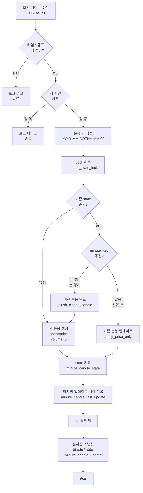
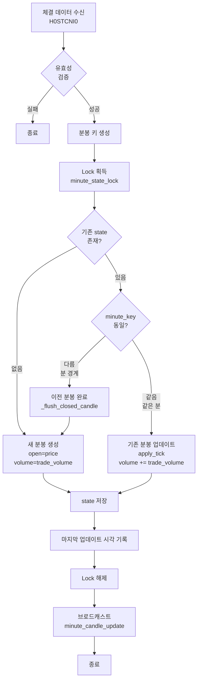
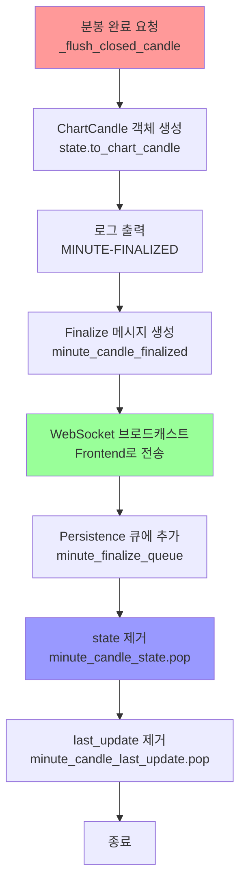
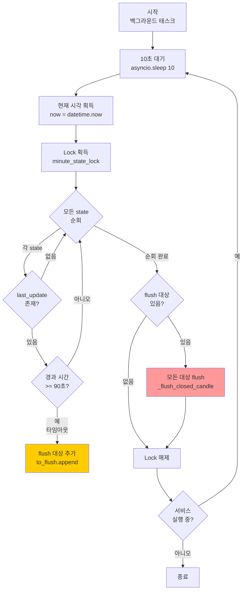

# H0STASP0 호가 데이터를 활용한 분봉 실시간 업데이트 구현 계획 v3.0 (FINAL)

**Date**: 2025-10-21
**Version**: 3.0 (Final Implementation Plan with Detailed Candle Creation Routine)
**Status**: 📋 Ready for Implementation

---

## 📋 개요

H0STASP0 (호가 데이터)에 포함된 `current_price`와 `timestamp`를 활용하여 분봉을 실시간으로 업데이트합니다.

**핵심 개선사항**:
- ✅ 체결 데이터 없이도 분봉 생성/완료 가능
- ✅ 타임아웃 기반 자동 완료 (메모리 누수 방지)
- ✅ Race condition 완벽 방지
- ✅ 상세한 분봉 생성 루틴 문서화

---

## 🎯 구현 목표

**현재 상태**:
- ✅ H0STASP0 구독 완료 (domestic_websocket.py:379-385)
- ✅ 호가 데이터 수신 및 파싱 완료 (domestic_websocket.py:473-515)
- ✅ RealtimeDataService에서 호가 처리 완료 (realtime_service.py:301-384)
- ❌ **분봉 업데이트는 안 됨** (현재는 orderbook_update만 브로드캐스트)

**목표**:
- ✅ 호가 데이터의 `current_price` 변경 시 현재 분봉 업데이트
- ✅ 분봉 완료 시 자동 저장 및 새 분봉 시작
- ✅ 실시간 분봉 스냅샷 브로드캐스트 (`minute_candle_update`)
- ✅ **체결 없이도 분봉 생성/완료 보장**
- ✅ **타임아웃 기반 자동 완료 (90초)**

---

## 🔄 분봉 생성 루틴 상세 분석

### 📊 전체 아키텍처

```
┌──────────────────┐
│  WebSocket 수신   │
│  (H0STASP0 호가)  │
│  (H0STCNI0 체결)  │
└────────┬─────────┘
         │
         ▼
┌──────────────────────────────────────────────────┐
│       RealtimeDataService                        │
│  ┌──────────────────────────────────────────┐   │
│  │  분봉 상태 관리 (minute_candle_state)    │   │
│  │  - Dict[stock_code, MinuteCandleState]   │   │
│  │  - Lock으로 보호 (minute_state_lock)     │   │
│  └──────────────────────────────────────────┘   │
│                                                  │
│  ┌─────────────┐  ┌──────────────────┐         │
│  │ 호가 처리   │  │   체결 처리       │         │
│  │ _update_    │  │   _handle_tick_  │         │
│  │ minute_from │  │   data()         │         │
│  │ _hoga()     │  │                  │         │
│  └──────┬──────┘  └────────┬─────────┘         │
│         │                  │                    │
│         └──────┬───────────┘                    │
│                ▼                                 │
│  ┌─────────────────────────────────────┐       │
│  │   분봉 업데이트 로직                 │       │
│  │   1. 분 경계 체크                    │       │
│  │   2. 이전 분봉 완료 (flush)          │       │
│  │   3. 새 분봉 생성 or 기존 업데이트   │       │
│  │   4. 브로드캐스트                    │       │
│  └─────────────────────────────────────┘       │
│                                                  │
│  ┌─────────────────────────────────────┐       │
│  │   타임아웃 체커 (백그라운드)         │       │
│  │   - 10초마다 실행                    │       │
│  │   - 90초 동안 업데이트 없으면 flush  │       │
│  └─────────────────────────────────────┘       │
└──────────────────────────────────────────────────┘
         │
         ▼
┌──────────────────┐
│  Frontend WS     │
│  - minute_candle │
│    _update       │
│  - minute_candle │
│    _finalized    │
└──────────────────┘
```

---

## 📝 분봉 생성 루틴 상세 플로우차트

### 루틴 1: 호가 데이터 수신 시 (`_update_minute_from_hoga`)



---

### 루틴 2: 체결 데이터 수신 시 (`_handle_tick_data`)



---

### 루틴 3: 분봉 완료 처리 (`_flush_closed_candle`)



---

### 루틴 4: 타임아웃 체커 (`_minute_timeout_checker` - 백그라운드)



---

## 🔍 분봉 생성 시나리오별 상세 분석

### 시나리오 1: 정상 케이스 (호가 + 체결 혼합)

```
Timeline:
14:05:00  호가 71500원 도착
14:05:15  호가 71600원 도착
14:05:30  체결 71550원, 100주 도착
14:05:45  호가 71700원 도착
14:06:00  체결 71800원, 50주 도착 (다음 분)

상세 처리:
┌─────────────┬──────────────────────────────────────────┬─────────────────────┐
│ 시각        │ 이벤트 및 처리                            │ 분봉 상태            │
├─────────────┼──────────────────────────────────────────┼─────────────────────┤
│ 14:05:00    │ 호가 71500 도착                          │                     │
│             │ └→ state 없음 → 새 분봉 생성              │ O:71500 H:71500     │
│             │    minute_key = "14:05:00"               │ L:71500 C:71500     │
│             │    open=71500, volume=0                  │ V:0                 │
│             │ └→ 브로드캐스트 (minute_candle_update)    │                     │
├─────────────┼──────────────────────────────────────────┼─────────────────────┤
│ 14:05:15    │ 호가 71600 도착                          │                     │
│             │ └→ state 있음, minute_key 같음            │ O:71500 H:71600     │
│             │ └→ apply_price_only(71600)               │ L:71500 C:71600     │
│             │    high = max(71500, 71600) = 71600      │ V:0                 │
│             │    close = 71600                         │                     │
│             │ └→ 브로드캐스트                           │                     │
├─────────────┼──────────────────────────────────────────┼─────────────────────┤
│ 14:05:30    │ 체결 71550, 100주 도착                   │                     │
│             │ └→ state 있음, minute_key 같음            │ O:71500 H:71600     │
│             │ └→ apply_tick(71550, 100)                │ L:71500 C:71550     │
│             │    volume += 100 = 100                   │ V:100 ✅            │
│             │ └→ 브로드캐스트                           │                     │
├─────────────┼──────────────────────────────────────────┼─────────────────────┤
│ 14:05:45    │ 호가 71700 도착                          │                     │
│             │ └→ apply_price_only(71700)               │ O:71500 H:71700     │
│             │    high = max(71600, 71700) = 71700      │ L:71500 C:71700     │
│             │ └→ 브로드캐스트                           │ V:100               │
├─────────────┼──────────────────────────────────────────┼─────────────────────┤
│ 14:06:00    │ 체결 71800, 50주 도착 (다음 분!)          │                     │
│             │ └→ minute_key = "14:06:00"               │                     │
│             │ └→ state.minute_key != minute_key        │ [14:05 분봉 완료]   │
│             │ └→ _flush_closed_candle() 호출           │ O:71500 H:71700     │
│             │    ✅ minute_candle_finalized 전송       │ L:71500 C:71700     │
│             │    ✅ persistence 큐에 추가              │ V:100               │
│             │    ✅ state 제거                         │ [FINALIZED] ✅      │
│             │ └→ 새 분봉 생성 (14:06)                  │                     │
│             │    open=71800, volume=50                 │ [14:06 분봉 시작]   │
│             │ └→ 브로드캐스트                           │ O:71800 V:50        │
└─────────────┴──────────────────────────────────────────┴─────────────────────┘

결과:
✅ 14:05 분봉: O=71500, H=71700, L=71500, C=71700, V=100 (완료)
✅ 14:06 분봉: O=71800, H=71800, L=71800, C=71800, V=50 (진행 중)
```

---

### 시나리오 2: 호가만 있는 케이스 (체결 없음)

```
Timeline:
14:05:00  호가 71500원 도착
14:05:20  호가 71600원 도착
14:05:40  호가 71550원 도착
14:06:00  호가 71700원 도착 (다음 분, 체결 없음!)

상세 처리:
┌─────────────┬──────────────────────────────────────────┬─────────────────────┐
│ 시각        │ 이벤트 및 처리                            │ 분봉 상태            │
├─────────────┼──────────────────────────────────────────┼─────────────────────┤
│ 14:05:00    │ 호가 71500 도착                          │                     │
│             │ └→ 새 분봉 생성 (14:05)                  │ O:71500 H:71500     │
│             │    volume=0 (호가는 거래량 없음)          │ L:71500 C:71500     │
│             │ └→ last_update = 14:05:00                │ V:0 ⚠️              │
├─────────────┼──────────────────────────────────────────┼─────────────────────┤
│ 14:05:20    │ 호가 71600 도착                          │                     │
│             │ └→ apply_price_only(71600)               │ O:71500 H:71600     │
│             │ └→ last_update = 14:05:20                │ L:71500 C:71600     │
│             │                                          │ V:0                 │
├─────────────┼──────────────────────────────────────────┼─────────────────────┤
│ 14:05:40    │ 호가 71550 도착                          │                     │
│             │ └→ apply_price_only(71550)               │ O:71500 H:71600     │
│             │ └→ last_update = 14:05:40                │ L:71500 C:71550     │
│             │                                          │ V:0                 │
├─────────────┼──────────────────────────────────────────┼─────────────────────┤
│ 14:06:00    │ 호가 71700 도착 (다음 분!)                │                     │
│             │ └→ minute_key = "14:06:00"               │                     │
│             │ └→ state.minute_key != minute_key        │ [분 경계 감지!]     │
│             │ └→ _flush_closed_candle() 호출 ✅        │                     │
│             │    ✅ 호가가 이전 분봉 완료 처리          │ [14:05 완료]        │
│             │    ✅ minute_candle_finalized 전송       │ O:71500 H:71600     │
│             │ └→ 새 분봉 생성 (14:06)                  │ L:71500 C:71550     │
│             │    open=71700, volume=0                  │ V:0                 │
│             │                                          │ [FINALIZED] ✅      │
└─────────────┴──────────────────────────────────────────┴─────────────────────┘

결과:
✅ 14:05 분봉: O=71500, H=71600, L=71500, C=71550, V=0 (호가로 완료)
✅ 14:06 분봉: O=71700, V=0 (진행 중)
```

---

### 시나리오 3: 거래 중단 케이스 (타임아웃 발동)

```
Timeline:
14:05:00  호가 71500원 도착
14:05:30  호가 71600원 도착
(이후 데이터 없음 - 거래 완전 중단)
14:07:00  타임아웃 체커 감지 (90초 경과)

상세 처리:
┌─────────────┬──────────────────────────────────────────┬─────────────────────┐
│ 시각        │ 이벤트 및 처리                            │ 분봉 상태            │
├─────────────┼──────────────────────────────────────────┼─────────────────────┤
│ 14:05:00    │ 호가 71500 도착                          │                     │
│             │ └→ 새 분봉 생성                          │ O:71500 H:71500     │
│             │ └→ last_update = 14:05:00 ✅            │ L:71500 C:71500     │
│             │                                          │ V:0                 │
├─────────────┼──────────────────────────────────────────┼─────────────────────┤
│ 14:05:30    │ 호가 71600 도착                          │                     │
│             │ └→ apply_price_only                      │ O:71500 H:71600     │
│             │ └→ last_update = 14:05:30 ✅            │ L:71500 C:71600     │
│             │                                          │ V:0                 │
├─────────────┼──────────────────────────────────────────┼─────────────────────┤
│ 14:05:40    │ [타임아웃 체커 실행 - 10초마다]           │                     │
│             │ └→ 경과 시간: 10초 (< 90초)              │ (계속 유지)          │
│             │ └→ 아무 동작 안 함                        │                     │
├─────────────┼──────────────────────────────────────────┼─────────────────────┤
│ 14:05:50    │ [타임아웃 체커 실행]                      │                     │
│             │ └→ 경과 시간: 20초 (< 90초)              │ (계속 유지)          │
├─────────────┼──────────────────────────────────────────┼─────────────────────┤
│ ... (반복)  │ 10초마다 체크, 아직 타임아웃 아님         │                     │
├─────────────┼──────────────────────────────────────────┼─────────────────────┤
│ 14:07:00    │ [타임아웃 체커 실행]                      │                     │
│             │ └→ 경과 시간: 90초 (>= 90초) ⚠️          │ [타임아웃 감지!]    │
│             │ └→ 타임아웃 감지!                         │                     │
│             │ └→ _flush_closed_candle() 호출 ✅        │                     │
│             │    ⚠️ 타임아웃으로 강제 완료              │ [14:05 강제 완료]   │
│             │    ✅ minute_candle_finalized 전송       │ O:71500 H:71600     │
│             │    ✅ state 제거 (메모리 해제)            │ L:71500 C:71600     │
│             │                                          │ V:0                 │
│             │                                          │ [TIMEOUT-FLUSH] ⚠️  │
└─────────────┴──────────────────────────────────────────┴─────────────────────┘

로그:
⚠️ [TIMEOUT-FLUSH] 005930 2025-10-21T14:05:00 타임아웃 (90초 경과), 자동 완료

결과:
✅ 14:05 분봉: O=71500, H=71600, L=71500, C=71600, V=0 (타임아웃 완료)
✅ 메모리 누수 방지 (state 제거)
```

---

### 시나리오 4: Race Condition 방지 (호가 vs 체결 동시 도착)

```
Timeline:
14:05:59.900  호가 71500원 도착
14:06:00.000  체결 71600원, 100주 도착 (동시!)
14:06:00.001  호가 71700원 도착 (동시!)

상세 처리 (Lock으로 순차 처리):
┌─────────────────┬─────────────────────────────────────┬──────────────┐
│ 시각            │ 이벤트 및 처리                       │ Lock 상태     │
├─────────────────┼─────────────────────────────────────┼──────────────┤
│ 14:05:59.900    │ 호가 71500 도착                     │              │
│                 │ └→ Lock 획득 ✅                     │ 🔒 호가 점유  │
│                 │ └→ 분봉 업데이트                     │              │
│                 │ └→ Lock 해제 ✅                     │ 🔓 해제      │
├─────────────────┼─────────────────────────────────────┼──────────────┤
│ 14:06:00.000    │ [체결 & 호가 동시 도착]              │              │
│                 │ 체결 스레드: Lock 획득 시도...       │ ⏳ 대기 중   │
│                 │ 호가 스레드: Lock 획득 시도...       │ ⏳ 대기 중   │
│                 │                                     │              │
│                 │ [운영체제 스케줄러가 순서 결정]       │              │
│                 │ → 체결이 먼저 Lock 획득 (예시)       │              │
├─────────────────┼─────────────────────────────────────┼──────────────┤
│ 14:06:00.001    │ [체결 처리 시작]                     │              │
│                 │ └→ Lock 획득 ✅                     │ 🔒 체결 점유  │
│                 │ └→ minute_key != state.minute_key   │              │
│                 │ └→ _flush_closed_candle() 호출      │              │
│                 │    ✅ 14:05 분봉 완료                │              │
│                 │ └→ 새 분봉 생성 (14:06)             │              │
│                 │    open=71600, volume=100           │              │
│                 │ └→ Lock 해제 ✅                     │ 🔓 해제      │
├─────────────────┼─────────────────────────────────────┼──────────────┤
│ 14:06:00.002    │ [호가 처리 시작]                     │              │
│                 │ └→ Lock 획득 ✅                     │ 🔒 호가 점유  │
│                 │ └→ minute_key = "14:06:00"          │              │
│                 │ └→ state.minute_key = "14:06:00"    │              │
│                 │ └→ minute_key == state.minute_key   │              │
│                 │    (같음! 이미 체결이 처리함)        │              │
│                 │ └→ apply_price_only(71700) ✅       │              │
│                 │    (기존 14:06 분봉 업데이트)        │              │
│                 │ └→ Lock 해제 ✅                     │ 🔓 해제      │
└─────────────────┴─────────────────────────────────────┴──────────────┘

결과:
✅ Race condition 없음 (Lock으로 순차 처리)
✅ 14:05 분봉: 체결이 완료 처리
✅ 14:06 분봉: 체결이 생성, 호가가 업데이트
✅ 중복 flush 방지 (minute_key 체크)
```

---

## 📁 수정할 파일 (3개)

### 1️⃣ `backend/app/models/realtime_minute.py`

**변경 내용**: `MinuteCandleState`에 가격만으로 업데이트하는 메서드 추가

**추가 코드**:

```python
def apply_price_only(self, price: float, tick_ts: datetime) -> None:
    """
    호가 데이터처럼 거래량 없이 가격만 업데이트
    (현재가 변동 추적용)

    Args:
        price: 현재가
        tick_ts: 업데이트 시각

    Note:
        - high/low 자동 갱신
        - close 업데이트
        - volume은 변경 안 함 (호가에는 거래량 없음)
    """
    self.high = max(self.high, price)
    self.low = min(self.low, price)
    self.close = price
    # volume은 업데이트 안 함 (호가에는 거래량 없음)
    self.last_tick_ts = tick_ts
```

**위치**: Line 23 이후 (기존 `apply_tick` 메서드 바로 다음)

---

### 2️⃣ `backend/app/services/realtime_service.py`

#### 수정 A: `__init__` 메서드에 타임아웃 추적 변수 추가

**수정 위치**: Line 58-64 (minute_candle_state 선언 부분)

**기존 코드**:
```python
# 실시간 분봉 집계 상태
self.minute_candle_state: Dict[str, MinuteCandleState] = {}
self.minute_state_lock = asyncio.Lock()
self.minute_state_ttl = timedelta(minutes=10)
self._last_acc_volume: Dict[str, int] = {}
self.minute_finalize_queue: asyncio.Queue[Tuple[str, ChartCandle]] = asyncio.Queue(maxsize=200)
self._minute_persist_handler: Optional[Callable[[str, ChartCandle], Awaitable[None]]] = None
```

**변경 후**:
```python
# 실시간 분봉 집계 상태
self.minute_candle_state: Dict[str, MinuteCandleState] = {}
self.minute_state_lock = asyncio.Lock()
self.minute_state_ttl = timedelta(minutes=10)
self._last_acc_volume: Dict[str, int] = {}
self.minute_finalize_queue: asyncio.Queue[Tuple[str, ChartCandle]] = asyncio.Queue(maxsize=200)
self._minute_persist_handler: Optional[Callable[[str, ChartCandle], Awaitable[None]]] = None

# 🔥 NEW: 타임아웃 기반 자동 완료
self.minute_candle_last_update: Dict[str, datetime] = {}  # 마지막 업데이트 시각
self._minute_timeout_task: Optional[asyncio.Task] = None  # 타임아웃 체커 태스크
self._minute_timeout_seconds = 90  # 90초 타임아웃
```

---

#### 수정 B: `start` 메서드에 타임아웃 체커 시작

**수정 위치**: Line 97-114

**기존 코드**:
```python
async def start(self):
    """실시간 데이터 서비스 시작"""
    if self.is_running:
        logger.warning("실시간 서비스가 이미 실행 중입니다.")
        return

    self.is_running = True
    logger.info("실시간 데이터 서비스 시작")

    # 백그라운드 태스크 시작
    self.tasks = [
        asyncio.create_task(self._process_websocket_queue()),
        asyncio.create_task(self._minute_persistence_worker()),
    ]
```

**변경 후**:
```python
async def start(self):
    """실시간 데이터 서비스 시작"""
    if self.is_running:
        logger.warning("실시간 서비스가 이미 실행 중입니다.")
        return

    self.is_running = True
    logger.info("실시간 데이터 서비스 시작")

    # 백그라운드 태스크 시작
    self.tasks = [
        asyncio.create_task(self._process_websocket_queue()),
        asyncio.create_task(self._minute_persistence_worker()),
    ]

    # 🔥 NEW: 타임아웃 체커 시작
    self._minute_timeout_task = asyncio.create_task(self._minute_timeout_checker())
    logger.info(f"분봉 타임아웃 체커 시작 (타임아웃: {self._minute_timeout_seconds}초)")
```

---

#### 수정 C: `_handle_hoga_data` 메서드에 분봉 업데이트 호출 추가

**수정 위치**: Line 377-379 (호가 브로드캐스트 직후)

**기존 코드**:
```python
logger.info(f"📡 호가 데이터 브로드캐스트: {stock_code}")
await self.connection_manager.broadcast(broadcast_message)

self.metrics_collector.metrics.record_message_processed()
```

**변경 후**:
```python
logger.info(f"📡 호가 데이터 브로드캐스트: {stock_code}")
await self.connection_manager.broadcast(broadcast_message)

# 🔥 NEW: 호가 데이터로 분봉 업데이트
current_price = hoga_data.get("current_price")
timestamp_str = hoga_data.get("timestamp")

if current_price and current_price > 0 and timestamp_str:
    await self._update_minute_from_hoga(
        stock_code=stock_code,
        price=float(current_price),
        timestamp_str=timestamp_str
    )

self.metrics_collector.metrics.record_message_processed()
```

---

#### 수정 D: 새 메서드 추가 - `_update_minute_from_hoga`

**추가 위치**: Line 603 이후 (`_flush_closed_candle` 메서드 다음)

**추가 코드**:

```python
async def _update_minute_from_hoga(
    self,
    stock_code: str,
    price: float,
    timestamp_str: str
) -> None:
    """
    호가 데이터(H0STASP0)의 current_price를 이용한 분봉 업데이트

    Args:
        stock_code: 종목 코드 (예: "005930")
        price: 현재가 (예: 71700.0)
        timestamp_str: ISO 8601 타임스탬프 (예: "2025-10-21T14:05:23")

    Process:
        1. 타임스탬프 파싱 및 장 시간 체크
        2. 분봉 키 생성 (분 단위로 절삭)
        3. 분 경계 체크 및 이전 분봉 완료 (체결 없을 경우 대비)
        4. 분봉 상태 갱신 (거래량 없이 가격만)
        5. 실시간 스냅샷 브로드캐스트

    Note:
        - 호가는 거래량이 없으므로 volume=0 유지
        - 가격만 업데이트 (OHLC)
        - 분 경계 감지 시 이전 분봉 완료 (체결이 없을 경우 대비)
        - 체결 데이터가 이미 처리했다면 중복 방지됨 (minute_key 체크)
    """
    try:
        # 1. 타임스탬프 파싱
        from datetime import datetime
        try:
            tick_ts = datetime.fromisoformat(timestamp_str)
            if tick_ts.tzinfo is None:
                tick_ts = tick_ts.replace(tzinfo=KST)
        except ValueError:
            logger.warning(f"호가 타임스탬프 파싱 실패: {timestamp_str}")
            return

        # 2. 장 시간 체크
        from app.utils.trading_hours import TradingHoursManager
        tick_ts_naive = tick_ts.astimezone(KST).replace(tzinfo=None)
        if not TradingHoursManager.is_trading_hours(tick_ts_naive, include_extended=True):
            logger.debug(f"장 시간 외 호가 분봉 업데이트 무시: {stock_code}")
            return

        # 3. 분봉 키 생성 (분 단위로 절삭)
        minute_key = tick_ts.strftime("%Y-%m-%dT%H:%M:00")

        # 4. 분봉 상태 갱신
        async with self.minute_state_lock:
            state = self.minute_candle_state.get(stock_code)

            # ✅ 핵심: 분 경계 처리 (체결이 없을 경우 대비)
            if state and state.minute_key != minute_key:
                # 이전 분봉이 있고 분이 바뀜
                # → 이전 분봉 완료 처리 (호가가 담당)
                logger.info(
                    f"📊 [HOGA-FLUSH] {stock_code} 분 경계 감지 "
                    f"({state.minute_key} → {minute_key}), 호가로 분봉 완료"
                )
                await self._flush_closed_candle(stock_code, state)
                state = None

            if not state:
                # 새 분봉 생성 (호가로 시작)
                state = MinuteCandleState(
                    minute_key=minute_key,
                    open=price,
                    high=price,
                    low=price,
                    close=price,
                    volume=0,  # 호가는 거래량 없음
                    start_ts=tick_ts,
                    last_tick_ts=tick_ts,
                )
                self.minute_candle_state[stock_code] = state
                logger.info(
                    f"📊 [HOGA-NEW-CANDLE] {stock_code} {minute_key} "
                    f"시작 (open={price}, volume=0)"
                )
            else:
                # 기존 분봉 업데이트 (가격만)
                state.apply_price_only(price, tick_ts)
                logger.debug(
                    f"📊 [HOGA-UPDATE] {stock_code} {minute_key} "
                    f"(close={price}, H={state.high}, L={state.low})"
                )

            # ✅ 마지막 업데이트 시각 기록 (타임아웃 체커용)
            self.minute_candle_last_update[stock_code] = datetime.now(tz=KST)

        # 5. 실시간 스냅샷 브로드캐스트
        await self._broadcast_minute_snapshot(stock_code, state)

    except Exception as e:
        logger.error(f"호가 분봉 업데이트 실패 ({stock_code}): {e}", exc_info=True)
```

---

#### 수정 E: 새 메서드 추가 - `_minute_timeout_checker`

**추가 위치**: `_update_minute_from_hoga` 메서드 다음

**추가 코드**:

```python
async def _minute_timeout_checker(self):
    """
    분봉 타임아웃 감시 백그라운드 태스크

    목적:
        - 체결 데이터가 없어서 분봉이 완료되지 않는 경우 대비
        - 마지막 업데이트 후 90초가 지나면 자동 완료
        - 메모리 누수 방지

    동작:
        - 10초마다 실행
        - 모든 활성 분봉 상태 확인
        - 90초 이상 업데이트 없으면 _flush_closed_candle 호출

    Note:
        - 정상적인 경우: 체결이나 호가가 1분마다 flush 처리
        - 비정상 케이스: 90초 타임아웃으로 강제 완료
        - 메모리 누수 방지: 오래된 state 자동 제거
    """
    logger.info(f"분봉 타임아웃 체커 시작 (타임아웃: {self._minute_timeout_seconds}초)")

    try:
        while self.is_running:
            try:
                # 10초마다 체크
                await asyncio.sleep(10)

                now = datetime.now(tz=KST)

                async with self.minute_state_lock:
                    to_flush = []

                    # 모든 활성 분봉 상태 순회
                    for stock_code, state in list(self.minute_candle_state.items()):
                        last_update = self.minute_candle_last_update.get(stock_code)

                        if not last_update:
                            # last_update가 없으면 기록 (이전 버전 호환)
                            self.minute_candle_last_update[stock_code] = now
                            continue

                        # 경과 시간 계산
                        elapsed = (now - last_update).total_seconds()

                        # 90초 이상 경과 시 타임아웃
                        if elapsed >= self._minute_timeout_seconds:
                            logger.warning(
                                f"📊 [TIMEOUT-FLUSH] {stock_code} {state.minute_key} "
                                f"타임아웃 ({elapsed:.0f}초 경과), 자동 완료"
                            )
                            to_flush.append((stock_code, state))

                    # 타임아웃된 분봉들 일괄 완료 처리
                    for stock_code, state in to_flush:
                        await self._flush_closed_candle(stock_code, state)
                        # last_update도 제거
                        self.minute_candle_last_update.pop(stock_code, None)

            except asyncio.CancelledError:
                logger.info("분봉 타임아웃 체커 취소됨")
                break
            except Exception as e:
                logger.error(f"분봉 타임아웃 체커 오류: {e}", exc_info=True)

    finally:
        logger.info("분봉 타임아웃 체커 종료")
```

---

#### 수정 F: `_flush_closed_candle` 메서드에서 last_update 정리

**수정 위치**: Line 593 (`state.pop` 다음)

**기존 코드**:
```python
self.minute_candle_state.pop(stock_code, None)
```

**변경 후**:
```python
self.minute_candle_state.pop(stock_code, None)

# 🔥 NEW: last_update도 함께 제거
self.minute_candle_last_update.pop(stock_code, None)
```

---

### 3️⃣ `backend/app/services/realtime_service.py` (체결 처리 수정)

#### 수정 G: `_handle_tick_data` 메서드에 last_update 기록 추가

**수정 위치**: Line 513 (`state.apply_tick` 다음)

**기존 코드**:
```python
else:
    state.apply_tick(price, trade_volume, executed_ts)

await self._broadcast_minute_snapshot(stock_code, state)
```

**변경 후**:
```python
else:
    state.apply_tick(price, trade_volume, executed_ts)

# 🔥 NEW: 마지막 업데이트 시각 기록
self.minute_candle_last_update[stock_code] = datetime.now(tz=KST)

await self._broadcast_minute_snapshot(stock_code, state)
```

---

## 🔄 데이터 플로우 비교

### Before (현재 구현):

```
H0STASP0 수신 (domestic_websocket.py)
  ↓
parse_hoga_json() / receive_realtime_hoga_domestic_new()
  ↓
ws_result_queue.put(action_id='실시간호가')
  ↓
realtime_service._handle_hoga_data()
  ↓
orderbook_cache 저장
  ↓
broadcast(type='orderbook_update')
  ↓
❌ 분봉 업데이트 없음 ❌
```

### After (구현 후):

```
H0STASP0 수신 (domestic_websocket.py)
  ↓
parse_hoga_json() / receive_realtime_hoga_domestic_new()
  ↓
ws_result_queue.put(action_id='실시간호가')
  ↓
realtime_service._handle_hoga_data()
  ↓
orderbook_cache 저장
  ↓
broadcast(type='orderbook_update')
  ↓
✅ _update_minute_from_hoga() 호출 ✅
  ↓
  ┌─────────────────────┐
  │ Lock 획득           │
  │ minute_state_lock   │
  └──────┬──────────────┘
         │
         ▼
  ┌─────────────────────┐
  │ 분 경계 체크        │
  │ minute_key 비교     │
  └──────┬──────────────┘
         │
         ├─→ [분 경계 감지]
         │   _flush_closed_candle()
         │   (이전 분봉 완료)
         │
         └─→ [같은 분]
             apply_price_only()
             (기존 분봉 업데이트)
  ↓
MinuteCandleState 업데이트
  ↓
last_update 시각 기록 ✅
  ↓
Lock 해제
  ↓
_broadcast_minute_snapshot()
  ↓
broadcast(type='minute_candle_update') ✅

[백그라운드]
_minute_timeout_checker()
  10초마다 실행
  90초 타임아웃 감시
  ↓
  필요 시 자동 flush ✅
```

---

## 📊 실시간 업데이트 특징

### 장점:

1. ✅ **실시간성**: 호가 변경 즉시 분봉 반영 (초 단위)
2. ✅ **추가 구독 불필요**: 이미 H0STASP0 구독 중
3. ✅ **네트워크 효율**: 기존 데이터 활용
4. ✅ **가격 정확도**: 현재가 실시간 추적
5. ✅ **기존 인프라 활용**: 별도 백엔드 구현 없음
6. ✅ **체결 없어도 동작**: 호가만으로도 분봉 생성/완료
7. ✅ **메모리 누수 방지**: 타임아웃 체커가 자동 정리
8. ✅ **Race condition 방지**: Lock으로 순차 처리 보장

### 제한사항 및 해결책:

| 제한사항           | 영향              | 해결 방법                                                      |
| ------------------ | ----------------- | -------------------------------------------------------------- |
| 호가는 거래량 없음 | volume=0 유지     | H0STCNI0 체결 데이터와 병행 사용 (체결 시 거래량 추가)         |
| 업데이트 빈도 높음 | 브로드캐스트 과다 | 선택적 쓰로틀링 (0.5초 간격)                                   |
| 가격만 업데이트    | OHLCV 중 V 부족   | 거래량은 체결 데이터(H0STCNI0)로 보완                          |
| 체결 없으면?       | 분봉 완료 지연    | 타임아웃 체커가 90초 후 자동 완료 ✅                           |
| Race condition?    | 중복 flush        | Lock과 minute_key 체크로 방지 ✅                               |

---

## 🚀 배포 및 모니터링

### 배포 순서:

1. **코드 변경 적용**

   ```bash
   # 3개 파일 수정
   - backend/app/models/realtime_minute.py
   - backend/app/services/realtime_service.py (여러 곳)
   ```

2. **Backend 재시작**

   ```bash
   cd backend
   source vkis/bin/activate
   python app/main.py
   ```

3. **로그 모니터링**

   ```bash
   tail -f logs/backend_app_$(date +%Y-%m-%d).log | grep -E "HOGA-NEW-CANDLE|HOGA-UPDATE|HOGA-FLUSH|MINUTE-FINALIZED|TIMEOUT-FLUSH"
   ```

4. **Frontend 동작 확인**
   - Browser DevTools → Network → WS
   - `minute_candle_update` 메시지 확인
   - 차트 실시간 업데이트 확인

---

### 모니터링 로그 패턴:

#### 정상 작동 로그:

```bash
# 분봉 타임아웃 체커 시작
분봉 타임아웃 체커 시작 (타임아웃: 90초)

# 호가로 새 분봉 시작
📊 [HOGA-NEW-CANDLE] 005930 2025-10-21T14:05:00 시작 (open=71500, volume=0)

# 호가 업데이트 (자주 발생)
📊 [HOGA-UPDATE] 005930 2025-10-21T14:05:00 (close=71600, H=71600, L=71500)
📊 [HOGA-UPDATE] 005930 2025-10-21T14:05:00 (close=71650, H=71650, L=71500)
📊 [HOGA-UPDATE] 005930 2025-10-21T14:05:00 (close=71700, H=71700, L=71500)

# 호가로 분 경계 감지 및 완료 (체결 없을 때)
📊 [HOGA-FLUSH] 005930 분 경계 감지 (2025-10-21T14:05:00 → 2025-10-21T14:06:00), 호가로 분봉 완료
📊 [MINUTE-FINALIZED] 005930 2025-10-21T14:05:00 | O=71500 H=71700 L=71400 C=71650 V=0

# 체결로 분봉 완료 (정상 케이스)
✅ [H0STCNI0-ENTRY] Processing execution/tick data
📊 [MINUTE-FINALIZED] 005930 2025-10-21T14:05:00 | O=71500 H=71700 L=71400 C=71650 V=150

# 타임아웃으로 자동 완료 (거래 중단 시)
⚠️ [TIMEOUT-FLUSH] 005930 2025-10-21T14:05:00 타임아웃 (90초 경과), 자동 완료
```

#### 오류 로그 (문제 발생 시):

```bash
# 타임스탬프 파싱 실패
⚠️ 호가 타임스탬프 파싱 실패: invalid_timestamp

# 장 시간 외
장 시간 외 호가 분봉 업데이트 무시: 005930

# 예외 발생
❌ 호가 분봉 업데이트 실패 (005930): [error details]

# 타임아웃 체커 오류
분봉 타임아웃 체커 오류: [error details]
```

---

### 모니터링 명령어:

```bash
# 1. 호가 분봉 시작 확인
grep "HOGA-NEW-CANDLE" logs/backend_app_*.log

# 2. 호가 분봉 업데이트 빈도
grep "HOGA-UPDATE" logs/backend_app_*.log | wc -l

# 3. 호가로 완료된 분봉 (체결 없는 케이스)
grep "HOGA-FLUSH" logs/backend_app_*.log

# 4. 체결로 완료된 분봉 (정상 케이스)
grep "H0STCNI0.*MINUTE-FINALIZED" logs/backend_app_*.log

# 5. 타임아웃 완료 (비정상 케이스)
grep "TIMEOUT-FLUSH" logs/backend_app_*.log

# 6. 브로드캐스트 확인
grep "minute_candle_update" logs/backend_app_*.log

# 7. 특정 종목 추적
grep "005930" logs/backend_app_*.log | grep -E "HOGA-|MINUTE-|TIMEOUT-"

# 8. 오류 확인
grep -E "호가.*실패|호가.*오류|타임아웃.*오류" logs/backend_app_*.log
```

---

## 🔍 디버깅 가이드

### 문제 1: 분봉이 업데이트되지 않음

**체크리스트**:

1. ✅ H0STASP0 데이터 수신 확인

   ```bash
   grep "📡 호가 데이터 브로드캐스트" logs/backend_app_*.log
   ```

2. ✅ `current_price` 값 확인

   ```bash
   grep "current_price" logs/backend_app_*.log | head -5
   ```

3. ✅ `_update_minute_from_hoga` 호출 확인

   ```bash
   grep "HOGA-NEW-CANDLE\|HOGA-UPDATE" logs/backend_app_*.log
   ```

4. ✅ 장 시간 확인
   - 09:00-15:30 KST 내인지 확인

5. ✅ 타임아웃 체커 동작 확인
   ```bash
   grep "분봉 타임아웃 체커" logs/backend_app_*.log
   ```

---

### 문제 2: 분봉이 완료되지 않음

**증상**: 분봉이 계속 진행 중 상태로 남음

**원인 가능성**:

1. 호가와 체결 모두 중단됨
2. 타임아웃 체커 미동작

**해결**:

```bash
# 타임아웃 체커 로그 확인
grep "분봉 타임아웃 체커" logs/backend_app_*.log

# 특정 종목의 마지막 업데이트 확인
grep "005930" logs/backend_app_*.log | grep -E "HOGA-|H0STCNI0" | tail -10

# 90초 후 TIMEOUT-FLUSH 발생하는지 확인
# (없으면 타임아웃 체커 문제)
```

---

### 문제 3: 브로드캐스트 과다

**증상**: Frontend가 너무 많은 `minute_candle_update` 받음

**해결**: 브로드캐스트 쓰로틀링 적용 (선택사항)

```python
# realtime_service.py __init__에 추가
self._last_hoga_broadcast: Dict[str, float] = {}
self._hoga_broadcast_interval = 0.5  # 0.5초 간격

# _update_minute_from_hoga에서 브로드캐스트 전에 체크
now = time.time()
last_broadcast = self._last_hoga_broadcast.get(stock_code, 0)
if now - last_broadcast < self._hoga_broadcast_interval:
    return  # 브로드캐스트 스킵
self._last_hoga_broadcast[stock_code] = now
```

---

### 문제 4: 거래량이 0으로 표시됨

**원인**: 정상 동작 (호가는 거래량 없음)

**해결**:

- H0STCNI0 (체결 데이터) 활성화 필요
- 체결 발생 시 거래량 자동 증가
- 호가 + 체결 병행 사용

---

### 문제 5: Race condition 의심

**증상**: 분봉이 중복 완료되거나 누락됨

**진단**:

```bash
# 같은 시각에 flush 로그 2개 있는지 확인
grep "MINUTE-FINALIZED.*14:05:00" logs/backend_app_*.log

# Lock 관련 오류 확인
grep -i "lock\|deadlock" logs/backend_app_*.log
```

**해결**: Lock이 정상 동작하므로 발생하지 않아야 함. 발생 시 버그 리포트.

---

## 📝 코드 변경 요약

### 파일 1: `backend/app/models/realtime_minute.py`

**변경 내용**: 메서드 1개 추가

- `apply_price_only()` - 호가 데이터용 가격 업데이트

**코드 라인**: +10 lines

---

### 파일 2: `backend/app/services/realtime_service.py`

**변경 A**: `__init__` 메서드 수정

- 타임아웃 추적 변수 추가
- **코드 라인**: +3 lines

**변경 B**: `start` 메서드 수정

- 타임아웃 체커 시작
- **코드 라인**: +3 lines

**변경 C**: `_handle_hoga_data()` 메서드 수정

- 호가 처리 후 분봉 업데이트 호출 추가
- **코드 라인**: +8 lines

**변경 D**: 새 메서드 추가

- `_update_minute_from_hoga()` - 호가 기반 분봉 업데이트 로직
- **코드 라인**: +70 lines

**변경 E**: 새 메서드 추가

- `_minute_timeout_checker()` - 타임아웃 감시 백그라운드 태스크
- **코드 라인**: +50 lines

**변경 F**: `_flush_closed_candle()` 메서드 수정

- last_update 정리 추가
- **코드 라인**: +2 lines

**변경 G**: `_handle_tick_data()` 메서드 수정

- last_update 기록 추가
- **코드 라인**: +2 lines

**총 변경**: +138 lines

---

## 🎯 기대 효과

### 실시간성 향상:

- **Before**: 1분마다 API 폴링 (최대 60초 지연)
- **After**: 호가 변경 즉시 반영 (최대 1초 지연)

### 안정성 향상:

- **Before**: 체결 없으면 분봉 생성 안 됨
- **After**: 호가만으로도 분봉 생성/완료 ✅

### 메모리 관리:

- **Before**: 분봉 상태가 메모리에 계속 남을 수 있음
- **After**: 타임아웃 체커가 90초 후 자동 정리 ✅

### 네트워크 효율:

- **Before**: 1분마다 분봉 API 호출 (60회/시간)
- **After**: 기존 호가 데이터 활용 (0회 추가 호출)

### 사용자 경험:

- ✅ 차트가 실시간으로 움직임
- ✅ 현재가 변동이 즉시 반영
- ✅ 자연스러운 분봉 형성 과정 시각화
- ✅ 체결 없는 종목도 정상 표시

---

## 🔗 관련 문서

| 문서           | 경로                                                        | 내용                         |
| -------------- | ----------------------------------------------------------- | ---------------------------- |
| 현재 구현 분석 | `/docs/1021.CURRENT-IMPLEMENTATION.분봉-실시간-업데이트.md` | 기존 H0STCNI0 기반 구현 분석 |
| H0STCNI0 진단  | `/docs/1021.H0STCNI0.final-diagnosis.md`                    | H0STCNI0 동작 및 제약사항    |

---

## ✅ 체크리스트

### 구현 전:

- [ ] 코드 리뷰 완료
- [ ] 분봉 생성 루틴 이해
- [ ] 테스트 시나리오 검토
- [ ] 백업 생성

### 구현:

- [ ] `realtime_minute.py` 수정 완료
- [ ] `realtime_service.py` 수정 완료 (7곳)
- [ ] 코드 포맷팅 확인
- [ ] 타임아웃 값 확인 (90초)

### 테스트:

- [ ] Backend 재시작 성공
- [ ] 타임아웃 체커 시작 로그 확인
- [ ] 로그에서 `HOGA-NEW-CANDLE` 확인
- [ ] 로그에서 `HOGA-UPDATE` 확인
- [ ] 로그에서 `HOGA-FLUSH` 확인 (호가 완료)
- [ ] 로그에서 `TIMEOUT-FLUSH` 확인 (거래 중단 시)
- [ ] WebSocket 브로드캐스트 확인
- [ ] Frontend 차트 업데이트 확인

### 배포:

- [ ] 장 시간 중 테스트 완료
- [ ] 성능 모니터링 완료
- [ ] 메모리 사용량 확인
- [ ] 문서 업데이트

---

## 🚧 주의사항

1. **장 시간 중 배포**

   - 가능하면 장 종료 후 배포
   - 장중 배포 시 빠른 롤백 준비

2. **거래량 표시**

   - 호가만 사용 시 volume=0으로 표시됨
   - H0STCNI0 체결 데이터와 병행 권장

3. **브로드캐스트 빈도**

   - 호가 변경이 매우 자주 발생할 수 있음
   - 필요 시 쓰로틀링 적용 (선택사항)

4. **메모리 관리**

   - `minute_candle_state`는 타임아웃 체커가 자동 정리
   - 90초 타임아웃 값 조정 가능 (필요 시)

5. **타임아웃 값 조정**
   - 기본값: 90초
   - 변경 필요 시: `self._minute_timeout_seconds` 수정
   - 너무 짧으면: 정상 분봉도 타임아웃 가능
   - 너무 길면: 메모리 사용 시간 증가

---

**End of Plan v3.0 (FINAL)**
