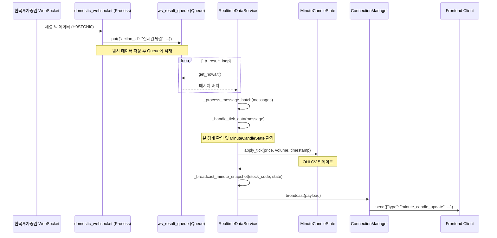

# 백엔드 실시간 분봉 업데이트(`_broadcast_minute_snapshot`) 분석

**문서 ID**: `1021.analysis.backend.mincandle.md`  
**작성일**: 2025-10-21  
**작성자**: Gemini Code Assist  
**상태**: **분석 완료**

---

## 1. 개요

이 문서는 한국투자증권 WebSocket으로부터 실시간 체결 틱(tick) 데이터를 수신하여, 프론트엔드에 '진행 중인 분봉'(`minute_candle_update`)을 브로드캐스트하는 `_broadcast_minute_snapshot()` 함수가 호출되기까지의 전체 데이터 흐름과 함수 호출 스택을 분석하고 설명합니다.

---

## 2. 데이터 흐름 시퀀스 다이어그램 (Mermaid)

아래 다이어그램은 체결 틱 데이터가 백엔드 시스템을 거쳐 프론트엔드 클라이언트에 전달되는 과정을 보여줍니다.

---

## 3. 함수 호출 스택 상세 설명

`_broadcast_minute_snapshot()` 호출까지의 과정은 여러 컴포넌트와 비동기 로직을 거칩니다. 각 단계의 역할은 다음과 같습니다.

### 1. `run_websocket` (in `domestic_websocket.py`)

-   **역할**: 한국투자증권 API로부터 실시간 체결 데이터를 수신하고 파싱하는 별도의 프로세스입니다.
-   **실행 흐름**:
    1.  `main.py`에서 `Process`로 실행되어 메인 이벤트 루프를 차단하지 않습니다.
    2.  한국투자증권 WebSocket 서버에 연결하고 체결 채널(`H0STCNI0`)을 구독합니다.
    3.  체결 데이터(e.g., `005930^093000^...`)를 수신하면, 이를 파싱하여 `action_id`, `stock_code`, `data` 등이 포함된 딕셔너리 형태로 변환합니다.
    4.  변환된 메시지를 `ws_result_queue`에 `put`하여 `RealtimeDataService`가 소비할 수 있도록 전달합니다.

### 2. `RealtimeDataService._tr_result_loop()`

-   **파일**: `backend/app/services/realtime_service.py`
-   **역할**: `ws_result_queue`를 지속적으로 폴링하여 메시지를 소비하는 메인 이벤트 루프입니다.
-   **실행 흐름**:
    1.  `asyncio.create_task`로 실행되는 무한 루프입니다.
    2.  `ws_result_queue.get_nowait()`를 사용하여 큐에서 메시지를 배치(batch) 단위로 가져옵니다.
    3.  가져온 메시지 배치를 `_process_message_batch()` 메서드로 전달하여 처리합니다.

### 3. `RealtimeDataService._process_message_batch()`

-   **파일**: `backend/app/services/realtime_service.py`
-   **역할**: 수신된 메시지 배치를 병렬로 처리하여 성능을 최적화합니다.
-   **실행 흐름**:
    1.  메시지 목록을 순회하며 `action_id`를 확인합니다.
    2.  `action_id`가 `"실시간체결"`인 경우, 해당 메시지를 처리할 `_handle_tick_data()` 코루틴을 생성하여 `asyncio.gather`로 병렬 실행합니다.

### 4. `RealtimeDataService._handle_tick_data()`

-   **파일**: `backend/app/services/realtime_service.py`
-   **역할**: 단일 체결 틱 데이터를 처리하고, 분봉 상태를 업데이트하며, 브로드캐스트를 트리거하는 핵심 로직입니다.
-   **실행 흐름**:
    1.  메시지에서 `stock_code`, `price`, `executed_time`, `trade_volume` 등 주요 데이터를 추출합니다.
    2.  `parse_kis_time`을 사용해 체결 시간을 파싱하고, `strftime`으로 분(minute) 단위의 `minute_key`를 생성합니다. (e.g., "2025-10-21T10:30:00")
    3.  `self.minute_state_lock`을 사용하여 특정 종목의 분봉 상태(`MinuteCandleState`)에 대한 동시 접근을 방지합니다.
    4.  `self.minute_candle_state` 딕셔너리에서 해당 `stock_code`의 상태 객체를 가져옵니다.
    5.  **분 경계 확인**: 만약 상태 객체의 `minute_key`가 현재 틱의 `minute_key`와 다르다면, 이전 분이 완료되었음을 의미합니다. 이 경우 `_flush_closed_candle()`을 호출하여 '완성된 분봉'(`minute_candle_finalize`)을 처리합니다.
    6.  **상태 업데이트**:
        -   상태 객체가 없거나 분이 바뀌었다면, 새로운 `MinuteCandleState` 객체를 생성합니다.
        -   `state.apply_tick()`을 호출하여 현재 틱의 가격과 거래량을 반영해 OHLCV(시가, 고가, 저가, 종가, 거래량)를 업데이트합니다.
    7.  **브로드캐스트 호출**: 업데이트된 `MinuteCandleState`를 인자로 하여 **`_broadcast_minute_snapshot()`**을 호출합니다.

### 5. `RealtimeDataService._broadcast_minute_snapshot()`

-   **파일**: `backend/app/services/realtime_service.py`
-   **역할**: 현재 '진행 중인 분봉'의 스냅샷을 WebSocket 클라이언트에게 브로드캐스트합니다.
-   **실행 흐름**:
    1.  `MinuteCandleState` 객체로부터 OHLCV 데이터를 가져와 `minute_candle_update` 타입의 메시지 페이로드를 구성합니다.
    2.  `self.connection_manager.broadcast(payload)`를 호출하여, 현재 연결된 모든 클라이언트에게 해당 메시지를 전송합니다.
    3.  프론트엔드에서는 `useRealtimeMinuteCandles` 훅이 이 메시지를 수신하고, `stock_code`를 필터링하여 해당 종목의 차트를 실시간으로 업데이트합니다.

---

## 4. 결론

`_broadcast_minute_snapshot()`의 호출은 단일 이벤트가 아니라, **[WebSocket 수신 → Queue → 비동기 루프 → 배치 처리 → 틱 데이터 핸들링 → 상태 업데이트]** 로 이어지는 정교한 파이프라인의 최종 단계입니다.

이 구조는 Python의 `multiprocessing.Queue`와 `asyncio`를 활용하여 I/O 바운드 작업(WebSocket 수신)과 CPU 바운드 작업(데이터 처리)을 분리하고, 여러 메시지를 효율적으로 처리하여 실시간성을 보장하도록 설계되었습니다.
