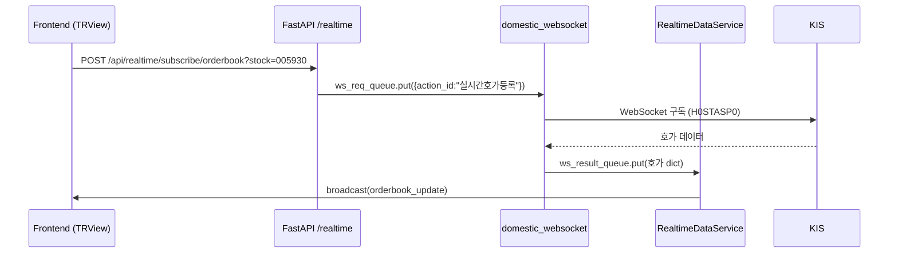
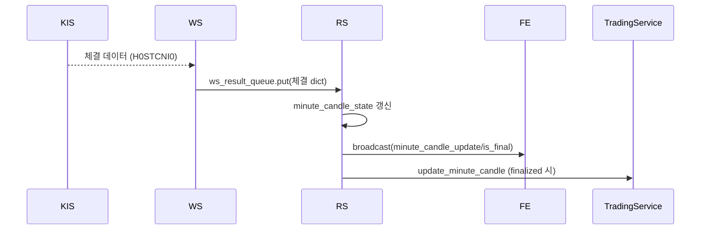

# 1023.FINAL.RealTimeUpdate.Candle

최신 코드 기준으로 **실시간 분봉/호가 업데이트 아키텍처**와 **주요 구현 지침**을 통합한 문서이다. 본 문서는 `/trview` 화면에서의 실시간 갱신 전 과정을 다루며, 프런트엔드 ↔ 백엔드 ↔ KIS WebSocket 흐름을 단일 시나리오로 정리한다.

---

## 1. 시스템 개요

| 구분 | 주요 구성요소 | 설명 |
| --- | --- | --- |
| 프런트엔드 | `TRViewPage`, `useTRViewChart`, `useRealtimeMinuteCandles`, `useOrderBook`, `wsManager` | REST로 초기 데이터 조회 후 WebSocket을 통해 실시간 이벤트를 처리한다. 종목 변경 시 구독을 동적으로 전환한다. |
| 백엔드 (FastAPI) | `app/api/realtime.py`, `RealtimeDataService`, `ConnectionManager` | REST 구독 요청을 큐에 저장하고, `RealtimeDataService`가 결과를 캐시 및 브로드캐스트한다. |
| 백엔드 (KIS WebSocket 프로세스) | `domestic_websocket.py`, `parse_hoga_json`, `receive_realtime_tick_domestic` | FastAPI에서 전달한 큐 명령을 받아 KIS WebSocket을 구독/해제하고 실시간 데이터를 메인 프로세스로 전달한다. |
| 데이터 저장 · 동기화 | `orderbook_cache`, `minute_candle_state`, `minute_finalize_queue`, `TradingService.update_minute_candle` | 호가/분봉 데이터를 메모리에 유지하고, 분봉 완성 시 파일 캐시에 반영한다. |

### 1.1 블록 다이어그램 및 역할

```
┌──────────────┐      REST       ┌────────────────────┐      Queue       ┌──────────────────────┐      WebSocket      ┌──────────┐
│  Frontend    │ ─────────────▶ │ FastAPI /realtime   │ ───────────────▶ │ domestic_websocket   │ ─────────────────▶ │  KIS API │
│ (TRViewPage) │                │  (REST + WS bridge) │                  │   (KIS WS worker)    │                    │ (H0ST..) │
└─────┬────────┘                └─────────┬───────────┘                  └─────────┬────────────┘                    └────┬─────┘
      │  WebSocket broadcast              │ ws_result_queue push                     │ 분봉/호가 dict 전달                     │
      │ ◀──────────────────────────────────┘                                        │                                       │
      │                                                                            │                                       │
      │  실시간 렌더링                                                            │                                       │
      │                                                                            │                                       │
      ▼                                                                            ▼                                       ▼
┌──────────────┐     캐시/상태      ┌────────────────────┐
│ useOrderBook │ ◀──────────────── │ RealtimeDataService │
│ useRealtime… │ ─────────────────▶│  (orderbook_cache,  │
└──────────────┘    broadcast      │   minute_state …)   │
                                   └────────────────────┘
```

- **Frontend**: `/trview` UI와 훅들이 REST 요청과 WebSocket 수신을 담당하며, 종목 변경 시 구독을 교체한다.
- **FastAPI /realtime**: REST 엔드포인트(`/subscribe`, `/orderbook` 등)를 제공하고, 큐를 통해 KIS WebSocket 워커와 통신한다.
- **domestic_websocket**: 별도 프로세스로 실행되어 KIS WebSocket을 유지하며, 구독 명령 처리 및 RAW 데이터를 파싱한다.
- **RealtimeDataService**: 큐에서 데이터를 소비하여 캐시를 갱신하고, 프런트 WebSocket 클라이언트로 브로드캐스트한다.
- **KIS API**: H0STASP0(호가), H0STCNI0(체결) 등 실시간 데이터를 제공하는 외부 서비스.

---

## 2. 시퀀스 요약

### 2.1 초기 진입 (`/trview`)
1. `TRViewPage`가 기본 종목(삼성전자)을 state로 설정하고 `useTRViewChart`/`useOrderBook` 훅을 초기화한다.
2. `useTRViewChart`는 `chartAPI`를 통해 **REST - `/api/chart/{stock}/minute`/`day`** 데이터를 가져와 차트를 렌더링한다.
3. `useOrderBook`은 **REST - `/api/realtime/orderbook/{stock}`** 호출로 초기 호가/현재가를 로드한다.
4. `TRViewPage`는 별도 `useEffect`로 **REST - `/api/realtime/subscribe/orderbook?stock_code={stock}`**를 호출하여 백엔드에 KIS 호가 구독을 요청한다.
5. WebSocket 연결(`wsManager.connect`)이 완료되면 `useRealtimeMinuteCandles`가 `type: 'subscribe'` 메시지를 전송해 분봉 채널을 구독한다.

### 2.2 실시간 이벤트 흐름 (호가)
1. 프런트의 REST 구독 요청(`subscribe_orderbook`) → FastAPI → `ws_req_queue`에 `{"action_id": "실시간호가등록", "종목코드": stock}` 저장.
2. `domestic_websocket.py`의 `process_queue()`가 큐를 읽어 KIS WebSocket에 실제 구독 명령을 전송한다.
3. KIS WebSocket에서 호가/체결 메시지를 수신하면 `parse_hoga_json` 혹은 `receive_realtime_hoga_domestic_new`가 표준 dict로 파싱한다.
4. 파싱된 메시지는 `ws_result_queue`를 통해 FastAPI 프로세스의 `RealtimeDataService._handle_hoga_data`로 전달된다.
5. `RealtimeDataService`는 `orderbook_cache` 갱신 → `connection_manager.broadcast`로 `orderbook_update` 메시지를 전송한다.
6. 프런트 `wsManager`는 `orderbook_update`를 수신하고, 해당 종목을 구독 중인 `useOrderBook` 리스너를 호출한다.

### 2.3 실시간 이벤트 흐름 (분봉)
1. 체결(H0STCNI0) 데이터는 KIS WebSocket → `receive_realtime_tick_domestic` → `ws_result_queue` → `RealtimeDataService._handle_tick_data`로 전달된다.
2. `_handle_tick_data`는 `minute_candle_state`를 갱신하고, `connection_manager.broadcast`를 통해 `minute_candle_update`/`minute_candle_finalized` 메시지를 전송한다.
3. 프런트 `useRealtimeMinuteCandles`가 해당 메시지를 받아 `currentCandle`/`finalizedCandles` state를 업데이트한다.
4. 분봉이 완성되면 `RealtimeDataService._flush_closed_candle`이 persistence 큐(`minute_finalize_queue`)에 저장하고, 등록된 핸들러(`TradingService.update_minute_candle`)로 파일 캐시를 갱신한다.

### 2.4 종목 전환
1. `TRViewChartControls`에서 종목을 선택하면 `stockCode` state가 변경된다.
2. `useOrderBook`은 기존 구독 해제(`sendUnsubscribe`) → 새 구독 등록 순으로 동작하며, REST 초기 로드도 재실행한다.
3. `useTRViewChart`는 `fetchData`를 재호출해 차트 데이터를 새 종목으로 교체한다.
4. `useRealtimeMinuteCandles`는 WebSocket `unsubscribe` → 새 `subscribe` 순으로 메시지를 전송한다.

---

## 3. 주요 모듈 상세

### 3.1 프런트엔드

#### TRViewPage (`stock-trading-ui/src/app/trview/page.tsx`)
- 상태: `stockCode`, `showVolume`, `showGrid`, `balance` 등.
- 초기 구독: `useEffect`에서 `/api/realtime/subscribe/orderbook` 호출.
- 차트/주문 패널 조합: `TRViewChart`, `OrderForm`, `OrdersList` 등 배치.

#### useTRViewChart (`stock-trading-ui/src/hooks/useTRViewChart.ts`)
- REST API: `chartAPI.getMinuteCandles` / `getDayCandles`.
- 실시간: `useRealtimeMinuteCandles`로 `minute_candle_update`/`finalized` 수신 후 merge.
- 추가 기능: `loadPrevious`로 과거 데이터 페이지네이션, `latestClose` 계산.

#### useRealtimeMinuteCandles (`stock-trading-ui/src/hooks/useRealtimeMinuteCandles.ts`)
- WebSocket `type: 'subscribe'`/`'unsubscribe'` 메시지 관리.
- 진행 중 분봉: `currentCandle`, 완성 분봉: `finalizedCandles` state 유지.
- 구독 실패 대비: 연결 타임아웃(10초) 후 오류 로그 출력.

#### useOrderBook (`stock-trading-ui/src/hooks/useOrderBook.ts`)
- REST 초기 로드: `apiClient.getCurrentOrderBook`.
- 구독 제어: `subscribedStockRef` + `isSubscribingRef`로 단일 구독 보장.
- 실시간 처리: `orderbook_update` 메시지를 받아 정렬(내림차순) 후 전체 호가 표시.
- 주기적 새로고침: `SILENT_REFRESH_INTERVAL`(1초)로 REST fallback.

#### wsManager (`stock-trading-ui/src/lib/websocket.ts`)
- `pendingSubscriptions`: Set으로 구독 목록 관리(중복 자동 제거).
- `subscribeToOrderBookUpdates`: 종목별 필터링 후 콜백 실행.
- 재연결 시 `restorePendingSubscriptions()`로 모든 구독 복원.

### 3.2 백엔드

#### FastAPI 라우터 (`backend/app/api/realtime.py`)
- `POST /subscribe/orderbook`: `ws_req_queue`에 `{"action_id": "실시간호가등록"}` push.
- `POST /unsubscribe/orderbook`: `{"action_id": "실시간호가해제"}` push + 캐시 무효화.
- `GET /orderbook/{stock}`: `orderbook_cache` 반환, 캐시 없으면 구독 요청 안내.
- 디버그: `/debug/queue-status`, `/debug/cache-status` 제공.

#### RealtimeDataService (`backend/app/services/realtime_service.py`)
- 큐 처리: `ws_result_queue`에서 메시지를 배치(`batch_size=10`)로 소비.
- 호가 처리: `_handle_hoga_data` → `orderbook_cache` 갱신 + 브로드캐스트.
- 분봉 처리: `_handle_tick_data`/`_update_minute_from_hoga` → `minute_candle_state` 갱신.
- 분봉 타임아웃: `_minute_timeout_checker`가 90초 이상 정체된 분봉을 강제 flush.
- Persistence: `_minute_persistence_worker`가 `TradingService.update_minute_candle` 호출.

#### ConnectionManager (`backend/app/websocket/connection.py`)
- WebSocket 연결/해제 관리 및 구독자(종목/지수/시장) 추적.
- `broadcast`/`broadcast_to_stock_subscribers`로 선택적 메시지 전송.
- 메시지 로깅: `websocket_logger`와 연계해 debug 가능.

#### domestic_websocket.py
- KIS WebSocket 연결 & queue 처리(`process_queue`).
- 파서: `parse_hoga_json` (JSON) / `receive_realtime_hoga_domestic_new` (파이프).
- 체결 파서: `receive_realtime_tick_domestic`.
- 에러 처리: `ALREADY IN SUBSCRIBE` 시 자동 재등록 등 재시도 로직 포함.

---

## 4. 데이터 구조

### 4.1 호가 메시지 (`orderbook_update.data`)
```json
{
  "asks": [
    {"price": 71800, "quantity": 1000},
    ...
  ],
  "bids": [
    {"price": 71700, "quantity": 850},
    ...
  ],
  "current_price": 71700,
  "timestamp": "2025-10-23T11:52:15"
}
```
- 프런트 정렬 기준: `price` 내림차순.
- 바 차트 계산: `quantity / maxQuantity`.

### 4.2 분봉 상태 (`MinuteCandleState`)
```python
MinuteCandleState(
    minute_key="2025-10-23T11:52:00",
    open=price_open,
    high=price_high,
    low=price_low,
    close=price_close,
    volume=accumulated_volume,
    start_ts=executed_ts,
    last_tick_ts=executed_ts
)
```
- 진행 중 분봉은 `minute_candle_update`로 브로드캐스트하며 `is_final=False`.
- 분봉 완료 시 `_flush_closed_candle` → `minute_candle_finalized` 전송 + persistence.

### 4.3 WebSocket 구독 메시지
| 방향 | 페이로드 |
| --- | --- |
| 프런트 → 백엔드 | `{"type": "subscribe", "stock_code": "005930"}` |
| 프런트 → 백엔드 | `{"type": "unsubscribe", "stock_code": "005930"}` |
| 백엔드 → 프런트 | `{"type": "orderbook_update", "stock_code": "...", "data": {...}}` |
| 백엔드 → 프런트 | `{"type": "minute_candle_update", "stock_code": "...", "candle": {...}, "is_final": false}` |
| 백엔드 → 프런트 | `{"type": "minute_candle_finalized", "stock_code": "...", "candle": {...}}` |

### 4.4 한투 API RAW 샘플 (2025-10-22 로그 발췌)
- 로그 위치: `logs/backend_app_2025-10-22.log` `09:02:57.446` (TR ID `H0STASP0`)
- KIS WebSocket에서 수신한 파이프(`^`) 구분 원문:

```
005930^090257^0^97100^97200^97300^97400^97500^97600^97700^97800^97900^98000^97000^96900^96800^96700^96600^96500^96400^96300^96200^96100^74104^22757^7294^26103^15483^2143^7042^19440^12711^20339^2978^39623^11884^29908^36883^78415^15801^12111^19374^52961^3^0^0^0^0^0^0^0^20251022^090257000000^N
```

  * 인덱스 0~2: 종목코드, HHMMSS, (미사용)현재가
  * 인덱스 3~12: 매도 1~10호가
  * 인덱스 13~22: 매수 1~10호가
  * 인덱스 23~32: 매도 1~10호가 잔량
  * 인덱스 33~42: 매수 1~10호가 잔량
  * 이후 필드: 호가 총잔량/시세부호/일자 등 부가정보

- 파싱 후 `RealtimeDataService._handle_hoga_data`로 전달된 dict:

```json
{
  "stock_code": "005930",
  "current_price": 97000,
  "asks": [
    {"price": 97100, "quantity": 74104},
    {"price": 97200, "quantity": 22757},
    {"price": 97300, "quantity": 7294},
    {"price": 97400, "quantity": 26103},
    {"price": 97500, "quantity": 15483},
    {"price": 97600, "quantity": 2143},
    {"price": 97700, "quantity": 7042},
    {"price": 97800, "quantity": 19440},
    {"price": 97900, "quantity": 12711},
    {"price": 98000, "quantity": 20339}
  ],
  "bids": [
    {"price": 97000, "quantity": 2978},
    {"price": 96900, "quantity": 39623},
    {"price": 96800, "quantity": 11884},
    {"price": 96700, "quantity": 29908},
    {"price": 96600, "quantity": 36883},
    {"price": 96500, "quantity": 78415},
    {"price": 96400, "quantity": 15801},
    {"price": 96300, "quantity": 12111},
    {"price": 96200, "quantity": 19374},
    {"price": 96100, "quantity": 52961}
  ],
  "timestamp": "2025-10-22T09:02:57",
  "market_data": {
    "open": 0,
    "high": 0,
    "low": 0,
    "volume": 0,
    "value": 0,
    "sign": "3",
    "change": 0,
    "drate": 0.0
  }
}
```

---

## 5. 코드 흐름 요약 (시나리오)

### 5.1 초기 구독


### 5.2 종목 전환
```mermaid
sequenceDiagram
  FE->>API: POST /unsubscribe (old stock)
  API->>WS: ws_req_queue.put({action_id:"실시간호가해제"})
  FE->>API: POST /subscribe (new stock)
  FE->>WS (WebSocket): {"type":"unsubscribe","stock_code":old}
  FE->>WS (WebSocket): {"type":"subscribe","stock_code":new}
  ... 이후 흐름은 초기 구독과 동일
```

### 5.3 분봉 업데이트


---

## 6. 구현 가이드

1. **새 종목 지원 시**
   - 프런트: `SAMPLE_STOCKS` 혹은 실제 종목 리스트에 추가.
   - 백엔드: 별도 설정 불필요하나, KIS 구독 권한(계좌/토큰) 확인 필요.

2. **구독 관련 버그 발생 시 체크리스트**
   1. `/api/realtime/subscribe/orderbook` 호출 여부 (브라우저 Network 탭).
   2. FastAPI 로그에서 `호가 구독 요청: {stock}` 및 `실시간호가등록` 출력 확인.
   3. `/api/realtime/debug/queue-status`로 큐 상태 점검 (`ws_req_queue_size`/`ws_result_queue_size`).
   4. `RealtimeDataService` 로그의 `📊 호가 데이터 처리` 또는 에러 메시지 확인.
   5. 프런트 콘솔의 `✅ 호가 구독 시작` 로그 확인.

3. **타임아웃/에러 처리 강화**
   - REST 구독 실패 시 재시도 로직 추가 고려 (현재는 콘솔 경고만).
   - WebSocket 연결이 자주 끊기는 경우 `wsManager.scheduleReconnect` 설정 확인.

4. **성능 최적화**
   - `RealtimeDataService.batch_size` 조정으로 처리량 튜닝.
   - 프런트 호가 렌더링은 정렬된 배열을 그대로 map하므로, 불필요한 re-render 방지를 위해 `_updateId` 등 key 관리 중요.

### 6.1 분봉 업데이트 → WebSocket 반영 상세

1. **체결 데이터 수신**  
   - `domestic_websocket.connect()` 루프가 `data[0] == '0'` 인 경우 체결/호가 메시지를 구분한다.  
   - 체결(TR ID `H0STCNI0`) 시 `receive_realtime_tick_domestic(raw_payload)`가 호출되어 dict로 변환.
   - 해당 dict는 `ws_result_queue.put({"action_id": "실시간체결", "stock_code": code, "data": dict})` 형태로 FastAPI 프로세스로 전달된다.

2. **RealtimeDataService에서 처리 (`backend/app/services/realtime_service.py`)**
   - `_tr_result_loop` → `_process_message_batch` → `_handle_tick_data` 호출.
   - `minute_key` 계산 후 `minute_candle_state` 갱신.  
   - 진행 중이면 `_broadcast_minute_snapshot()` 실행 → `payload = {"type": "minute_candle_update", ...}` → `self.connection_manager.broadcast(payload)`.
   - 분 경계가 지나면 `_flush_closed_candle()` 호출:
     ```python
     candle = state.to_chart_candle()
     await self._enqueue_candle_for_persistence(stock_code, candle)
     finalize_message = {
         "type": "minute_candle_finalized",
         "stock_code": stock_code,
         "candle": candle.model_dump()
     }
     await self.connection_manager.broadcast(finalize_message)
     ```
   - 동시에 `minute_finalize_queue`에 저장되어 persistence 워커가 `TradingService.update_minute_candle`을 실행한다.

3. **프런트엔드 반영 (`stock-trading-ui/src/hooks/useRealtimeMinuteCandles.ts`)**
   - 구독 시 `wsManager.send({type: 'subscribe', stock_code})`로 분봉 채널 등록.
   - `subscribeToMinuteCandles`/`subscribeToMinuteCandleFinalized` 리스너가 실행되어
     ```typescript
     if (message.stock_code !== stockCode) return;
     setCurrentCandle({...}); // minute_candle_update
     setFinalizedCandles(prev => [...prev, candle]); // minute_candle_finalized
     ```
   - `useTRViewChart`는 `mergedChartData`로 기존 차트 데이터와 실시간 데이터를 병합하고, `TRViewChart`에 전달하여 시각적으로 즉시 반영한다.

4. **실제 분 변경 시 코드 매칭**
   - **분 경계 감지**: `_handle_tick_data` 내부 `if state and state.minute_key != minute_key: await self._flush_closed_candle(...)`
   - **완성 브로드캐스트**: `_flush_closed_candle`의 `self.connection_manager.broadcast(finalize_message)`
   - **프런트 하이라이트**: `TRViewChart`의 `flashPriceLine`이 최신 `close` 변경을 감지해 가격선을 잠깐 표시.
   - **Persistence 기록**: `minute_persistence_worker`가 `TradingService.update_minute_candle`을 await 하여 `chart_cache`에 반영.

### 6.2 분별 타임라인 샘플 (14:05 분 → 14:06 분 경계)
다음은 2025-10-21 분석 문서(working/1021.FINAL.RTUPDATE.MINCANDLE.plan.v3.0.md)의 시나리오를 현재 코드에 맞게 정리한 것이다.

| 시각        | 이벤트/처리 | 관련 코드 |
|-------------|-------------|-----------|
| **14:05:00** | 호가 71,500원 도착 → `minute_candle_state` 없음 → 새 상태 생성 (open/high/low/close = 71500, volume=0) | `_update_minute_from_hoga` → `MinuteCandleState(...)` |
| **14:05:15** | 호가 71,600원 → 기존 상태에 `apply_price_only` → high/close 갱신 → `minute_candle_update` 브로드캐스트 | `_update_minute_from_hoga` ↔ `_broadcast_minute_snapshot` |
| **14:05:30** | 체결 71,550원 100주 → `apply_tick` → volume 누적 100 → 브로드캐스트 (is_final=False) | `_handle_tick_data` → `_broadcast_minute_snapshot` |
| **14:05:45** | 호가 71,700원 → high/close 업데이트 → 브로드캐스트 | 동일 |
| **14:06:00** | 체결 71,800원 50주 (다음 분) → minute_key 변경 감지 → `_flush_closed_candle` 실행 → 14:05 분봉 완성 (minute_candle_finalized 전송 + persistence 큐) → 새 14:06 상태 생성 (open=71800, volume=50) | `_handle_tick_data` → `_flush_closed_candle` → `_enqueue_candle_for_persistence` → `_update_minute_from_hoga` |

이 타임라인은 실시간으로 `TRViewChart`에 반영되어, 분 경계 시 기존 분봉이 확정되고 새 분봉이 즉시 생성되는 과정을 사용자가 확인할 수 있다.

---

## 7. 현재 코드 상태 대비 주요 참고 경로

| 기능 | 프런트 파일 | 백엔드 파일 |
| --- | --- | --- |
| 호가 REST/실시간 | `useOrderBook.ts`, `OrderBook.tsx` | `app/api/realtime.py`, `RealtimeDataService`, `domestic_websocket.py` |
| 분봉 REST/실시간 | `useTRViewChart.ts`, `useRealtimeMinuteCandles.ts`, `TRViewChart.tsx` | `RealtimeDataService`, `TradingService.update_minute_candle` |
| WebSocket 관리 | `websocket.ts` | `app/websocket/connection.py`, `domestic_websocket.py` |
| 로그/디버그 | `console.log` (프런트), `logs/backend_app_YYYY-MM-DD.log`, `API_YYYYMMDD.log` | - |

---

## 8. 부록

### 8.1 REST 엔드포인트 요약
| 메서드 | 경로 | 설명 |
| --- | --- | --- |
| GET | `/api/chart/{stock}/minute?date=YYYY-MM-DD` | 당일 분봉 데이터 |
| GET | `/api/chart/{stock}/day?start_date&end_date` | 일봉 데이터 |
| GET | `/api/realtime/orderbook/{stock}` | 호가 캐시 조회 |
| POST | `/api/realtime/subscribe/orderbook?stock_code={stock}` | 호가 구독 등록 |
| POST | `/api/realtime/unsubscribe/orderbook?stock_code={stock}` | 호가 구독 해제 |
| GET | `/api/realtime/debug/queue-status` | 큐 상태 확인 |
| GET | `/api/realtime/debug/cache-status` | 호가 캐시 상태 |

### 8.2 WebSocket 메시지 타입
| 타입 | 설명 |
| --- | --- |
| `connection_status`, `heartbeat`, `pong` | 연결 상태 모니터링 |
| `orderbook_update` | 호가 정보 |
| `minute_candle_update` | 진행 중 분봉 |
| `minute_candle_finalized` | 완성 분봉 |
| `market_index_update`, `market_status_update` | 지수/장상태 |

---

이 문서는 mincandle 실시간 갱신 기능의 최종 설계/구현 가이드로, 신규 개발자 온보딩 및 향후 개선 작업의 기준 문서로 활용할 수 있다.
